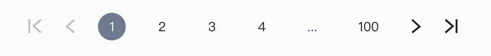

# Paginate

Paginate 為 github 上取下後再修改，架構較複雜，故不提供原始碼，僅提供說明





```jsx
import Paginate from '../components/paginate';


  constructor(props) {
    super(props);
    const query = new URLSearchParams(this.props.location.search);
    this.state = {
      keyword: query.get('keyword'),
      page: Number(query.get('page')) || 1,
    };
  }

  this.state = {
    page: 1,
  };
  
  pageChange = (result) => {
    this.props.history.push(
      `${this.props.location.pathname}?keyword=${this.state.keyword}&page=${result.selected + 1}`
    );
  }

  <Paginate
    initialPage={this.state.page - 1}
    pageCount={100}
    pageRangeDisplayed={3}
    marginPagesDisplayed={1}
    containerClassName='fui-pagination'
    previousLabel={<i className='icon-chevron-left'></i>}
    nextLabel={<i className='icon-chevron-right'></i>}
    firstLabel={<i className='icon-first'></i>}
    lastLabel={<i className='icon-last'></i>}
    onPageChange={this.pageChange}
  />
```



### Props

| Name | Type | Description |
| :--- | :--- | :--- |
| `pageCount` | `Number` | **Required.** The total number of pages. |
| `pageRangeDisplayed` | `Number` | **Required.** The range of pages displayed. |
| `marginPagesDisplayed` | `Number` | **Required.** The number of pages to display for margins. |
| `previousLabel` | `Node` | Label for the `previous` button. |
| `nextLabel` | `Node` | Label for the `next` button. |
| `breakLabel` | `Node` | Label for ellipsis. |
| `breakClassName` | `String` | The classname on tag `li` of the ellipsis element. |
| `breakLinkClassName` | `String` | The classname on tag `a` of the ellipsis element. |
| `onPageChange` | `Function` | The method to call when a page is clicked. Exposes the current page object as an argument. |
| `initialPage` | `Number` | The initial page selected. |
| `forcePage` | `Number` | To override selected page with parent prop. |
| `disableInitialCallback` | `boolean` | Disable `onPageChange` callback with initial page. Default: `false` |
| `containerClassName` | `String` | The classname of the pagination container. |
| `pageClassName` | `String` | The classname on tag `li` of each page element. |
| `pageLinkClassName` | `String` | The classname on tag `a` of each page element. |
| `activeClassName` | `String` | The classname for the active page. |
| `activeLinkClassName` | `String` | The classname on the active tag `a`. |
| `previousClassName` | `String` | The classname on tag `li` of the `previous` button. |
| `nextClassName` | `String` | The classname on tag `li` of the `next` button. |
| `previousLinkClassName` | `String` | The classname on tag `a` of the `previous` button. |
| `nextLinkClassName` | `String` | The classname on tag `a` of the `next` button. |
| `disabledClassName` | `String` | The classname for disabled `previous` and `next` buttons. |
| `hrefBuilder` | `Function` | The method is called to generate the `href` attribute value on tag `a` of each page element. |
| `extraAriaContext` | `String` | DEPRECATED: Extra context to add to the `aria-label` HTML attribute. |
| `ariaLabelBuilder` | `Function` | The method is called to generate the `aria-label` attribute value on each page link |

