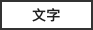
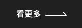

# Button

## 樣式

### Primary

<table>
  <thead>
    <tr>
      <th style="text-align:left">Large</th>
      <th style="text-align:left">Medium</th>
      <th style="text-align:left">Small</th>
    </tr>
  </thead>
  <tbody>
    <tr>
      <td style="text-align:left">
        <p>
          
        </p>
        <p>Default</p>
      </td>
      <td style="text-align:left">
        <p>
          
        </p>
        <p>Default</p>
      </td>
      <td style="text-align:left">
        <p>
          
        </p>
        <p>Default</p>
      </td>
    </tr>
    <tr>
      <td style="text-align:left">
        
        <br />Hover</td>
      <td style="text-align:left">
        <p>
          
        </p>
        <p>Hover</p>
      </td>
      <td style="text-align:left">
        <p>
          
        </p>
        <p>Hover</p>
      </td>
    </tr>
    <tr>
      <td style="text-align:left">
        <p>&#x200B;
          
        </p>
        <p>Disable</p>
      </td>
      <td style="text-align:left">
        <p>
          
        </p>
        <p>Disable</p>
      </td>
      <td style="text-align:left">
        <p>
          
        </p>
        <p>Disable</p>
      </td>
    </tr>
  </tbody>
</table>

<table>
  <thead>
    <tr>
      <th style="text-align:left"><b>Reverse-Large</b>
      </th>
      <th style="text-align:left"><b>Reverse-Medium</b>
      </th>
      <th style="text-align:left"><b>Reverse-Small</b>
      </th>
    </tr>
  </thead>
  <tbody>
    <tr>
      <td style="text-align:left">
        <p>
          
        </p>
        <p>Default</p>
      </td>
      <td style="text-align:left">
        <p>
          
        </p>
        <p>Default</p>
      </td>
      <td style="text-align:left">--</td>
    </tr>
    <tr>
      <td style="text-align:left">
        <p>
          
        </p>
        <p>Hover</p>
      </td>
      <td style="text-align:left">
        <p>
          
        </p>
        <p>Hover(&#x80CC;&#x666F;&#x900F;&#x660E;&#x5EA6;70%)</p>
      </td>
      <td style="text-align:left">--</td>
    </tr>
    <tr>
      <td style="text-align:left">
        <p>
          
        </p>
        <p>Disable</p>
      </td>
      <td style="text-align:left">
        <p>
          
        </p>
        <p>Disable</p>
      </td>
      <td style="text-align:left">--</td>
    </tr>
  </tbody>
</table>

[DEMO](http://fetnet-storybook.aja.com.tw/iframe.html?id=button--primary)

### Secondary

<table>
  <thead>
    <tr>
      <th style="text-align:left">Large</th>
      <th style="text-align:left">Medium</th>
      <th style="text-align:left">Small</th>
    </tr>
  </thead>
  <tbody>
    <tr>
      <td style="text-align:left">
        <p>
          
        </p>
        <p>Default</p>
      </td>
      <td style="text-align:left">
        <p>
          
        </p>
        <p>Default</p>
      </td>
      <td style="text-align:left">
        <p>
          
        </p>
        <p>Default</p>
      </td>
    </tr>
    <tr>
      <td style="text-align:left">
        <p>
          
        </p>
        <p>Hover</p>
      </td>
      <td style="text-align:left">
        <p>
          
        </p>
        <p>Hover</p>
      </td>
      <td style="text-align:left">
        <p>
          
        </p>
        <p>Hover</p>
      </td>
    </tr>
    <tr>
      <td style="text-align:left">
        <p>
          
        </p>
        <p>Disable</p>
      </td>
      <td style="text-align:left">
        <p>
          
        </p>
        <p>Disable</p>
      </td>
      <td style="text-align:left">
        <p>
          
        </p>
        <p>Disable</p>
      </td>
    </tr>
  </tbody>
</table>

<table>
  <thead>
    <tr>
      <th style="text-align:left"><b>Reverse-Large</b>
      </th>
      <th style="text-align:left"><b>Reverse-Medium</b>
      </th>
      <th style="text-align:left"><b>Reverse-Small</b>
      </th>
    </tr>
  </thead>
  <tbody>
    <tr>
      <td style="text-align:left">
        <p>
          
        </p>
        <p>Default</p>
      </td>
      <td style="text-align:left">
        <p>&#x200B;
          
        </p>
        <p>Default</p>
      </td>
      <td style="text-align:left">--</td>
    </tr>
    <tr>
      <td style="text-align:left">
        <p>
          
        </p>
        <p>Hover(&#x80CC;&#x666F;&#x900F;&#x660E;&#x5EA6;20%)</p>
      </td>
      <td style="text-align:left">
        <p>&#x200B;
          
        </p>
        <p>Hover(&#x80CC;&#x666F;&#x900F;&#x660E;&#x5EA6;20%)</p>
      </td>
      <td style="text-align:left">--</td>
    </tr>
    <tr>
      <td style="text-align:left">
        <p>
          
        </p>
        <p>Disable</p>
      </td>
      <td style="text-align:left">
        <p>&#x200B;
          
        </p>
        <p>Disable</p>
      </td>
      <td style="text-align:left">--</td>
    </tr>
  </tbody>
</table>

[DEMO](http://fetnet-storybook.aja.com.tw/iframe.html?id=button--secondary)

### Arrow

Hover動效: 文字原位置淡出，icon右移60px。CSS緩動方式: 300ms, ease-in-out

<table>
  <thead>
    <tr>
      <th style="text-align:left"></th>
      <th style="text-align:left"></th>
    </tr>
  </thead>
  <tbody>
    <tr>
      <td style="text-align:left">
        <p>
          
        </p>
        <p>Default</p>
      </td>
      <td style="text-align:left">
        
        <br />Default</td>
    </tr>
    <tr>
      <td style="text-align:left">
        <p>
          
        </p>
        <p>Hover</p>
      </td>
      <td style="text-align:left">
        <p>
          
        </p>
        <p>Hover</p>
      </td>
    </tr>
  </tbody>
</table>

[DEMO](http://fetnet-storybook.aja.com.tw/iframe.html?id=button--arrow)

#### Text

<table>
  <thead>
    <tr>
      <th style="text-align:left"></th>
      <th style="text-align:left"></th>
    </tr>
  </thead>
  <tbody>
    <tr>
      <td style="text-align:left">
        <p>
          
        </p>
        <p>Default</p>
      </td>
      <td style="text-align:left">
        <p>
          
        </p>
        <p>Default</p>
      </td>
    </tr>
    <tr>
      <td style="text-align:left">
        <p>
          
        </p>
        <p>Hover</p>
        <p>&#x52D5;&#x6548;: &#x6574;&#x9AD4;&#x6DE1;&#x5316;(&#x900F;&#x660E;&#x5EA6;60%)&#xFF0C;icon&#x53F3;&#x79FB;6px&#x3002;CSS&#x7DE9;&#x52D5;&#x65B9;&#x5F0F;:
          300ms, ease-in-out</p>
      </td>
      <td style="text-align:left">
        <p>
          
        </p>
        <p>Hover</p>
        <p>&#x52D5;&#x6548;: &#x6574;&#x9AD4;&#x6DE1;&#x5316;(&#x900F;&#x660E;&#x5EA6;60%)&#x3002;CSS&#x7DE9;&#x52D5;&#x65B9;&#x5F0F;:
          300ms, ease-in-out</p>
      </td>
    </tr>
  </tbody>
</table>

[DEMO](http://fetnet-storybook.aja.com.tw/iframe.html?id=button--text)

#### Tag

Hover動效: 文字反白, 按鈕外框轉實心。CSS緩動方式: 300ms, ease-in-out

<table>
  <thead>
    <tr>
      <th style="text-align:left"></th>
      <th style="text-align:left"></th>
    </tr>
  </thead>
  <tbody>
    <tr>
      <td style="text-align:left">
        <p>
          
        </p>
        <p>Default</p>
      </td>
      <td style="text-align:left">
        <p>
          
        </p>
        <p>Hover</p>
      </td>
    </tr>
  </tbody>
</table>

[DEMO](http://fetnet-storybook.aja.com.tw/iframe.html?id=button--tag)

#### Label

Hover動效: 文字反白, 按鈕外框轉實心。CSS緩動方式: 300ms, ease-in-out

<table>
  <thead>
    <tr>
      <th style="text-align:left"></th>
      <th style="text-align:left"></th>
    </tr>
  </thead>
  <tbody>
    <tr>
      <td style="text-align:left">
        <p>
          
        </p>
        <p>Default</p>
      </td>
      <td style="text-align:left">
        <p>
          
        </p>
        <p>Hover</p>
      </td>
    </tr>
  </tbody>
</table>

[DEMO](http://fetnet-storybook.aja.com.tw/iframe.html?id=button--label)

## 使用說明

按鈕以 960px 為分界設定 Desktop 與 Mobile 樣式。目前已處理為 component，僅需帶入對應的屬性與內容；考慮到未來按鈕的使用性較大，一併附上 HTML 的使用方式，若未來有需求，也可直接使用 HTML。



```jsx
import Button from '../compontents/Button';

const handleClick = (event) => {
	form.submit();
}

<Button onClick={handleClick}>
	Submit
</Button>


<Button style="secondary" link={'//path/you/want/to.go'}>
	Link
</Button>

// ----- HTML 使用方式，在 React 中 class 記得改為 className ------

<button class="fui-button is-primary">
	<span class='text'>Button</span>
</button>

<a class="fui-button is-secondary is-reverse" disabled>
	<span class="text">Button</span>
</a>
```



```jsx
import React from 'react';

const Button = (props) => {
    const handleClick = () => {
        if (props.link) {
            if (props.target === '_blank') window.open(props.link)
            else window.location.href = props.link
        } else {
            props.onClick()
        }
    }

    return (
        <button 
        role="button"
        className={`
            fui-button 
            ${props.style ? `is-${props.style}` : 'is-primary'} 
            ${props.size ? `is-${props.size}` : ''} 
            ${props.reverse ? 'is-reverse' : ''}
        `} 
        onClick={handleClick} >
            {props.children}
        </button>
    )
}

export default Button;
```



#### Properties

| 名稱 | 屬性 | 選項 | 必填 | 說明 |
| :--- | :--- | :--- | :--- | :--- |
| btnStyle  | String | `primary` `secondary` `tag` `text` `arrow` | true | 根據帶入的選項，會顯示為對應的樣式，預設為 `primary` |
| size | String | `large` `small` |  |  |
| reverse | Boolean | reverse={true} |  | 是否為反白樣式，只對 `secondary` `arrow` 兩個樣式有效，預設為 `false` |
| disabled | Boolean | disabled={true} |  | 顯示 disabled 狀態，預設為 `false` |
| link | String |  |  | 要跳轉的連結 |
| onClick | Function |  |  | 根據需要可串接相關事件 |
| children | nonodnod |  | true | 按鈕文字必須有內容 |


