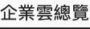
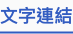
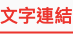
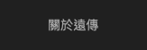

# Link

## TextLink - L

Hover動效: 文字範圍底部伸縮2px底線CSS緩動方式: 300ms, ease-in-out

<table>
  <thead>
    <tr>
      <th style="text-align:left"></th>
      <th style="text-align:left"></th>
    </tr>
  </thead>
  <tbody>
    <tr>
      <td style="text-align:left">
        <p>
          
        </p>
        <p>Default</p>
      </td>
      <td style="text-align:left">
        <p>
          
        </p>
        <p>Hover</p>
      </td>
    </tr>
  </tbody>
</table>

#### Code

具備連結功能的標題，可以導入網站主頁。在網頁內容中的 Panel 中，使用連結包入 &lt;h4/&gt;。



```jsx
import { Link } from 'react-route-dom';
import Panel from '../components/panel/Panel';

<Panel>
    <Link to="/your/link" className="sub-link-title">
        <h4>Your Link Text</h4>
    </Link>
</Panel>
```



[DEMO](http://fetnet-storybook.aja.com.tw/iframe.html?id=link--text-link-large) 

## Textlink - M

Hover動效: 文字範圍底部伸縮2px底線CSS緩動方式: 300ms, ease-in-out

<table>
  <thead>
    <tr>
      <th style="text-align:left">EBU</th>
      <th style="text-align:left"></th>
    </tr>
  </thead>
  <tbody>
    <tr>
      <td style="text-align:left">
        <p>
          
        </p>
        <p>Default</p>
      </td>
      <td style="text-align:left">
        <p>
          
        </p>
        <p>Hover</p>
      </td>
    </tr>
  </tbody>
</table>

<table>
  <thead>
    <tr>
      <th style="text-align:left">CBU</th>
      <th style="text-align:left"></th>
    </tr>
  </thead>
  <tbody>
    <tr>
      <td style="text-align:left">
        <p>
          
        </p>
        <p>Default</p>
      </td>
      <td style="text-align:left">
        <p>
          
        </p>
        <p>Hover</p>
      </td>
    </tr>
  </tbody>
</table>

#### Code

在頁面一般內容中使用。



```jsx
import { Link } from 'react-route-dom';


<Link to="/your/link">
    Your Link Text
</Link>
```



[DEMO](http://fetnet-storybook.aja.com.tw/iframe.html?id=link--text-link-medium)

## Menulink

Hover動效: 文字顏色漸變CSS緩動方式: 300ms, ease-in-out

<table>
  <thead>
    <tr>
      <th style="text-align:left">CBU</th>
      <th style="text-align:left"></th>
    </tr>
  </thead>
  <tbody>
    <tr>
      <td style="text-align:left">
        <p>
          
        </p>
        <p>Default</p>
      </td>
      <td style="text-align:left">
        <p>
          
        </p>
        <p>Hover</p>
      </td>
    </tr>
  </tbody>
</table>

<table>
  <thead>
    <tr>
      <th style="text-align:left">EBU</th>
      <th style="text-align:left"></th>
    </tr>
  </thead>
  <tbody>
    <tr>
      <td style="text-align:left">
        <p>
          
        </p>
        <p>Default</p>
      </td>
      <td style="text-align:left">
        <p>
          
        </p>
        <p>Hover</p>
      </td>
    </tr>
  </tbody>
</table>

#### Code

在 header 中，分為側邊欄，子選項等不同樣式。



```jsx
import { Link } from 'react-route-dom';
import LinkItem from '../../item/LinkItem';

<header>
    <Link to="/your/link">
        <h4>Your Link Text</h4>
    </Link>
    <LinkItem link={"/link/to/your/path"}>
        Your Link Text
    </LinkItem>
<header>
```



[DEMO](http://fetnet-storybook.aja.com.tw/iframe.html?id=link--menu-link)

## Footer Textlink

Hover動效：整體淡化 \(透明度 60%\)CSS緩動方式: 300ms, ease-in-out


<table>
  <thead>
    <tr>
      <th style="text-align:left"></th>
      <th style="text-align:left"></th>
    </tr>
  </thead>
  <tbody>
    <tr>
      <td style="text-align:left">
        <p>
          
        </p>
        <p>Default</p>
      </td>
      <td style="text-align:left">
        <p>
          
        </p>
        <p>Hover</p>
      </td>
    </tr>
    <tr>
      <td style="text-align:left">
        <p>
          
        </p>
        <p>Default &#x6DF1;&#x8272;&#x5E95;</p>
      </td>
      <td style="text-align:left">
        <p>
          
        </p>
        <p>Hover &#x6DF1;&#x8272;&#x5E95;</p>
      </td>
    </tr>
  </tbody>
</table>

#### Code



```jsx
import { Link } from 'react-route-dom';
import LinkItem from '../../item/LinkItem';

<footer>
    <Link to="/your/link">
        <h4>Your Link Text</h4>
    </Link>
</footer>
```



[DEMO](http://fetnet-storybook.aja.com.tw/iframe.html?id=link--footer-link)

