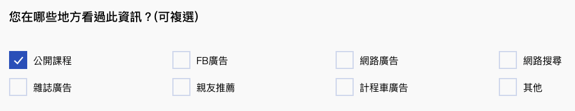
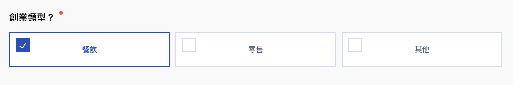
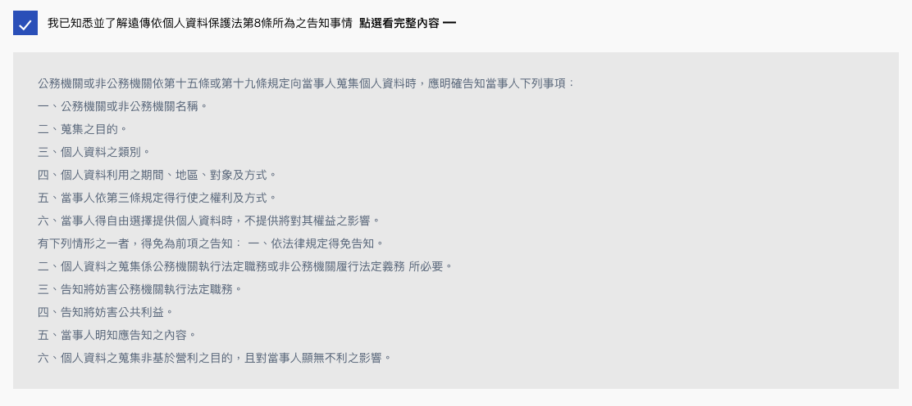

# Checkbox

## CheckboxButtons





```jsx
import CheckboxButtons from '../../components/form/CheckboxButtons';
import Formsy from 'formsy-react';

class Consultation extends React.Component {
  render () {
    return (
      <Formsy
        onValid={this.enableButton}
        onInvalidSubmit={this.disableButton}
        ref={this.form}>
        
          <CheckboxButtons
            label='您在哪些地方看過此資訊？(可複選)'
            name='resources'
            options={[
              { value: '1', label: '公開課程' },
              { value: '2', label: 'FB廣告' },
              { value: '3', label: '網路廣告' },
              { value: '4', label: '網路搜尋' },
              { value: '5', label: '雜誌廣告' },
              { value: '6', label: '親友推薦' },
              { value: '7', label: '計程車廣告' },
              { value: '8', label: '其他' },
            ]}
            onChange={this.onChange}
          />
          
      </Formsy>
    )
  }
}
```



```jsx
import React from 'react'
import { withFormsy } from 'formsy-react';
import PropTypes from 'prop-types';

class CheckboxButtons extends React.Component {
    constructor(props) {
        super(props);
        this.state ={ 
            required: this.props.required || false,
            options: this.props.options, 
            selected: this.props.default ? this.props.default.split(/,/g) : []
        }
        
    }

    componentDidMount() {
        if(this.props.default) {
            this.props.setValue(this.props.default);
        }
    }
    
    handleChange = (event) => {
        let selected = Object.assign(this.state.selected)
        let val = event.currentTarget.value
        if(event.currentTarget.checked) {
            selected.push(val)
        } else {
            selected.splice(selected.indexOf(val), 1)
        }
        // debugger
        this.setState({selected: selected})
        this.props.setValue(selected.length ? selected.toString() : null);
        this.props.onChange(this.props.name, this.state.selected);
    }


    render(){
        const errorMessage = this.props.getErrorMessage();
    
        return (
            <div className="form-group">
                <label className={this.state.required ? 'is-required' : ''}>{this.props.label}</label>
                <div className="checkbox-buttons">
                    {
                        this.props.options.map((opt, i) => (
                             <label className="checkbox" key={`checkbox-buttons-${this.props.name}-${i}`}>
                                <input 
                                type="checkbox" 
                                name={this.props.name} 
                                value={opt.value}
                                onChange={e => this.handleChange(e)}
                                checked={this.state.selected.indexOf(opt.value) > -1} />
                                <div className="content">{opt.label}</div>
                            </label>
                        ))
                    }
                </div>
                <div className="error-message">{errorMessage}</div>
            </div>
        );
    }
}

CheckboxButtons.propTypes = {
    required: PropTypes.bool,
    label: PropTypes.string.isRequired,
    name: PropTypes.string.isRequired,
    default: PropTypes.string,
    options: PropTypes.arrayOf(
        PropTypes.shape({
            value: PropTypes.string.isRequired,
            label: PropTypes.string.isRequired,
        })
    ),
    onChange: PropTypes.func
}

export default withFormsy(CheckboxButtons)
```



#### Properties

<table>
  <thead>
    <tr>
      <th style="text-align:left">&#x540D;&#x7A31;</th>
      <th style="text-align:left">&#x5C6C;&#x6027;</th>
      <th style="text-align:left">&#x5FC5;&#x586B;</th>
      <th style="text-align:left">&#x9078;&#x9805;</th>
      <th style="text-align:left">&#x8AAA;&#x660E;</th>
    </tr>
  </thead>
  <tbody>
    <tr>
      <td style="text-align:left">name</td>
      <td style="text-align:left">String</td>
      <td style="text-align:left">true</td>
      <td style="text-align:left"></td>
      <td style="text-align:left">&#x8F38;&#x5165;&#x6846;&#x540D;&#x7A31;</td>
    </tr>
    <tr>
      <td style="text-align:left">validations</td>
      <td style="text-align:left">String or Object</td>
      <td style="text-align:left"></td>
      <td style="text-align:left"></td>
      <td style="text-align:left">&#x9A57;&#x8B49;&#x689D;&#x4EF6;</td>
    </tr>
    <tr>
      <td style="text-align:left">validationError</td>
      <td style="text-align:left">String or Object</td>
      <td style="text-align:left"></td>
      <td style="text-align:left"></td>
      <td style="text-align:left">&#x932F;&#x8AA4;&#x8A0A;&#x606F;</td>
    </tr>
    <tr>
      <td style="text-align:left">required</td>
      <td style="text-align:left">Boolean</td>
      <td style="text-align:left"></td>
      <td style="text-align:left"></td>
      <td style="text-align:left">&#x662F;&#x5426;&#x70BA;&#x5FC5;&#x586B;</td>
    </tr>
    <tr>
      <td style="text-align:left">options</td>
      <td style="text-align:left">Array</td>
      <td style="text-align:left"></td>
      <td style="text-align:left">
        <p>{</p>
        <p>value,</p>
        <p>label</p>
        <p>}</p>
      </td>
      <td style="text-align:left"></td>
    </tr>
    <tr>
      <td style="text-align:left">label</td>
      <td style="text-align:left">String</td>
      <td style="text-align:left"></td>
      <td style="text-align:left"></td>
      <td style="text-align:left">&#x6A19;&#x984C;</td>
    </tr>
    <tr>
      <td style="text-align:left">value</td>
      <td style="text-align:left">String</td>
      <td style="text-align:left"></td>
      <td style="text-align:left"></td>
      <td style="text-align:left">&#x503C;</td>
    </tr>
    <tr>
      <td style="text-align:left">default</td>
      <td style="text-align:left">String</td>
      <td style="text-align:left"></td>
      <td style="text-align:left"></td>
      <td style="text-align:left">&#x9810;&#x8A2D;&#x503C;</td>
    </tr>
    <tr>
      <td style="text-align:left">onChange</td>
      <td style="text-align:left">Function</td>
      <td style="text-align:left"></td>
      <td style="text-align:left"></td>
      <td style="text-align:left">&#x8F38;&#x5165;&#x6846;&#x503C;&#x6539;&#x8B8A;&#x4E8B;&#x4EF6;</td>
    </tr>
  </tbody>
</table>

## CheckGroup





```jsx
import CheckGroup from '../../components/form/CheckGroup';
import Formsy from 'formsy-react';

class Form extends React.Component {
  render() {
    return (
      <Formsy
      className='fui-container'
      onValidSubmit={this.submit}
      onValid={this.enableButton}
      onInvalidSubmit={this.disableButton}
      noValidate
      ref={this.form}>
      
        <CheckGroup
        onChange={this.onChange}
        validationErrors={{ isDefaultRequiredValue: '您有興趣了解' }}
        label='您有興趣了解'
        name='your_need'
        required={this.state.form.your_need.required}
        default={this.state.form.your_need.value}
        options={[
          { value: '0', label: '遠傳AWS雲端服務' },
          { value: '1', label: '遠傳Azure雲端服務' },
          { value: '2', label: '遠傳Azure Stack雲端服務' },
          { value: '3', label: '遠傳GCP雲端服務' },
          { value: '4', label: '遠傳VMware雲端服務' },
          { value: '5', label: '遠傳雲端運算' },
          { value: '6', label: '遠傳雲端機房(IDC)' },
        ]}
        />
      </Formsy>
    )
  }
}
```



```jsx
import React from 'react';
import { withFormsy } from 'formsy-react';
import PropTypes from 'prop-types';

class CheckGroup extends React.Component {
  constructor(props) {
    super(props);
    this.state = {
      required: this.props.required || false,
      options: this.props.options,
      selected: this.props.default ? this.props.default.split(/,/g) : [],
    };

    this.handleChange = this.handleChange.bind(this);
  }

  componentDidMount() {
    if (this.props.default) {
      this.props.setValue(this.props.default);
    }
  }

  handleChange(event) {
    let selected = Object.assign(this.state.selected);
    let val = event.currentTarget.value;
    if (event.currentTarget.checked) {
      selected.push(val);
    } else {
      selected.splice(selected.indexOf(val), 1);
    }
    this.setState({ selected: selected });
    this.props.setValue(selected.length ? selected.toString() : null);
    this.props.onChange(this.props.name, this.state.selected);
  }

  render() {
    const errorMessage = this.props.getErrorMessage();

    return (
      <div className='form-group'>
        <label className={this.state.required ? 'is-required' : ''}>{this.props.label}</label>

        <div className='checkbox-group'>
          {this.props.options.map((option, i) => (
            <label className='checkbox is-icon-box' key={`checkbox-${this.props.name}-${i}`}>
              <input
                type='checkbox'
                name={this.props.name}
                value={option.value}
                onChange={this.handleChange}
                checked={this.state.selected.indexOf(option.value) > -1}
              />
              <div className='content'>
                {option.icon ? <div className='icon'>{option.icon}</div> : ''}
                <div className='text'>{option.label}</div>
              </div>
            </label>
          ))}
        </div>
        {!!errorMessage ? <span className='error-message'>{errorMessage}</span> : ''}
      </div>
    );
  }
}

CheckGroup.propTypes = {
  required: PropTypes.bool,
  label: PropTypes.string.isRequired,
  name: PropTypes.string.isRequired,
  default: PropTypes.string,
  options: PropTypes.arrayOf(
    PropTypes.shape({
      value: PropTypes.string.isRequired,
      label: PropTypes.string.isRequired,
    })
  ),
  onChange: PropTypes.func,
};

export default withFormsy(CheckGroup);

```



#### Properties

<table>
  <thead>
    <tr>
      <th style="text-align:left">&#x540D;&#x7A31;</th>
      <th style="text-align:left">&#x5C6C;&#x6027;</th>
      <th style="text-align:left">&#x5FC5;&#x586B;</th>
      <th style="text-align:left">&#x9078;&#x9805;</th>
      <th style="text-align:left">&#x8AAA;&#x660E;</th>
    </tr>
  </thead>
  <tbody>
    <tr>
      <td style="text-align:left">name</td>
      <td style="text-align:left">String</td>
      <td style="text-align:left">true</td>
      <td style="text-align:left"></td>
      <td style="text-align:left">&#x8F38;&#x5165;&#x6846;&#x540D;&#x7A31;</td>
    </tr>
    <tr>
      <td style="text-align:left">validations</td>
      <td style="text-align:left">String or Object</td>
      <td style="text-align:left"></td>
      <td style="text-align:left"></td>
      <td style="text-align:left">&#x9A57;&#x8B49;&#x689D;&#x4EF6;</td>
    </tr>
    <tr>
      <td style="text-align:left">validationError</td>
      <td style="text-align:left">String or Object</td>
      <td style="text-align:left"></td>
      <td style="text-align:left"></td>
      <td style="text-align:left">&#x932F;&#x8AA4;&#x8A0A;&#x606F;</td>
    </tr>
    <tr>
      <td style="text-align:left">required</td>
      <td style="text-align:left">Boolean</td>
      <td style="text-align:left"></td>
      <td style="text-align:left"></td>
      <td style="text-align:left">&#x662F;&#x5426;&#x70BA;&#x5FC5;&#x586B;</td>
    </tr>
    <tr>
      <td style="text-align:left">options</td>
      <td style="text-align:left">Array</td>
      <td style="text-align:left"></td>
      <td style="text-align:left">
        <p>{</p>
        <p>value,</p>
        <p>label</p>
        <p>}</p>
      </td>
      <td style="text-align:left"></td>
    </tr>
    <tr>
      <td style="text-align:left">label</td>
      <td style="text-align:left">String</td>
      <td style="text-align:left"></td>
      <td style="text-align:left"></td>
      <td style="text-align:left">&#x6A19;&#x984C;</td>
    </tr>
    <tr>
      <td style="text-align:left">value</td>
      <td style="text-align:left">String</td>
      <td style="text-align:left"></td>
      <td style="text-align:left"></td>
      <td style="text-align:left">&#x503C;</td>
    </tr>
    <tr>
      <td style="text-align:left">default</td>
      <td style="text-align:left">String</td>
      <td style="text-align:left"></td>
      <td style="text-align:left"></td>
      <td style="text-align:left">&#x9810;&#x8A2D;&#x503C;</td>
    </tr>
    <tr>
      <td style="text-align:left">onChange</td>
      <td style="text-align:left">Function</td>
      <td style="text-align:left"></td>
      <td style="text-align:left"></td>
      <td style="text-align:left">&#x8F38;&#x5165;&#x6846;&#x503C;&#x6539;&#x8B8A;&#x4E8B;&#x4EF6;</td>
    </tr>
  </tbody>
</table>

## CheckboxCollapse





```jsx
import CheckboxCollapse from '../../components/form/CheckboxCollapse';
import Formsy from 'formsy-react';

class Form extends React.Component {
  render() {
    return (
      <Formsy
      className='fui-container'
      onValidSubmit={this.submit}
      onValid={this.enableButton}
      onInvalidSubmit={this.disableButton}
      noValidate
      ref={this.form}>
      
        <CheckboxCollapse
          name='agree'
          required
          validationErrors={{ isDefaultRequiredValue: '請同意個人資料保護法第8條所為之告知事情' }}
          collapseContent={`
            <p>公務機關或非公務機關依第十五條或第十九條規定向當事人蒐集個人資料時，應明確告知當事人下列事項：</p>
            <p>
            一、公務機關或非公務機關名稱。<br/>
            二、蒐集之目的。<br/>
            三、個人資料之類別。<br/>
            四、個人資料利用之期間、地區、對象及方式。<br/>
            五、當事人依第三條規定得行使之權利及方式。<br/>
            六、當事人得自由選擇提供個人資料時，不提供將對其權益之影響。<br/>
            有下列情形之一者，得免為前項之告知：
            一、依法律規定得免告知。<br/>
            二、個人資料之蒐集係公務機關執行法定職務或非公務機關履行法定義務
                所必要。<br/>
            三、告知將妨害公務機關執行法定職務。<br/>
            四、告知將妨害公共利益。<br/>
            五、當事人明知應告知之內容。<br/>
            六、個人資料之蒐集非基於營利之目的，且對當事人顯無不利之影響。</p>
          `}
          label='我已知悉並了解遠傳依個人資料保護法第8條所為之告知事情'
          getCheckbox={e => this.onChange('agree', e)}
          checked={false}
        />
      </Formsy>
    )
  }
}
```



```jsx
import React from 'react'
import { withFormsy } from 'formsy-react';
import PropTypes from 'prop-types';

class CheckboxCollapse extends React.Component {
  constructor(props) {
    super(props);
    this.content = React.createRef();
    this.state = {
      submitted: false,
      isInvalid: false,
      contentHeight: 0,
      open: false,
      checked: this.props.getValue()
    }
  }

  componentDidMount() {
    this.setState({ contentHeight: this.content.current.children[0].clientHeight+20 });
  }

  componentDidUpdate() {
    if (this.props.isFormSubmitted() !== this.state.submitted) {
      this.setState({
        submitted: this.props.isFormSubmitted(),
        isInvalid: this.props.showRequired() || this.props.showError()
      })
    }

    if (this.props.getValue() !== this.state.checked) {
      this.setState({
        checked: this.props.getValue()
      })
    }
  }

  openDetail = event => {
    this.setState({
      open: !this.state.open
    })
  }

  handleChange = event => {
    this.setState({
      checked: event.currentTarget.checked
    })
    this.props.setValue(event.currentTarget.checked);
  }

  passCheckedVal = () => {
    this.props.getCheckbox(this.state.checked);
  }

  render() {

    const errorMessage = this.props.getErrorMessage();

    return (
      <div className={`fui-collapse is-collapse-checkbox ${this.state.open ? 'is-open' : ''}`}>
        <div className={`checkbox is-agreement`}>
          <input type="checkbox" onChange={this.handleChange} name={this.props.name} id={this.props.name} value='1' checked={this.props.getValue()} />
          <label htmlFor={this.props.name} className="content">
            {this.props.label}
          </label>
          <span className="collapse-trigger" onClick={this.openDetail}>
            <span className="text-sm">點選看完整內容</span>
            <i className={`icon-${this.state.open ? 'minus' : 'plus'}`}></i>
          </span>
        </div>
        <div ref={this.content} className="collapse-body mt-0" style={{ height: this.state.open ? this.state.contentHeight : 0 }}>
          <article dangerouslySetInnerHTML={{ __html: this.props.collapseContent }}></article>
        </div>
        {
          this.state.isInvalid ? (<span className="error-message">{errorMessage}</span>) : ''
        }
      </div>
    );
  }
}

CheckboxCollapse.propTypes = {
  name: PropTypes.string.isRequired,
  label: PropTypes.string.isRequired,
  collapseContent: PropTypes.string.isRequired,
  checked: PropTypes.bool,
  value: PropTypes.any,
  getCheckbox: PropTypes.func
}

export default withFormsy(CheckboxCollapse)
```



#### Properties

| 名稱 | 屬性 | 必填 | 選項 | 說明 |
| :--- | :--- | :--- | :--- | :--- |
| name | String | true |  | 輸入框名稱 |
| label | String |  |  | 標題 |
| collapseContent | Node |  |  | HTML 內容 |
| checked | Boolean |  |  | 是否選取 |
| validationError | String or Object |  |  | 錯誤訊息 |
| required | Boolean |  |  | 是否為必填 |
| getCheckbox | Function |  |  | 回傳選取狀態 |

