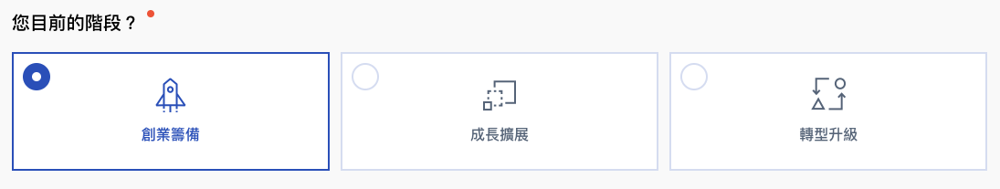
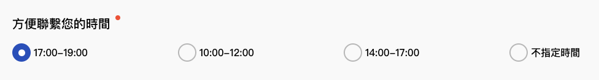

# Radio Button

## RadioGroup





```jsx
import CheckboxButtons from '../../components/form/CheckboxButtons';
import Formsy from 'formsy-react';

class Consultation extends React.Component {
  render () {
    return (
      <Formsy
        onValid={this.enableButton}
        onInvalidSubmit={this.disableButton}
        ref={this.form}>
        
          <RadioGroup
            validationErrors='請選擇階段'
            onChange={this.onChange}
            label='您目前的階段？'
            name='step'
            required={this.state.form.step.required}
            default={this.state.form.step.value}
            options={[
              {
                value: '0',
                label: '創業籌備',
                icon: {
                  default: '/resources/product/images/opt-1.png',
                  selected: '/resources/product/images/opt-1-selected.png',
                },
              },
              {
                value: '1',
                label: '成長擴展',
                icon: {
                  default: '/resources/product/images/opt-2.png',
                  selected: '/resources/product/images/opt-2-selected.png',
                },
              },
              {
                value: '2',
                label: '轉型升級',
                icon: {
                  default: '/resources/product/images/opt-3.png',
                  selected: '/resources/product/images/opt-3-selected.png',
                },
              },
            ]}
          />
          
      </Formsy>
    )
  }
}
```



```jsx
import React from 'react';
import { withFormsy } from 'formsy-react';
import PropTypes from 'prop-types';

class RadioGroup extends React.Component {
    constructor(props) {
        super(props);
        this.state = {
            required: this.props.required || false,
            options: this.props.options,
            selected: this.props.default || null
        }

        this.handleChange = this.handleChange.bind(this);
    }

    componentDidMount() {
        if (this.props.default) {
            this.props.setValue(this.props.default);
        }
    }

    handleChange(event) {
        //   debugger
        if (event.currentTarget.checked) {
            this.setState({ selected: event.currentTarget.value })
            this.props.setValue(this.state.selected);
            this.props.onChange(this.props.name, event.currentTarget.value)
        }
    }

    render() {
        const errorMessage = this.props.getErrorMessage();
        return (
            <div className="form-group">
                <label className={this.state.required ? 'is-required' : ''}>{this.props.label}</label>

                <div className="radio-group">
                    {
                        this.props.options.map((option, i) => (
                            <label className="radio is-icon-box" key={`radio-${this.props.name}-${i}`}>
                                <input type="radio"
                                    name={this.props.name}
                                    value={option.value}
                                    onChange={this.handleChange}
                                    checked={this.state.selected === option.value} />
                                <div className="content">
                                    {option.icon ?
                                        <div className="icon">
                                            
                                            
                                        </div> : ''
                                    }
                                    <div className="text">{option.label}</div>
                                </div>
                            </label>
                        ))
                    }
                </div>
                {!!errorMessage ? <span className="error-message">{errorMessage}</span> : null}
            </div>
        );
    }
}

RadioGroup.propTypes = {
    required: PropTypes.bool,
    label: PropTypes.string.isRequired,
    name: PropTypes.string.isRequired,
    default: PropTypes.string,
    options: PropTypes.arrayOf(
        PropTypes.shape({
            icon: PropTypes.shape({
                default: PropTypes.string,
                selected: PropTypes.string
            }),
            value: PropTypes.string.isRequired,
            label: PropTypes.string.isRequired,
        })
    ),
    onChange: PropTypes.func
}

export default withFormsy(RadioGroup)
```



#### Properties

<table>
  <thead>
    <tr>
      <th style="text-align:left">&#x540D;&#x7A31;</th>
      <th style="text-align:left">&#x5C6C;&#x6027;</th>
      <th style="text-align:left">&#x5FC5;&#x586B;</th>
      <th style="text-align:left">&#x9078;&#x9805;</th>
      <th style="text-align:left">&#x8AAA;&#x660E;</th>
    </tr>
  </thead>
  <tbody>
    <tr>
      <td style="text-align:left">name</td>
      <td style="text-align:left">String</td>
      <td style="text-align:left">true</td>
      <td style="text-align:left"></td>
      <td style="text-align:left">&#x8F38;&#x5165;&#x6846;&#x540D;&#x7A31;</td>
    </tr>
    <tr>
      <td style="text-align:left">validations</td>
      <td style="text-align:left">String or Object</td>
      <td style="text-align:left"></td>
      <td style="text-align:left"></td>
      <td style="text-align:left">&#x9A57;&#x8B49;&#x689D;&#x4EF6;</td>
    </tr>
    <tr>
      <td style="text-align:left">validationError</td>
      <td style="text-align:left">String or Object</td>
      <td style="text-align:left"></td>
      <td style="text-align:left"></td>
      <td style="text-align:left">&#x932F;&#x8AA4;&#x8A0A;&#x606F;</td>
    </tr>
    <tr>
      <td style="text-align:left">required</td>
      <td style="text-align:left">Boolean</td>
      <td style="text-align:left"></td>
      <td style="text-align:left"></td>
      <td style="text-align:left">&#x662F;&#x5426;&#x70BA;&#x5FC5;&#x586B;</td>
    </tr>
    <tr>
      <td style="text-align:left">label</td>
      <td style="text-align:left">String</td>
      <td style="text-align:left"></td>
      <td style="text-align:left"></td>
      <td style="text-align:left">&#x6A19;&#x984C;</td>
    </tr>
    <tr>
      <td style="text-align:left">options</td>
      <td style="text-align:left">Array</td>
      <td style="text-align:left"></td>
      <td style="text-align:left">
        <p>{</p>
        <p>value: String,</p>
        <p>label: String,</p>
        <p>icon: {</p>
        <p>default,</p>
        <p>selected</p>
        <p>}</p>
        <p>}</p>
      </td>
      <td style="text-align:left"></td>
    </tr>
    <tr>
      <td style="text-align:left">default</td>
      <td style="text-align:left">String</td>
      <td style="text-align:left"></td>
      <td style="text-align:left"></td>
      <td style="text-align:left">&#x9810;&#x8A2D;&#x503C;</td>
    </tr>
    <tr>
      <td style="text-align:left">onChange</td>
      <td style="text-align:left">Function</td>
      <td style="text-align:left"></td>
      <td style="text-align:left"></td>
      <td style="text-align:left">&#x8F38;&#x5165;&#x6846;&#x503C;&#x6539;&#x8B8A;&#x4E8B;&#x4EF6;</td>
    </tr>
  </tbody>
</table>

## RadioButtons





```jsx
import RadioButtons from '../../components/form/RadioButtons';
import Formsy from 'formsy-react';

class Consultation extends React.Component {
  render () {
    return (
      <Formsy
        onValid={this.enableButton}
        onInvalidSubmit={this.disableButton}
        ref={this.form}>
        
          <RadioButtons
            label='方便聯繫您的時間'
            required
            validationErrors={{ isDefaultRequiredValue: '請選擇方便聯繫您的時間' }}
            name='contact_time'
            options={[
              { value: '3', label: '17:00-19:00' },
              { value: '1', label: '10:00-12:00' },
              { value: '2', label: '14:00-17:00' },
              { value: '0', label: '不指定時間' },
            ]}
            selected='3'
            getSelected={e => this.onChange('contact_time', e)}
          />
      </Formsy>
    )
  }
}
```



```jsx
import { withFormsy } from 'formsy-react';
import PropTypes from 'prop-types';
import React from 'react';

class RadioButtons extends React.Component {
  constructor(props) {
    super(props);

    this.state = {
      submitted: false,
      isInvalid: false,
      options: this.props.options,
      selected: this.props.selected || '',
    };
    this.handleChange = this.handleChange.bind(this);
    this.passSelectedOption = this.passSelectedOption.bind(this);
  }

  componentDidMount() {
    this.props.setValue(this.props.selected);
  }

  componentDidUpdate(nextProps) {
    // console.log('value', this.props.getValue(), 'nextProps', nextProps.selected, 'props.selected', this.props.selected, 'state.selected',this.state.selected)
    if (this.props.getValue() !== this.state.selected) {
      this.props.setValue(this.props.selected)
      this.setState({
        selected: this.props.selected
      })
    }
    if (this.props.isFormSubmitted() !== this.state.submitted) {
      this.setState({
        submitted: this.props.isFormSubmitted(),
        isInvalid: this.props.showError(),
      });
    }
  }

  handleChange = event => {
    this.setState({
      selected: event.currentTarget.value
    });
    this.props.setValue(event.currentTarget.value);
    this.setState({
      isInvalid: this.props.showError(),
    });
    window.addEventListener('click', this.passSelectedOption);
  };

  passSelectedOption = () => {
    this.props.getSelected(this.state.selected);
  };

  mappingOption = () => {
    return this.props.options.map(option => (
      <label className='radio-button' key={`radio-button-${this.props.name}-${option.label}`}>
        <p>{option.label}</p>
        <input
          type='radio'
          value={option.value}
          checked={option.value === this.state.selected}
          name={this.props.name}
          onChange={this.handleChange}
        />
        <span className='checkmark'></span>
      </label>
    ));
  };

  render() {
    const errorMessage = this.props.getErrorMessage();

    return (
      <div className='form-group'>
        {!!this.props.label ? (
          <label htmlFor={`input-${this.props.name}`} className={this.props.required ? 'is-required' : ''}>
            {this.props.label}
          </label>
        ) : (
          ''
        )}
        {/* {this.props.label ? <label>{this.props.label}</label> : ''} */}
        <div className='radio-buttons'>
          <div className='radio-group'>{this.mappingOption()}</div>
        </div>
        {this.state.isInvalid ? <span className='error-message'>{errorMessage}</span> : ''}
      </div>
    );
  }
}

RadioButtons.propTypes = {
  label: PropTypes.string,
  name: PropTypes.string.isRequired,
  options: PropTypes.arrayOf(
    PropTypes.shape({
      label: PropTypes.string,
      value: PropTypes.string,
    })
  ).isRequired,
  selected: PropTypes.string,
  getSelected: PropTypes.func,
};

export default withFormsy(RadioButtons);

```



#### Properties

<table>
  <thead>
    <tr>
      <th style="text-align:left">&#x540D;&#x7A31;</th>
      <th style="text-align:left">&#x5C6C;&#x6027;</th>
      <th style="text-align:left">&#x5FC5;&#x586B;</th>
      <th style="text-align:left">&#x9078;&#x9805;</th>
      <th style="text-align:left">&#x8AAA;&#x660E;</th>
    </tr>
  </thead>
  <tbody>
    <tr>
      <td style="text-align:left">name</td>
      <td style="text-align:left">String</td>
      <td style="text-align:left">true</td>
      <td style="text-align:left"></td>
      <td style="text-align:left">&#x8F38;&#x5165;&#x6846;&#x540D;&#x7A31;</td>
    </tr>
    <tr>
      <td style="text-align:left">validations</td>
      <td style="text-align:left">String or Object</td>
      <td style="text-align:left"></td>
      <td style="text-align:left"></td>
      <td style="text-align:left">&#x9A57;&#x8B49;&#x689D;&#x4EF6;</td>
    </tr>
    <tr>
      <td style="text-align:left">validationError</td>
      <td style="text-align:left">String or Object</td>
      <td style="text-align:left"></td>
      <td style="text-align:left"></td>
      <td style="text-align:left">&#x932F;&#x8AA4;&#x8A0A;&#x606F;</td>
    </tr>
    <tr>
      <td style="text-align:left">required</td>
      <td style="text-align:left">Boolean</td>
      <td style="text-align:left"></td>
      <td style="text-align:left"></td>
      <td style="text-align:left">&#x662F;&#x5426;&#x70BA;&#x5FC5;&#x586B;</td>
    </tr>
    <tr>
      <td style="text-align:left">options</td>
      <td style="text-align:left">Array</td>
      <td style="text-align:left"></td>
      <td style="text-align:left">
        <p>{</p>
        <p>label: String,</p>
        <p>value: String</p>
        <p>}</p>
      </td>
      <td style="text-align:left">&#x9078;&#x9805;</td>
    </tr>
    <tr>
      <td style="text-align:left">label</td>
      <td style="text-align:left">String</td>
      <td style="text-align:left"></td>
      <td style="text-align:left"></td>
      <td style="text-align:left">&#x6A19;&#x984C;</td>
    </tr>
    <tr>
      <td style="text-align:left">selected</td>
      <td style="text-align:left">String</td>
      <td style="text-align:left"></td>
      <td style="text-align:left"></td>
      <td style="text-align:left">&#x9810;&#x8A2D;&#x503C;</td>
    </tr>
    <tr>
      <td style="text-align:left">getSelected</td>
      <td style="text-align:left">Function</td>
      <td style="text-align:left"></td>
      <td style="text-align:left"></td>
      <td style="text-align:left">&#x8F38;&#x5165;&#x6846;&#x503C;&#x6539;&#x8B8A;&#x4E8B;&#x4EF6;</td>
    </tr>
  </tbody>
</table>

