# FETNET AEM UI

## Summary
- [FETNET AEM UI](#fetnet-aem-ui)
  - [Summary](#summary)
  - [Container](#container)
  - [網格系統](#網格系統)
  - [修改樣式](#修改樣式)
  - [文字樣式](#文字樣式)
  - [顯示方式](#顯示方式)
  - [文字對齊](#文字對齊)
  - [間距](#間距)
  - [顏色](#顏色)
  - [連結](#連結)
  - [表格](#表格)
  - [按鈕](#按鈕)
  - [清單](#清單)
  - [Panel](#panel)
  - [圖片](#圖片)
  - [牌卡](#牌卡)

--- 

## Container

內容預設範圍，寬度為畫面 100%，當瀏覽器大於 960px 則為畫面的 90%，最大不超過 1200px。

```html
<div class='fui-container'></div>
```

--- 

## 網格系統

**瀏覽器斷點**
| 斷點名稱 | Breakpoint |
| :--- | :--- |
| sm | >= 600px |
| md | >= 960px |
| lg | >= 1200px |
| xl | >= 1920px |

- `MuiGrid-container` 可設定 `MuiGrid-spacing-{size}-{1 ~ 6}` 增加欄位間距
- Grid column 可設定 1 ~ 12 並根據需要修改設定 `sm`、`md`、`lg`、`xl` 等尺寸的欄位寬度。

**SAMPLE**
```html
<div class='MuiGrid-root MuiGrid-container MuiGrid-spacing-xs-2'>
  <div class='MuiGrid-root MuiGrid-item MuiGrid-grid-md-6'>
  </div>
  <div class='MuiGrid-root MuiGrid-item MuiGrid-grid-md-6'>
  </div>
</div>
```

--- 

## 修改樣式

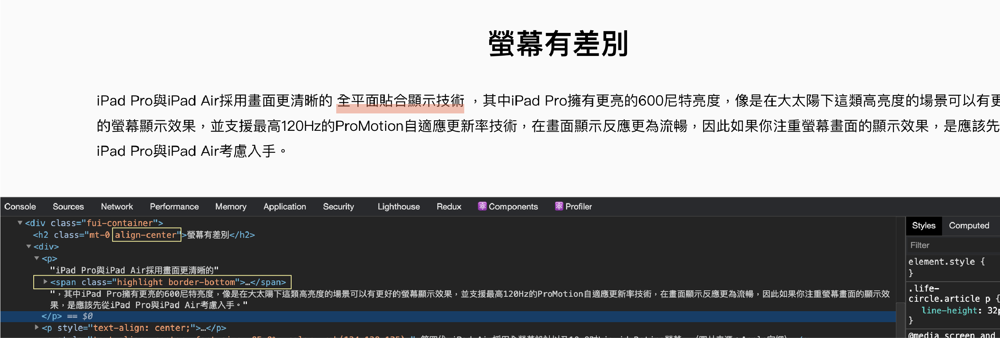

在更新前可使用瀏覽器 debug mode 多測試樣式效果及使用方式。

--- 

## 文字樣式
<table>
  <tr>
   <td><strong>樣式名稱</strong>
   </td>
   <td colspan="2" ><strong>說明</strong>
   </td>
  </tr>
  <tr>
   <td>p, .text, .body-1
   </td>
   <td colspan="2" ><strong>字級：</strong>16px(1rem)，<strong>行距：</strong>28px

**使用範例**
```html
<p>
  一般內文
</p>

<div class='body-1'>一般內文</div>

<div class='text'>一般內文</div>
```
   </td>
  </tr>
  <tr>
   <td>h1, .heading-1
   </td>
   <td colspan="2" ><strong>字級：</strong>32px，<strong>行距：</strong>32px

**使用範例**
```html
<h1>
  Heading1 文字
</h1>
<div class='heading-1'></div>
```
   </td>
  </tr>
  <tr>
   <td>h2, .heading-2
   </td>
   <td colspan="2" ><strong>字級：</strong>28px，<strong>行距：</strong>42px
   </td>
  </tr>
  <tr>
   <td>h3, .heading-3
   </td>
   <td colspan="2" ><strong>字級：</strong>24px，<strong>行距：</strong>36px
   </td>
  </tr>
  <tr>
   <td>h4, .heading-4
   </td>
   <td colspan="2" ><strong>字級：</strong>22px，<strong>行距：</strong>33px
   </td>
  </tr>
  <tr>
   <td>h5, .heading-5
   </td>
   <td colspan="2" ><strong>字級：</strong>20px，<strong>行距：</strong>30px
   </td>
  </tr>
  <tr>
   <td>h6, .heading-6, .subtitle
   </td>
   <td colspan="2" ><strong>字級：</strong>18px，<strong>行距：</strong>27px
   </td>
  </tr>
  <tr>
   <td>.body
   </td>
   <td colspan="2" ><strong>字級：</strong>18px，<strong>行距：</strong>32px
   </td>
  </tr>
  <tr>
   <td>small, .text-sm, .body-2
   </td>
   <td colspan="2" ><strong>字級：</strong>14px，<strong>行距：</strong>24px
   </td>
  </tr>
  <tr>
   <td>.text-mini
   </td>
   <td colspan="2" ><strong>字級：</strong>12px
   </td>
  </tr>
  <tr>
   <td>.is-text-bold
   </td>
   <td colspan="2" ><strong>字重：</strong>600
   </td>
  </tr>
  <tr>
   <td>.is-text-medium
   </td>
   <td colspan="2" ><strong>字重：</strong>500
   </td>
  </tr>
  <tr>
   <td>.is-text-regular
   </td>
   <td colspan="2" ><strong>字重：</strong>400
   </td>
  </tr>
  <tr>
   <td>.is-text-light
   </td>
   <td colspan="2" ><strong>字重：</strong>300
   </td>
  </tr>
  <tr>
   <td>.highlight.border-bottom
   </td>
   <td colspan="2" >
  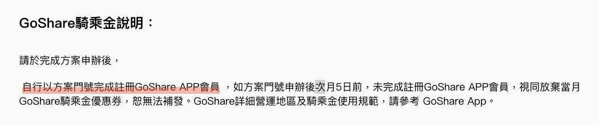

**SAMPLE**
```
<p>
  一個段落裡<span class='highlight border-bottom'>要 highlight 的文字</span>
</p>
```
   </td>
  </tr>
</table>

--- 

## 顯示方式
<table>
  <tr>
   <td width='300'><strong>樣式名稱</strong>
   </td>
   <td><strong>說明</strong>
   </td>
  </tr>
  <tr>
   <td>d-inline, d-{size}-inline
   </td>
   <td rowspan="7" colspan="2" >對應到 CSS 中 display 的設定，建議對 CSS 較熟悉的再使用，剛開始只要使用 inline、 inline-block、block、none 就可以了。
<p>

**使用範例：** 
`<span class='d-none d-md-block'>小網隱藏、大網顯示</span>`
   </td>
  </tr>
  <tr>
   <td>d-inline-block, d-{size}-inline-block
   </td>
  </tr>
  <tr>
   <td>d-block, d-{size}-block
   </td>
  </tr>
  <tr>
   <td>d-table, d-{size}-table
   </td>
  </tr>
  <tr>
   <td>d-flex, d-{size}-flex
   </td>
  </tr>
  <tr>
   <td>d-inline-flex, d-{size}-inline-flex
   </td>
  </tr>
  <tr>
   <td>d-none, d-{size}-none
   </td>
  </tr>
</table>

--- 

## 文字對齊
<table>
  <tr>
   <td><strong>樣式名稱</strong>
   </td>
   <td><strong>說明</strong>
   </td>
   <td><strong>備註</strong>
   </td>
  </tr>
  <tr>
   <td>align-center, align-center-{size}
   </td>
   <td>置中對齊
   </td>
   <td rowspan="6" >可參考<strong>瀏覽器斷點</strong>，在斷點以上的尺寸就會使用相關設定。

使用範例
```html
<div class='align-right'>
  文字會靠右對齊
</div>

<h1 class='align-center'>
  文字置中對齊
</h1>
```
   </td>
  </tr>
  <tr>
   <td>align-left, align-left-{size}
   </td>
   <td>靠左對齊
   </td>
  </tr>
  <tr>
   <td>align-right, align-right-{size}
   </td>
   <td>靠右對齊
   </td>
  </tr>
  <tr>
   <td>float-left, float-left-{size}
   </td>
   <td>區塊向左浮動
   </td>
  </tr>
  <tr>
   <td>float-right, float-right-{size}
   </td>
   <td>區塊向右浮動
   </td>
  </tr>
  <tr>
   <td>float-middle, float-middle-{size}
   </td>
   <td>區塊置中
   </td>
  </tr>
</table>

--- 

## 間距
<table>
  <tr>
   <td><strong>樣式名稱</strong>
   </td>
   <td><strong>說明</strong>
   </td>
  </tr>
  <tr>
   <td>m{dir}-{size}-{0-10}
   </td>
   <td rowspan="6" >

**m：** margin | **p：** padding 

**數字：** 1 ~ 10，以 8px 為單位

**dir(方向)**
**t：** 上  |  **b：** 下  |  **l：** 左  |  **r：** 右  |  **x：** 左右間距  |  **y：** 上下間距 
 
**size：** 可參考**瀏覽器斷點**，在斷點以上的尺寸就會使用相關設定。

**使用範例：**
`<span class='mt-5'>上方間距增加 40px</span>`
`<span class='py-0'>左右空間 0</span>`

   </td>
  </tr>
  <tr>
   <td rowspan="5" >p{dir}-{size}-{0-10}
   </td>
  </tr>
  <tr>
  </tr>
  <tr>
  </tr>
  <tr>
  </tr>
  <tr>
  </tr>
</table>

## 顏色

<table>
  <tr>
   <td><strong>樣式名稱</strong>
   </td>
   <td><strong>說明</strong>
   </td>
  </tr>
  <tr>
   <td>is-text-{color}
   </td>
   <td rowspan="2" ><strong>color：</strong>帶入顏色名稱，可設定文字或背景顏色

**範例：**
`<span class='is-text-gray50'>文字是灰色的</span>`
`<span class='is-bg-navy100 is-text-white'>深藍底白字</span>`
   </td>
  </tr>
  <tr>
   <td>is-bg-{color}
   </td>
  </tr>
</table>

--- 

## 連結
連結樣式主要用字啊 AEM、CBU 環境中。
| 樣式名稱 | 範例 | 範例(Hover) | 說明 |
| :--- | :--- | :--- | :--- |
| .underline-link | 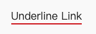 |  | 加上 ` is-text-black50` 可變成黑色底線 |
| .hover-underline-link | 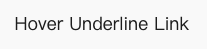 | 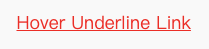 |  |
| .animation-underline |  | 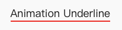 | 底線會由左至右動態滑出 |

**SAMPLE**
```html
<a href='your/link' class='underline-link'>Underline Link</a>

<a href='your/link' class='hover-underline-link'>Hover Underline Link</a>

<a href='your/link' class='animation-underline'>Animation Underline</a>

```
---
## 表格

表格遵照 HTML 規則撰寫即可，對於內容較多，小網需要捲軸呈現的可使用 `fui-table-response`。
```html
<div className="fui-table-response">
  <table>
    <thead>
      <tr>
        <th>購買門號</th>
        <th>方案名稱</th>
        <th>金額</th>
      </tr>
    </thead>
    <tbody>
      <tr>
        <td>0926-899-868</td>
        <td>超4代易付180MB_60天_$180(1.2GB組合)</td>
        <td>$180.00</td>
      </tr>
    </tbody>
  </table>
</div>
```
---

## 按鈕

| 範例 | 樣式名稱 | 尺寸選項 | 其他選項 | 說明 |
| :--- | :--- | :--- | :--- | :--- |
|  | .is-primary | .is-large<br>.is-small | is-disabled |  |
|  | .is-primary.is-reverse | .is-large<br>.is-small | is-disabled |  |
| 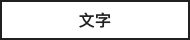 | .is-secondary | .is-large<br>.is-small | is-disabled |  |
|  | .is-secondary.is-reverse | .is-large<br>.is-small | is-disabled |  |
|  | .is-arrow |  |  |  |
|  | .is-text | is-small |  |  |
|  | .is-tag |  |  |  |
|  | .is-label |  |  |  |

**SAMPLE**

按鈕 HTML 中，文字必須用 `<span class='text'>...</span>` 包住，避免要搭配 icon 及圖片時對齊跑掉。

```html
<a class="fui-button is-primary">
  <span class='text'>Button</span>
</a>

<a class="fui-button is-secondary is-reverse" disabled>
  <span class="text">Button</span>
</a>

<a class="fui-button is-secondary is-reverse is-disabled" >
  <span class="text">Button</span>
</a>

<a class="fui-button is-text">
  <span class="text">Button</span>
  <i class="icon-chevron-right"></i>
</a>
```

---

## 清單
<table>
  <tr>
    <th> 範例
    <th> HTML
  <tr>
    <td> 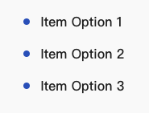
    <td>

```html
<div class="fui-list ">

  <div class="fui-item  ">
    <span class="prefix"><i class="bulleted-dot"></i></span>
    <span class="content">文字內容</span>
  </div>
  
</div>
```
  <tr>
    <td>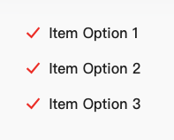
    <td>

```html
<div class="fui-list ">
  <!-- Copy area start -->
  <div class="fui-item  ">
    <span class="prefix"><i class="is-text-accent icon-check"></i></span>
    <span class="content">文字內容</span>
  </div>
  <!-- Copy area end -->
</div>
```
  <tr>
    <td>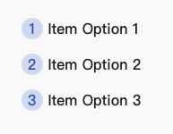
    <td>

```html
<div class="fui-list ">
  <!-- Copy area start -->
  <div class="fui-item  ">
    <span class="prefix"><i class="number">1</i></span>
    <span class="content">文字內容</span>
  </div>
  <!-- Copy area end -->
</div>
```
</table>

---

## Panel

Panel 可搭配前面的樣式設定修改間距或背景文字顏色。

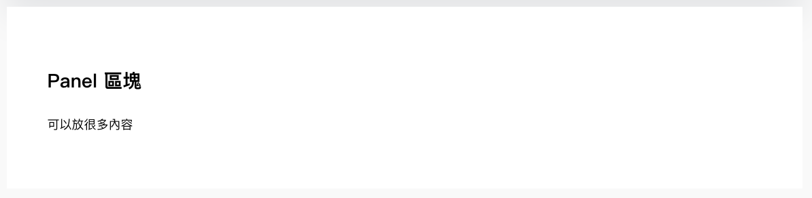

```html
<div class='fui-panel'>
  <!-- 放入你要的 HTML -->
</div>
```

---

## 圖片

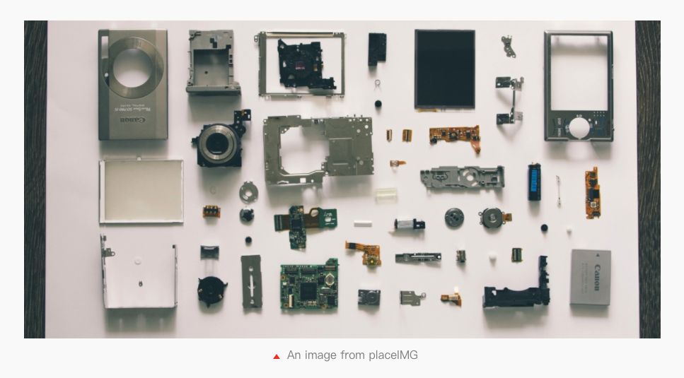

```html
<figure class="fui-figure ">
  
   <figcaption>An image from placeIMG</figcaption>
</figure>
```

---

## 牌卡

**單一牌卡**
```html
<div class="fui-card">
  <a class="fui-card-action" href="#">
    <div class="fui-card-image">
      
    </div>
    <div class="fui-card-caption">
      <div class="fui-card-content">
        <h5 class="fui-card-title">青春無價，就要給你學生價！
        </h5>
        <p class="fui-card-description">
          488上網標到飽，＋100把超夯手機、3C $0帶回家！
        </p>
      </div>
      <div class="fui-card-extra">
        <div class="fui-button is-arrow mb-0 ">看更多</div>
      </div>
    </div>
  </a>
</div>
```

**整組牌卡**


| 樣式名稱 | 說明 |
| :--- | :--- |
| .no-scrollbar | 小網時牌卡往下排列，不然預設出現左右捲軸 |
| .two-card | 一列顯示 2 張牌卡 |
| .three-card | 一列顯示 3 張牌卡 |
| .four-card | 一列顯示 4 張牌卡 |

```html
<div class='fui-container'>
  <div class='fui-cards three-card no-scrollbar'>
    <div class="fui-card">
      <a rel="noopener" class="fui-card-action" href="#">
        <div class="fui-card-image">
          
        </div>
        <div class="fui-card-caption">
          <div class="fui-card-content">
            <h5 class="fui-card-title">青春無價，就要給你學生價！
            </h5>
            <p class="fui-card-description">
              488上網標到飽，＋100把超夯手機、3C $0帶回家！
            </p>
          </div>
          <div class="fui-card-extra">
            <div class="fui-button is-arrow mb-0 ">看更多</div>
          </div>
        </div>
      </a>
    </div>
    <div class="fui-card">
      ...
    </div>
    <div class="fui-card">
      ...
    </div>
  </div>
</div>
```