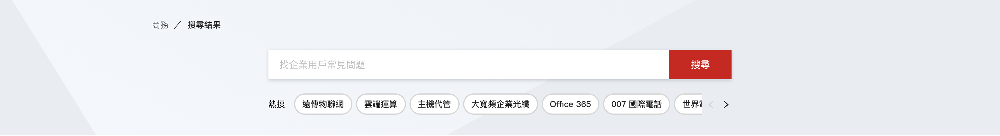
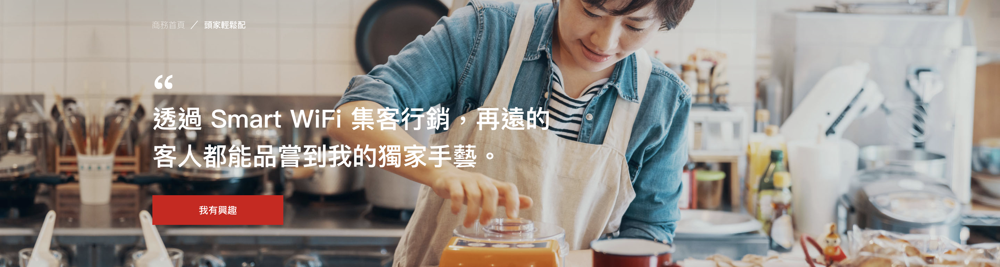

# Banner

## SectionBanner1

主視覺banner模組, 可依需求修改欄位:  
1. 大標: 大網限制最多3行  
2. 按鈕: 文字最大字符串長度&lt;20 \(20個字元\)  
3.更換背景圖: 大網 1920\*470px 小網750\*900px \(小網實際顯示尺寸375\*450px\)













```jsx
import SectionBanner1 from '../components/partials/banner/SectionBanner1';

<SectionBanner1
    image={
      md: '/resources/product/images/ebu-aws-banner.png',
      sm: '/resources/product/images/ebu-aws-banner-mb.jpg'
    }
    title='導入遠傳AWS雲端託管，讓您不再投入大量資金與人力維護傳統機房。'
    action={{ text: '免費諮詢', link: '#' }}
/>
```



```jsx
import React from 'react';
import Button from '../../Button';

import PropTypes from 'prop-types';

const SectionBanner1 = props => {
  const [isMobile, setIsMobile] = React.useState(window.innerWidth < 768);

  React.useEffect(() => {
    window.addEventListener('resize', e => {
      setIsMobile(window.innerWidth < 768)
    })
  })

  return (
    <section
      className='fui-banner is-product is-section-banner-1'
      style={{
        backgroundImage: `url(${isMobile ? props.image.sm : props.image.md})`,
      }}>
      <div className='fui-container'>
        <div className='caption'>
          <h1 className='mt-0 with-quote'>{props.title}</h1>
          <Button {...props.action} btnStyle='primary'>
            {props.action.text}
          </Button>
        </div>
      </div>
    </section>
  );
};

SectionBanner1.propTypes = {
  title: PropTypes.string,
  image: PropTypes.shape({
    md: PropTypes.string,
    sm: PropTypes.string,
  }),
  action: PropTypes.shape({
    icon: PropTypes.string,
    link: PropTypes.string,
    text: PropTypes.string,
  }),
  onChange: PropTypes.func,
};

export default SectionBanner1;

```



#### Properties

<table>
  <thead>
    <tr>
      <th style="text-align:left">&#x540D;&#x7A31;</th>
      <th style="text-align:left">&#x5C6C;&#x6027;</th>
      <th style="text-align:left">&#x5FC5;&#x586B;</th>
      <th style="text-align:left">&#x9078;&#x9805;</th>
      <th style="text-align:left">&#x8AAA;&#x660E;</th>
    </tr>
  </thead>
  <tbody>
    <tr>
      <td style="text-align:left">image</td>
      <td style="text-align:left">String</td>
      <td style="text-align:left">true</td>
      <td style="text-align:left"></td>
      <td style="text-align:left">image:{md: &apos;/resources/product/images/ebu-aws-banner.png&apos;, sm:
        &apos;/resources/product/images/ebu-aws-banner-mb.jpg&apos;}</td>
    </tr>
    <tr>
      <td style="text-align:left">HTML</td>
      <td style="text-align:left"></td>
      <td style="text-align:left"></td>
      <td style="text-align:left">&#x6A19;&#x984C;&#xFF0C;&#x53EF;&#x4F7F;&#x7528; HTML</td>
      <td style="text-align:left"></td>
    </tr>
    <tr>
      <td style="text-align:left">action</td>
      <td style="text-align:left">Object</td>
      <td style="text-align:left"></td>
      <td style="text-align:left">
        <p>{</p>
        <p>link: String,</p>
        <p>text: String</p>
        <p>}</p>
      </td>
      <td style="text-align:left">&#x6309;&#x9215;&#x6A23;&#x5F0F;&#x70BA; primary</td>
    </tr>
  </tbody>
</table>

## SectionBanner2

主視覺banner模組, 可依需求修改欄位:  
1. 大標: 最大字符串長度&lt;30 \(30個字元\), 大網建議最多1行  
2. 小標: 文字最大字符串長度&lt;60 \(60個字元\), 大網建議最多1行  
3. 按鈕: 文字最大字符串長度&lt;20 \(20個字元\)  
4. 更換背景圖 \(1920x470px\)













```jsx
import SectionBanner2 from '../components/partials/banner/SectionBanner2';

<SectionBanner2
  image={{
    md: '/resources/ebu/images/ebu-telephone-banner-1440x460.jpg',
    sm: '/resources/ebu/images/ebu-telephone-banner-sm.jpg',
  }}
  title='市內電話輕鬆省'
  description='遠傳市話推出超值優惠方案，節省成本同時享有優質通話品質！'
  action={{
    text: '免費諮詢',
    link: '#',
  }}
/>
```



```jsx
import React from 'react';
import Button from '../../Button'

import PropTypes from 'prop-types'

class SectionBanner2 extends React.Component {
    // console.log(color)
    render() {
        return (
            <section className="fui-banner is-product is-style-2">
                <div className="banner-img">
                    <div className="d-none d-sm-block" style={{ backgroundImage: `url(${this.props.image.md})` }}></div>
                    <div className="d-block d-sm-none" style={{ backgroundImage: `url(${this.props.image.sm})` }}></div>
                </div>
                {/* 
                 */}
                <div className="fui-container">
                    <div className="caption">
                        <h1 className="my-0" dangerouslySetInnerHTML={{ __html: this.props.title }}></h1>
                        <p className="subtitle mt-0" dangerouslySetInnerHTML={{ __html: this.props.description }}></p>
                        {
                            this.props.action ? (
                                <Button {...this.props.action} btnStyle='primary'>{this.props.action.text}</Button>
                            ) : null
                        }
                    </div>
                </div>
            </section>
        )
    }
}

SectionBanner2.propTypes = {
    title: PropTypes.string,
    description: PropTypes.string,
    image: PropTypes.shape({
        md: PropTypes.string,
        retinaMd: PropTypes.string,
        sm: PropTypes.string,
        retinaSm: PropTypes.string
    }),
    action: PropTypes.shape({
        icon: PropTypes.string,
        link: PropTypes.string,
        text: PropTypes.string
    }),
    onChange: PropTypes.func
}

export default SectionBanner2;
```



#### Properties

<table>
  <thead>
    <tr>
      <th style="text-align:left">&#x540D;&#x7A31;</th>
      <th style="text-align:left">&#x5C6C;&#x6027;</th>
      <th style="text-align:left">&#x5FC5;&#x586B;</th>
      <th style="text-align:left">&#x9078;&#x9805;</th>
      <th style="text-align:left">&#x8AAA;&#x660E;</th>
    </tr>
  </thead>
  <tbody>
    <tr>
      <td style="text-align:left">image</td>
      <td style="text-align:left">Object</td>
      <td style="text-align:left"></td>
      <td style="text-align:left">
        <p>{
          <br />md,</p>
        <p>retinaMd,
          <br />sm,</p>
        <p>retinaSm
          <br />}</p>
      </td>
      <td style="text-align:left">
        <p>retinaMd, retinaSm</p>
        <p>&#x70BA;&#x7D66; retina display &#x4F7F;&#x7528;&#xFF0C;</p>
        <p>&#x82E5;&#x6C92;&#x63D0;&#x4F9B;&#xFF0C;&#x9810;&#x8A2D;&#x6703;&#x4F7F;&#x7528;
          md, sm</p>
      </td>
    </tr>
    <tr>
      <td style="text-align:left">title</td>
      <td style="text-align:left">HTML</td>
      <td style="text-align:left">true</td>
      <td style="text-align:left"></td>
      <td style="text-align:left">&#x6A19;&#x984C;&#xFF0C;&#x53EF;&#x5E36;&#x5165; HTML</td>
    </tr>
    <tr>
      <td style="text-align:left">description</td>
      <td style="text-align:left">HTML</td>
      <td style="text-align:left"></td>
      <td style="text-align:left"></td>
      <td style="text-align:left">&#x526F;&#x6A19;&#xFF0C;&#x53EF;&#x5E36;&#x5165; HTML</td>
    </tr>
    <tr>
      <td style="text-align:left">actions</td>
      <td style="text-align:left">Object</td>
      <td style="text-align:left"></td>
      <td style="text-align:left">
        <p>{</p>
        <p>text: String,</p>
        <p>link: String</p>
        <p>}</p>
      </td>
      <td style="text-align:left">&#x6309;&#x9215;&#x9023;&#x7D50;&#x8207;&#x6587;&#x5B57;</td>
    </tr>
  </tbody>
</table>

## SectionBanner3











## FormBanner

主視覺banner模組, 可依需求修改欄位:  
 1. 大標: 大網最多2行.   
2. 更換背景圖 \(大網1920x240px /小網750x340px\)













```jsx
import FormBanner from '../components/partials/banner/FormBanner';

<FormBanner
  title='聯絡我們'
  image={{
    sm: '/resources/help-center/images/ebu-survey-banner-sm.jpg',
    md: '/resources/help-center/images/ebu-survey-banner.jpg',
  }}
/>
```



```jsx
import React from 'react';

import PropTypes from 'prop-types';

class FormBanner extends React.Component {
    constructor(props) {
        super(props)
        this.state = {
            bg: this.props.image.md
        }
    }
    componentDidMount() {
        this.setState({
            bg: (window.innerWidth < 640) ? this.props.image.sm : this.props.image.md
        })

        window.addEventListener('resize', e => {
            this.setState({
                bg: (window.innerWidth < 640) ? this.props.image.sm : this.props.image.md
            })
        })
    }
    render() {
        return (
            <section className="fui-banner is-form" style={{
                backgroundImage: `url(${this.state.bg})`
            }}>
                <div className="fui-container">
                    <h1>{this.props.title}</h1>
                </div>
            </section>
        )
    }
}

FormBanner.propTypes = {
    image: PropTypes.shape({
        sm: PropTypes.string.isRequired,
        md: PropTypes.string.isRequired
    }).isRequired,
    title: PropTypes.string.isRequired
}
export default FormBanner;
```



#### Properties

| 名稱 | 屬性 | 必填 | 選項   | 說明 |
| :--- | :--- | :--- | :--- | :--- |
| image | Object |  | {   md,   sm } |  |
| title | String | true |  | 標題 |

## EsectionList

大網標題文字框固定寬度, 標題限制行數=2, 條列文字限制10則. 背景圖隨著區塊高度等比延展並且靠右對齊。  
小網標題文字框100%\(左右padding=15px\), 條列文字限制10則. 背景圖高度=450px, 寬度等比縮放, 並且靠右對齊。













```javascript
import ESectionList from '../components/partials/ESectionList';

export const whyFetnet = {
  title: '為何選擇遠傳作為您的雲端夥伴？',
  image: '/resources/product/images/aws-content-image.jpg',
  layout: 'image-right',
  content: {
    type: 'item',
    prefix: 'check',
    list: [
      { content: '具有代理AWS的代管服務合作夥伴資格 (Managed Service Partner, MSP)' },
      { content: '前瞻性的顧問服務，同時擁有專業證照認證，將成為您最信賴的合作夥伴' },
      { content: '提供優異的資訊安全服務，讓您不必再多花時間與預算尋找第三方供應商' },
      { content: '規劃完整一站式服務，提供多元雲端解決方案，解決企業客戶客製化需求' },
      { content: '按您的使用量計費，用多少、付多少，彈性的費用讓帳單更透明' },
      { content: '擁有對IT環境建置的完整專業知識以及發展策略的豐富經驗' },
      { content: '24 小時不間斷的網路及設備監控中心與專業維運人員' },
    ],
  },
};

<ESectionList {...Mock.whyFetnet} />
```



```jsx
import React from 'react';
import {Grid} from '@material-ui/core';
import Item from '../item/Item';

import PropTypes from 'prop-types';

class ESectionList extends React.Component {
    constructor(props) {
        super(props);
        this.state = {
            style: this.props.bgStyle || 'default'
        }
    }

    render() {
        return (
            <section className={`fui-content-image is-section-list is-${this.props.layout}`} id={this.props.id}>
                
                <div className="fui-container">
                    <Grid container spacing={1}>
                        <Grid item xs={12} sm={12} md={7}>
                            <h3>{this.props.title}</h3>
                            {
                                this.props.content.type==='item' ? (
                                    this.props.content.list.map((item,i) => (
                                        <Item key={`content-image-${i}`} prefix={this.props.content.prefix}>{item.content}</Item>
                                    ))
                                ) : (<div className="text" dangerouslySetInnerHTML={{__html: this.props.content}}></div>)
                            }
                        </Grid>
                    </Grid>
                </div>
            </section>
        )
    }
}

ESectionList.propTypes = {
    bgStyle: PropTypes.string,
    layout: PropTypes.string,
    retinaImage: PropTypes.string,
    image: PropTypes.string,
    title: PropTypes.string,
    content: PropTypes.oneOfType([
        PropTypes.string,
        PropTypes.shape({
            type: PropTypes.string,
            prefix: PropTypes.string,
            list: PropTypes.arrayOf(
                PropTypes.objectOf(Item)
            )
        })
    ])
}

export default ESectionList;
```



#### Properties

<table>
  <thead>
    <tr>
      <th style="text-align:left">&#x540D;&#x7A31;</th>
      <th style="text-align:left">&#x5C6C;&#x6027;</th>
      <th style="text-align:left">&#x5FC5;&#x586B;</th>
      <th style="text-align:left">&#x9078;&#x9805;</th>
      <th style="text-align:left">&#x8AAA;&#x660E;</th>
    </tr>
  </thead>
  <tbody>
    <tr>
      <td style="text-align:left">retinaImage</td>
      <td style="text-align:left">String</td>
      <td style="text-align:left"></td>
      <td style="text-align:left"></td>
      <td style="text-align:left"></td>
    </tr>
    <tr>
      <td style="text-align:left">image</td>
      <td style="text-align:left">String</td>
      <td style="text-align:left">true</td>
      <td style="text-align:left"></td>
      <td style="text-align:left"></td>
    </tr>
    <tr>
      <td style="text-align:left">title</td>
      <td style="text-align:left">String</td>
      <td style="text-align:left"></td>
      <td style="text-align:left"></td>
      <td style="text-align:left"></td>
    </tr>
    <tr>
      <td style="text-align:left">content</td>
      <td style="text-align:left">String or Object</td>
      <td style="text-align:left"></td>
      <td style="text-align:left">
        <p>HTML String</p>
        <p></p>
        <p>{
          <br />type: String
          <br />prefix: String,
          <br />content: String
          <br />}</p>
      </td>
      <td style="text-align:left">
        <p>&#x4F7F;&#x7528; type &#x505A;&#x5224;&#x65B7;</p>
        <p>&#x82E5;&#x6C92;&#x6709; type&#xFF0C;&#x5247;&#x76F4;&#x63A5;&#x4F7F;&#x7528;
          HTML</p>
        <p>&#x6709; type&#xFF0C;&#x5247;&#x5E36;&#x5165;&#x7684;&#x5E36;&#x5165;
          <a
          href="https://app.gitbook.com/@ajacreative/s/fetnet-1/~/drafts/-M1UkYttoQWiI6NSJVz2/elements/item">Item</a>
        </p>
      </td>
    </tr>
  </tbody>
</table>

## EbuBanner














```javascript
import EbuBanner from '../components/partials/banner/EbuBanner';

<EbuBanner {...bannerTab} />

export const bannerTab = {
  tabs: {
    name: 'EbuBannerTab',
    list: [
      {
        link: '/ebu/index-micro',
        name: 'tab-1',
        icon: '/resources/ebu/icons/ebu-micro.svg',
        focusIcon: '/resources/ebu/icons/ebu-micro-focus.svg',
        label: '微型企業',
      },
      {
        link: '/ebu/index-medium',
        name: 'tab-2',
        icon: '/resources/ebu/icons/ebu-medium.svg',
        focusIcon: '/resources/ebu/icons/ebu-medium-focus.svg',
        label: '中小企業',
      },
      {
        link: '/ebu/index-large',
        name: 'tab-3',
        icon: '/resources/ebu/icons/ebu-corp.svg',
        focusIcon: '/resources/ebu/icons/ebu-corp-focus.svg',
        label: '大型企業',
      },
      {
        link: '/ebu/index-public',
        name: 'tab-4',
        icon: '/resources/ebu/icons/ebu-public.svg',
        focusIcon: '/resources/ebu/icons/ebu-public-focus.svg',
        label: '公部門',
      },
    ],
  },
  tabContent: [
    {
      image: {
        md: '/resources/ebu/images/ebu-micro-bkg-1440x620.jpg',
        sm: '/resources/ebu/images/banner/ebu-micro-banner-sm@2x.jpg',
      },
      content: {
        title: '頭家輕鬆配<br/>幫您策劃開店的大小事！',
        actions: [
          {
            text: '策劃去',
            link: '#',
          },
          {
            text: '免費諮詢',
            link: '#',
          },
        ],
      },
    },
    {
      image: {
        md: '/resources/ebu/images/banner/ebu-medium-banner.jpg',
        sm: '/resources/ebu/images/banner/ebu-medium-banner-sm@2x.jpg',
      },
      content: {
        title: '別再追隨別人的腳步<br/>將資金用在對的科技上 ',
        actions: [
          {
            text: '策劃去',
            link: '#',
          },
          {
            text: '免費諮詢',
            link: '#',
          },
        ],
      },
    },
    {
      image: {
        md: '/resources/ebu/images/banner/ebu-large-banner.jpg',
        sm: '/resources/ebu/images/banner/ebu-large-banner-sm.jpg',
      },
      subOption: [
        {
          md: '/resources/ebu/images/banner/ebu-large-banner.jpg',
          sm: '/resources/ebu/images/banner/ebu-large-banner-sm.jpg',
        },
        {
          md: '/resources/ebu/images/banner/ebu-public-banner.jpg',
          sm: '/resources/ebu/images/banner/ebu-public-banner-sm.jpg',
        },
        {
          md: '/resources/ebu/images/banner/ebu-large-banner.jpg',
          sm: '/resources/ebu/images/banner/ebu-large-banner-sm.jpg',
        },
        {
          md: '/resources/ebu/images/banner/ebu-public-banner.jpg',
          sm: '/resources/ebu/images/banner/ebu-public-banner-sm.jpg',
        }
      ],
      content: {
        dropdown: [
          { text: '擁抱物聯網 創造全新價值 ', value: '/ebu/index' },
          { text: '別再追隨別人將資金用在對的科技上 ', value: '/ebu/index' },
          { text: '創造全新價值 ', value: '/ebu/index' },
          { text: '別再追隨別人的腳步將資金用在對的科技上 ', value: '/ebu/index' },
        ],
        actions: [
          {
            text: '了解更多',
            link: '/ebu/index',
          },
        ],
      },
    },
    {
      image: {
        md: '/resources/ebu/images/banner/ebu-public-banner.jpg',
        sm: '/resources/ebu/images/banner/ebu-public-banner-sm.jpg',
      },
      subOption: [
        {
          md: '/resources/ebu/images/banner/ebu-public-banner.jpg',
          sm: '/resources/ebu/images/banner/ebu-public-banner-sm.jpg',
        },
        {
          md: '/resources/ebu/images/banner/ebu-large-banner.jpg',
          sm: '/resources/ebu/images/banner/ebu-large-banner-sm.jpg',
        },
        {
          md: '/resources/ebu/images/banner/ebu-large-banner.jpg',
          sm: '/resources/ebu/images/banner/ebu-large-banner-sm.jpg',
        },
        {
          md: '/resources/ebu/images/banner/ebu-public-banner.jpg',
          sm: '/resources/ebu/images/banner/ebu-public-banner-sm.jpg',
        }
      ],
      content: {
        dropdown: [
          { text: '打造智慧城市 實現台灣科技島', value: '/ebu/index' },
          { text: '別再追隨別人將資金用在對的科技上 ', value: '/ebu/index' },
          { text: '擁抱物聯網 ', value: '/ebu/index' },
          { text: '別再追隨別人的腳步將資金用在對的科技上 ', value: '/ebu/index' },
        ],
        actions: [
          {
            text: '深入了解',
            link: '/ebu/index',
          },
        ],
      },
    },
  ],
};


```



```javascript
import React from 'react';
import Tab from '../../tab/Tab';
import Button from '../../Button';
import Dropdown from '../../Dropdown';

import PropTypes from 'prop-types';

const EbuBanner = props => {
  const banner = React.createRef();
  const [currentTab, setCurrentTab] = React.useState(0);
  const [isFade, setIsFade] = React.useState(false);
  const [selectItem, setSelectItem] = React.useState(null);
  const [subTab, setSubTab] = React.useState([-1, -1, 0, 0]);

  React.useEffect(() => {
    let pathname = window.location.pathname;
    let sub = []
    props.tabs.list.map((tab, i) => {
      if (tab.link === pathname) {
        setCurrentTab(i);
      }

      sub[i] = props.tabContent[i].subOption ? 0 : -1;
    });
    setSubTab(sub)
  }, [props.tabs.list, props.tabContent]);

  const handleChange = newValue => {
    setIsFade(true);
    setCurrentTab(newValue);

    if (props.onChange) props.onChange(newValue);
    setTimeout(() => {
      setIsFade(false);
    }, 600);
  };

  const dropdownChange = (item, idx) => {
    let sub = Object.assign(subTab);
    sub[currentTab] = idx;
    let selectedBanner = banner.current.getElementsByClassName('fui-banner-bg')[currentTab];
    selectedBanner.classList.add('fade-out')
    setSubTab(sub)
    setSelectItem(item);
    setTimeout(() => {
      selectedBanner.classList.remove('fade-out')
    }, 500)
  };

  return (
    <section className={`fui-banner fui-ebu ${isFade ? 'fade' : ''}`} ref={banner}>
      {props.tabContent.map((tab, idx) => (
        <div key={`banner-bg-${idx}`} className={`fui-banner-bg ${currentTab === idx ? 'is-active' : ''}`}>
          
          
          
          
        </div>
      ))}
      <div className='fui-container'>
        <div className='fui-tab-container'>
          <div className='fui-tab-header'>
            <Tab icon={true} {...props.tabs} onChange={handleChange} />
          </div>
          <div className='fui-tab-body'>
            {props.tabContent.map((tab, idx) => (
              <div
                className={`fui-tab-pane ${currentTab === idx ? 'is-active' : ''}`}
                key={`tabbody-${idx}`}
                role='tabpanel'
                id={`simple-tabpanel-${idx}`}
                aria-labelledby={`simple-tab-${idx}`}>
                <div className='tab-content'>
                  {tab.content.title ? (
                    <h3 className='tab-title' dangerouslySetInnerHTML={{ __html: tab.content.title }}></h3>
                  ) : (
                    ''
                  )}

                  {tab.content.dropdown ? (
                    <Dropdown
                      className='for-banner'
                      list={tab.content.dropdown}
                      label={!selectItem ? tab.content.dropdown[0].text : selectItem.text}
                      arrow={true}
                      hasCheck={true}
                      onChange={dropdownChange}
                    />
                  ) : (
                    ''
                  )}

                  {tab.content.actions ? (
                    <div className='action'>
                      {tab.content.actions.map((elem, i) => (
                        <Button
                          key={`ebu-banner-action-${i}`}
                          {...elem}
                          className='is-large'
                          btnStyle={i === 0 ? 'primary' : 'secondary'}
                          link={!selectItem ? elem.link : selectItem.value}>
                          {elem.text}
                        </Button>
                      ))}
                    </div>
                  ) : (
                    ''
                  )}
                </div>
              </div>
            ))}
          </div>
        </div>
      </div>
    </section>
  );
};

EbuBanner.propTypes = {
  tabs: PropTypes.shape({
    name: PropTypes.string,
    list: PropTypes.arrayOf(
      PropTypes.shape({
        link: PropTypes.string,
        icon: PropTypes.string,
        focusIcon: PropTypes.string,
        label: PropTypes.string.isRequired,
      })
    ),
  }),
  tabContent: PropTypes.arrayOf(
    PropTypes.shape({
      subOption: PropTypes.arrayOf(
        PropTypes.shape({
          md: PropTypes.string,
          retinaMd: PropTypes.string,
          sm: PropTypes.string,
          retinaSm: PropTypes.string,
        })
      ),
      image: PropTypes.shape({
        md: PropTypes.string,
        retinaMd: PropTypes.string,
        sm: PropTypes.string,
        retinaSm: PropTypes.string,
      }),
      content: PropTypes.shape({
        title: PropTypes.string,
        actions: PropTypes.arrayOf(PropTypes.objectOf(Button)),
      }),
    })
  ),
  onChange: PropTypes.func,
};

export default EbuBanner;

```



#### Properties

<table>
  <thead>
    <tr>
      <th style="text-align:left">&#x540D;&#x7A31;</th>
      <th style="text-align:left">&#x5C6C;&#x6027;</th>
      <th style="text-align:left">&#x5FC5;&#x586B;</th>
      <th style="text-align:left">&#x9078;&#x9805;</th>
      <th style="text-align:left">&#x8AAA;&#x660E;</th>
    </tr>
  </thead>
  <tbody>
    <tr>
      <td style="text-align:left">tabs</td>
      <td style="text-align:left">Object</td>
      <td style="text-align:left"></td>
      <td style="text-align:left">
        <p>{</p>
        <p>name: string,</p>
        <p>list: array
          <br />link: string,
          <br />name: string,
          <br />icon: string,
          <br />focusIcon: string,
          <br />text: string,</p>
        <p>}</p>
      </td>
      <td style="text-align:left">&#x53EF;&#x53C3;&#x8003; <a href="https://app.gitbook.com/@ajacreative/s/fetnet-1/~/drafts/-M1UkYttoQWiI6NSJVz2/components/tab">Tab</a>
      </td>
    </tr>
    <tr>
      <td style="text-align:left">tabContent</td>
      <td style="text-align:left">Array</td>
      <td style="text-align:left"></td>
      <td style="text-align:left">
        <p>{</p>
        <p> <b>image</b>: {
          <br /> <b>md</b>: string,
          <br /> <b>sm</b>: string</p>
        <p>},</p>
        <p> <b>subOption</b>: [</p>
        <p>{</p>
        <p> <b>md</b>: string,</p>
        <p> <b>sm</b>: string</p>
        <p>}</p>
        <p>],</p>
        <p> <b>content</b>: {</p>
        <p> <b>title</b>: String,</p>
        <p> <b>dropdown</b>: [</p>
        <p>{</p>
        <p>text: string</p>
        <p>value: string</p>
        <p>}</p>
        <p>],</p>
        <p> <b>actions</b>: [</p>
        <p>{</p>
        <p>text: string</p>
        <p>link: string</p>
        <p>}</p>
        <p>]</p>
        <p>}</p>
        <p>}</p>
      </td>
      <td style="text-align:left">
        <p>image &#x5FC5;&#x586B;
          <br />
        </p>
        <p><b>subOption</b> 
          <br />&#x82E5; content &#x6709; dropdown&#xFF0C;
          <br />&#x5247;&#x4F7F;&#x7528; subOption &#x5207;&#x63DB;&#x5716;&#x7247;&#x3002;
          <br
          />
          <br /><b>content<br /></b>title &#x6216; dropdown
          <br />&#x4E8C;&#x64C7;&#x4E00;&#x4F7F;&#x7528;</p>
        <p></p>
        <p>&#x82E5;&#x4F7F;&#x7528; dropdown&#xFF0C;
          <br />&#x6309;&#x9215;&#x6703;&#x8207;&#x4E0B;&#x62C9;&#x9078;&#x55AE;&#x9023;&#x52D5;&#xFF0C;&#x4E0D;&#x9700;&#x5E36;&#x5165;
          link</p>
      </td>
    </tr>
  </tbody>
</table>

## HelpCenterBanner




```jsx
import HelpCenterBanner from '../components/partials/banner/HelpCenterBanner';

<HelpCenterBanner
  title={"需要什麼幫助?"}
  bgImg={{
    sm: "/resources/help-center/images/ebu-helpcenter-home-banner-sm.jpg",
    md: "/resources/help-center/images/ebu-helpcenter-home-banner.jpg",
  }}
  keyword={{
    defaultKeyword: [
      'Gogoro',
      'Gogoro 699',
      'google',
      'GPS',
      'GPS Google',
      'Gogo',
      'GoPro',
      'Geo',
      'SEO',
      'OPPO',
    ],
    path: '/help-center/search',
    placeholder: '找企業用戶常見問題'
  }}
  hot={{
    path: '/help-center',
    hotword: [
      '遠傳物聯網',
      '雲端運算',
      '主機代管',
      '大寬頻企業光纖',
      'Office 365',
      '007 國際電話',
      '世界電話國碼',
      '世界電話國碼',
      '世界電話國碼',
      '世界電話國碼',
    ]
  }}
/>
```



```jsx
import React from 'react';
import { Grid } from '@material-ui/core';
import KeywordInput from '../../KeywordInput';
import HotWord from '../../HotWord';
import PropTypes from 'prop-types';

class HelpCenterBanner extends React.Component {
  constructor(props) {
    super(props);
    this.state = {
      keyword: '',
      isMobile: window.innerWidth < 768,
    };
  }

  componentDidMount() {
    window.addEventListener('resize', e => {
      this.setState({
        isMobile: window.innerWidth < 768
      })
    })
  }

  render() {
    return (
      <div className='fui-banner is-help-center' style={{
        backgroundImage: `url(${this.state.isMobile ? this.props.bgImg.sm : this.props.bgImg.md})`
      }}>
        <div className='caption'>
          <div className='fui-container'>
            <Grid container justify='center'>
              <Grid item xs={12} sm={10} md={8}>
                <h1>{this.props.title}</h1>

                <KeywordInput
                  keyword={this.state.keyword}
                  {...this.props.keyword}
                />

                <HotWord {...this.props.hot} />
              </Grid>
            </Grid>
          </div>
        </div>
      </div>
    )
  }
}

HelpCenterBanner.propTypes = {
  title: PropTypes.string,
  bgImg: {
    md: PropTypes.string,
    sm: PropTypes.string
  },
  keyword: {
    defaultKeyword: PropTypes.arrayOf(
      PropTypes.string
    ),
    path: PropTypes.string,
    placeholder: PropTypes.string
  },
  hot: {
    hotword: PropTypes.arrayOf(
      PropTypes.string
    ),
    path: PropTypes.string
  }
}

export default HelpCenterBanner;
```



#### Properties

<table>
  <thead>
    <tr>
      <th style="text-align:left">&#x540D;&#x7A31;</th>
      <th style="text-align:left">&#x5C6C;&#x6027;</th>
      <th style="text-align:left">&#x5FC5;&#x586B;</th>
      <th style="text-align:left">&#x9078;&#x9805;</th>
      <th style="text-align:left">&#x8AAA;&#x660E;</th>
    </tr>
  </thead>
  <tbody>
    <tr>
      <td style="text-align:left">title</td>
      <td style="text-align:left">String</td>
      <td style="text-align:left"></td>
      <td style="text-align:left"></td>
      <td style="text-align:left"></td>
    </tr>
    <tr>
      <td style="text-align:left">bgImg</td>
      <td style="text-align:left">Object</td>
      <td style="text-align:left"></td>
      <td style="text-align:left">
        <p>{
          <br /> <b>md</b>: string</p>
        <p><b>  sm</b>: string</p>
        <p>}</p>
      </td>
      <td style="text-align:left">&#x5206;&#x5927;&#x5C0F;&#x7DB2;&#x51FA;&#x5716;</td>
    </tr>
    <tr>
      <td style="text-align:left">keyword</td>
      <td style="text-align:left">Object</td>
      <td style="text-align:left"></td>
      <td style="text-align:left">{
        <br /> <b>defaultKeyword</b>: array
        <br /> <b>path</b>: string
        <br /> <b>placeholder</b>: string
        <br />}</td>
      <td style="text-align:left">
        <p><b>defaultKeyword</b> 
        </p>
        <p>&#x9810;&#x8A2D;&#x95DC;&#x9375;&#x5B57;
          <br />
        </p>
        <p><b>path</b> 
          <br />&#x9EDE;&#x64CA;&#x641C;&#x5C0B;&#x5F8C;&#x8981;&#x5E36;&#x5165;&#x7684;&#x9801;&#x9762;</p>
        <p></p>
        <p><b>placeholder</b> &#x63D0;&#x793A;&#x8AAA;&#x660E;</p>
      </td>
    </tr>
    <tr>
      <td style="text-align:left">hot</td>
      <td style="text-align:left">Object</td>
      <td style="text-align:left"></td>
      <td style="text-align:left">{
        <br /> <b>hotword</b>: array
        <br /> <b>path</b>: string
        <br />}</td>
      <td style="text-align:left"><b>path</b> &#x9EDE;&#x64CA;&#x95DC;&#x9375;&#x5B57;&#x8981;&#x5C0E;&#x5165;&#x7684;&#x9801;&#x9762;</td>
    </tr>
  </tbody>
</table>

## SearchBanner





```jsx
import SearchBanner from '../components/partials/banner/SearchBanner'

<SearchBanner
  bgImg={{
    md: "/resources/common/images/ebu-banner-search.png",
    sm: "/resources/common/images/ebu-banner-search.png"
  }}
  keyword={{
    defaultKeyword: [
      'Gogoro',
      'Gogoro 699',
      'google',
      'GPS',
      'GPS Google',
      'Gogo',
      'GoPro',
      'Geo',
      'SEO',
      'OPPO',
    ],
    path: '/search',
    placeholder: '找企業用戶常見問題'
  }}
  hot={{
    path: '/search',
    hotword: [
      '遠傳物聯網',
      '雲端運算',
      '主機代管',
      '大寬頻企業光纖',
      'Office 365',
      '007 國際電話',
      '世界電話國碼',
      '世界電話國碼',
      '世界電話國碼',
      '世界電話國碼',
    ]
  }}
/>
```



```jsx
import React from 'react';
import { Grid } from '@material-ui/core';
import KeywordInput from '../../KeywordInput';
import HotWord from '../../HotWord';
import PropTypes from 'prop-types';

class SearchBanner extends React.Component {
  constructor(props) {
    super(props);
    this.state = {
      keyword: '',
      isMobile: window.innerWidth < 768,
    };
  }

  componentDidMount() {
    window.addEventListener('resize', e => {
      this.setState({
        isMobile: window.innerWidth < 768
      })
    })
  }

  render () {
    return (
      <section className='fui-banner is-search' style={{
        backgroundImage: `url(${this.state.isMobile ? this.props.bgImg.sm : this.props.bgImg.md})`
      }}>
        <div className="fui-container">
          <Grid container justify='center'>
            <Grid item xs={12} sm={12} md={8}>
              <KeywordInput
                keyword={this.state.keyword}
                {...this.props.keyword}
              />

              <HotWord {...this.props.hot} />
            </Grid>
          </Grid>
        </div>
      </section>
    )
  }
}

SearchBanner.propTypes = {
  bgImg: {
    md: PropTypes.string,
    sm: PropTypes.string
  },
  keyword: {
    defaultKeyword: PropTypes.arrayOf(
      PropTypes.string
    ),
    path: PropTypes.string,
    placeholder: PropTypes.string
  },
  hot: {
    hotword: PropTypes.arrayOf(
      PropTypes.string
    ),
    path: PropTypes.string
  }
}

export default SearchBanner;
```



#### Properties

<table>
  <thead>
    <tr>
      <th style="text-align:left">&#x540D;&#x7A31;</th>
      <th style="text-align:left">&#x5C6C;&#x6027;</th>
      <th style="text-align:left">&#x5FC5;&#x586B;</th>
      <th style="text-align:left">&#x9078;&#x9805;</th>
      <th style="text-align:left">&#x8AAA;&#x660E;</th>
    </tr>
  </thead>
  <tbody>
    <tr>
      <td style="text-align:left">title</td>
      <td style="text-align:left">String</td>
      <td style="text-align:left"></td>
      <td style="text-align:left"></td>
      <td style="text-align:left"></td>
    </tr>
    <tr>
      <td style="text-align:left">bgImg</td>
      <td style="text-align:left">Object</td>
      <td style="text-align:left"></td>
      <td style="text-align:left">
        <p>{
          <br /> <b>md</b>: string</p>
        <p><b>  sm</b>: string</p>
        <p>}</p>
      </td>
      <td style="text-align:left">&#x5206;&#x5927;&#x5C0F;&#x7DB2;&#x51FA;&#x5716;</td>
    </tr>
    <tr>
      <td style="text-align:left">keyword</td>
      <td style="text-align:left">Object</td>
      <td style="text-align:left"></td>
      <td style="text-align:left">{
        <br /> <b>defaultKeyword</b>: array
        <br /> <b>path</b>: string
        <br /> <b>placeholder</b>: string
        <br />}</td>
      <td style="text-align:left">
        <p><b>defaultKeyword</b> 
        </p>
        <p>&#x9810;&#x8A2D;&#x95DC;&#x9375;&#x5B57;
          <br />
        </p>
        <p><b>path</b> 
          <br />&#x9EDE;&#x64CA;&#x641C;&#x5C0B;&#x5F8C;&#x8981;&#x5E36;&#x5165;&#x7684;&#x9801;&#x9762;</p>
        <p></p>
        <p><b>placeholder</b> &#x63D0;&#x793A;&#x8AAA;&#x660E;</p>
      </td>
    </tr>
    <tr>
      <td style="text-align:left">hot</td>
      <td style="text-align:left">Object</td>
      <td style="text-align:left"></td>
      <td style="text-align:left">{
        <br /> <b>hotword</b>: array
        <br /> <b>path</b>: string
        <br />}</td>
      <td style="text-align:left"><b>path</b> &#x9EDE;&#x64CA;&#x95DC;&#x9375;&#x5B57;&#x8981;&#x5C0E;&#x5165;&#x7684;&#x9801;&#x9762;</td>
    </tr>
  </tbody>
</table>

## SolutionBanner





```jsx
import SolutionBanner from '../components/partials/banner/SolutionBanner';

<SolutionBanner 
image={{
  md: '/resources/ebu/images/ebu-solution-2.jpg',
  sm: '/resources/ebu/images/ebu-solution-2-sm.jpg',
}} 
title='聰明的iPad POS收銀系統，讓我隨時分析銷售數據，有效地管理訂單。' 
action={{
  text: '我有興趣',
  link: '#',
}}/>

```



```jsx
import React from 'react';
import Button from '../../Button';

import PropTypes from 'prop-types';

const SolutionBanner = props => {
  return (
    <section className='fui-banner is-solution'>
      
      
      <div className='caption'>
        <div className='fui-container'>
          <h1 className='with-quote'>{props.title}</h1>
          <Button btnStyle='primary' link={props.action.link}>
            {props.action.text}
          </Button>
        </div>
      </div>
    </section>
  );
};

SolutionBanner.propTypes = {
  title: PropTypes.string,
  image: PropTypes.shape({
    md: PropTypes.string,
    sm: PropTypes.string,
  }),
  action: PropTypes.shape({
    icon: PropTypes.string,
    link: PropTypes.string,
    text: PropTypes.string,
  }),
  onChange: PropTypes.func,
};

export default SolutionBanner;

```



#### Properties

<table>
  <thead>
    <tr>
      <th style="text-align:left">&#x540D;&#x7A31;</th>
      <th style="text-align:left">&#x5C6C;&#x6027;</th>
      <th style="text-align:left">&#x5FC5;&#x586B;</th>
      <th style="text-align:left">&#x9078;&#x9805;</th>
      <th style="text-align:left">&#x8AAA;&#x660E;</th>
    </tr>
  </thead>
  <tbody>
    <tr>
      <td style="text-align:left">title</td>
      <td style="text-align:left">String</td>
      <td style="text-align:left"></td>
      <td style="text-align:left"></td>
      <td style="text-align:left"></td>
    </tr>
    <tr>
      <td style="text-align:left">image</td>
      <td style="text-align:left">Object</td>
      <td style="text-align:left"></td>
      <td style="text-align:left">
        <p>{
          <br /> <b>md</b>: string</p>
        <p><b>  sm</b>: string</p>
        <p>}</p>
      </td>
      <td style="text-align:left"></td>
    </tr>
    <tr>
      <td style="text-align:left">action</td>
      <td style="text-align:left">Object</td>
      <td style="text-align:left"></td>
      <td style="text-align:left">
        <p>{</p>
        <p> <b>text</b>: string,</p>
        <p> <b>link</b>: string</p>
        <p>}</p>
      </td>
      <td style="text-align:left"></td>
    </tr>
  </tbody>
</table>

## ZipcodeBanner




```jsx
<ZipcodeBanner 
bgImg={{
  md: '/resources/help-center/images/ebu-helpcenter-call-banner.png',
  sm: '/resources/help-center/images/ebu-helpcenter-call-banner-sm.jpg'
}}
title={`世界電話國碼與<br />城市區碼`}
/>
```



```text
import React from 'react';
import {Grid} from '@material-ui/core';
import PropTypes from 'prop-types';

class ZipcodeBanner extends React.Component {
  constructor(props) {
    super(props);
    this.state = {
      isMobile: window.innerWidth < 768,
    };
  }

  componentDidMount() {
    window.addEventListener('resize', e => {
      this.setState({
        isMobile: window.innerWidth < 768
      })
    })
  }

  render() {
    return (
      <div className='fui-banner is-zipcode' style={{
        backgroundImage: `url(${this.state.isMobile ? this.props.bgImg.sm : this.props.bgImg.md})`
      }}>
        <div className='fui-container'>
          <Grid container spacing={2} justify='center'>
            <Grid item xs={12} sm={12} md={10}>
              <h1 dangerouslySetInnerHTML={{__html: this.props.title}}>
              </h1>
            </Grid>
          </Grid>
        </div>
      </div>
    )
  }
}

ZipcodeBanner.propTypes = {
  bgImg: PropTypes.shape({
    md: PropTypes.string,
    sm: PropTypes.string
  }),
  title: PropTypes.string
}

export default ZipcodeBanner;
```



#### Properties

<table>
  <thead>
    <tr>
      <th style="text-align:left">&#x540D;&#x7A31;</th>
      <th style="text-align:left">&#x5C6C;&#x6027;</th>
      <th style="text-align:left">&#x5FC5;&#x586B;</th>
      <th style="text-align:left">&#x9078;&#x9805;</th>
      <th style="text-align:left">&#x8AAA;&#x660E;</th>
    </tr>
  </thead>
  <tbody>
    <tr>
      <td style="text-align:left">title</td>
      <td style="text-align:left">String</td>
      <td style="text-align:left"></td>
      <td style="text-align:left"></td>
      <td style="text-align:left"></td>
    </tr>
    <tr>
      <td style="text-align:left">bgImg</td>
      <td style="text-align:left">Object</td>
      <td style="text-align:left"></td>
      <td style="text-align:left">
        <p>{
          <br /> <b>md</b>: string</p>
        <p><b>  sm</b>: string</p>
        <p>}</p>
      </td>
      <td style="text-align:left"></td>
    </tr>
  </tbody>
</table>

## FaqBanner




```jsx
import FormBanner from '../components/partials/banner/FormBanner';

<FormBanner
  title='管理電子報'
  image={{
    sm: '/resources/ebu/images/img-pattern-dargray-50-banner-m@2x.jpg',
    md: '/resources/ebu/images/img-patternd-arkgray-50-banner@2x.jpg',
  }}
/>
```



```jsx
import React from 'react';

import PropTypes from 'prop-types';

class FormBanner extends React.Component {
    constructor(props) {
        super(props)
        this.state = {
            bg: this.props.image.md
        }
    }
    componentDidMount() {
        this.setState({
            bg: (window.innerWidth < 640) ? this.props.image.sm : this.props.image.md
        })

        window.addEventListener('resize', e => {
            this.setState({
                bg: (window.innerWidth < 640) ? this.props.image.sm : this.props.image.md
            })
        })
    }
    render() {
        return (
            <section className="fui-banner is-form" style={{
                backgroundImage: `url(${this.state.bg})`
            }}>
                <div className="fui-container">
                    <h1>{this.props.title}</h1>
                </div>
            </section>
        )
    }
}

FormBanner.propTypes = {
    image: PropTypes.shape({
        sm: PropTypes.string.isRequired,
        md: PropTypes.string.isRequired
    }).isRequired,
    title: PropTypes.string.isRequired
}
export default FormBanner;
```



#### Properties

<table>
  <thead>
    <tr>
      <th style="text-align:left">&#x540D;&#x7A31;</th>
      <th style="text-align:left">&#x5C6C;&#x6027;</th>
      <th style="text-align:left">&#x5FC5;&#x586B;</th>
      <th style="text-align:left">&#x9078;&#x9805;</th>
      <th style="text-align:left">&#x8AAA;&#x660E;</th>
    </tr>
  </thead>
  <tbody>
    <tr>
      <td style="text-align:left">title</td>
      <td style="text-align:left">String</td>
      <td style="text-align:left"></td>
      <td style="text-align:left"></td>
      <td style="text-align:left"></td>
    </tr>
    <tr>
      <td style="text-align:left">image</td>
      <td style="text-align:left">Object</td>
      <td style="text-align:left"></td>
      <td style="text-align:left">
        <p>{
          <br /> <b>md</b>: string</p>
        <p><b>  sm</b>: string</p>
      </td>
      <td style="text-align:left"></td>
    </tr>
  </tbody>
</table>

## BannerPromotionBasic


#### Properties



```jsx
import BannerPromotionBasic from '../components/partials/banner/BannerPromotionBasic';

<BannerPromotionBasic
          bgColor="#fff"
          slides={
            [
              {
                image: {
                  md: '/resources/cbu/img/cbu-promotion-device-1920x500.jpg',
                  sm: '/resources/cbu/img/cbu-promotion-students-750x1000.jpg'
                },
                tag: "網路限定",
                title: '買 iPhone SE 到遠傳，最經濟',
                description: '享受不用等，iPhone SE現貨開賣',
                actions: [
                  {
                    btnStyle: 'primary',
                    target: '_blank',
                    type: 'link',
                    text: '申辦4.５G方案',
                    link: '#'
                  },
                  {
                    btnStyle: 'secondary',
                    target: '_blank',
                    type: 'link',
                    text: '拿好禮1+1',
                    link: '#'
                  }
                ]
              },
              {
                image: {
                  md: '/resources/cbu/img/ebu-aws-banner-1440-x-460@2x.jpg',
                  sm: '/resources/cbu/img/ebu-aws-banner-375-x-500@2x.jpg'
                },
                theme: 'dark',
                tag: "網路限定",
                title: '買 iPhone SE 到遠傳，最經濟',
                description: '<div class="list"><h5>488上網飆到飽，+100把超夯手機、3C $0帶回家！</h5></div> <div class="list"><h5>488上網飆到飽，+100把超夯手機、3C $0帶回家！</h5></div>',
                actions: [
                  {
                    btnStyle: 'primary',
                    target: '_blank',
                    type: 'link',
                    text: '申辦4.５G方案',
                    link: '#'
                  },
                  {
                    btnStyle: 'secondary',
                    target: '_blank',
                    type: 'link',
                    text: '拿好禮1+1',
                    link: '#'
                  }
                ]
              },
            ]
          }
          openModal={this.openModal}
        />
```



```jsx
import React from 'react';
import Slider from 'react-slick';
import Button from '../../Button';
import Modal from 'react-modal';

import PropTypes from 'prop-types';

class BannerPromotionBasic extends React.Component {
  constructor(props) {
    super(props);

    this.slideSetting = {
      dots: true,
      infinite: false,
      arrows: false,
      slidesToShow: 1,
      draggable: true,
      adaptiveHeight: true,
      afterChange: current => this.setState({ activeSlide: current })
    };
    this.state = {
      modalOpen: false,
      activeSlide: 0,
    }
  }

  setModalContent = (content) => {
    this.props.openModal({
      type: 'exclusive-promotion',
      ...content
    })
  }
  getThemeColor = () => {
    let current = this.state.activeSlide;
    return this.props.slides[current].theme === 'dark' ? 'dark-theme' : '';
  }
  render() {
    return (
      <div className={`fui-banner is-exclusive is-promotion ${this.getThemeColor()} ${this.props.className ? this.props.className : ''}`}>
        <Slider {...this.slideSetting}>
          {
            this.props.slides.map((slide, i) => (
              <div className={`estore-banner-item ${slide.theme === 'dark' ? 'dark-theme' : ''}`} key={`estore-banner-${i}`}>
                <div className='bg' style={this.props.bgColor ? { backgroundColor: this.props.bgColor } : null}>
                  
                  
                </div>
                <div className='caption'>
                  <div className='fui-container'>
                    {!!slide.tag ? <div className='tag'>
                      <div className='tag-bg'></div>
                      {slide.tag}
                    </div> : null}
                    <h1 dangerouslySetInnerHTML={{
                      __html: slide.title
                    }} />
                    <div className="description" dangerouslySetInnerHTML={{
                      __html: slide.description
                    }} />
                    <div className='action p-0'>
                      {
                        slide.actions.map((act, j) => (
                          act.type === 'link' ? (
                            <Button link={act.link} target={act.target} btnStyle={act.btnStyle} key={`estore-banner-${i}-btn-${j}`} size='large'>
                              {act.text}
                            </Button>
                          ) : (
                              <Button onClick={e => this.setModalContent(act.modalContent)} btnStyle={act.btnStyle} key={`estore-banner-${i}-btn-${j}`} size='large'>
                                {act.text}
                              </Button>
                            )
                        ))
                      }
                    </div>
                  </div>
                </div>

                <div className='fui-arrow d-block d-sm-none'>
                  <i className="icon-chevron-down"></i>
                </div>
              </div>
            ))
          }
        </Slider>
      </div>
    )
  }
}

BannerPromotionBasic.propTypes = {
  slides: PropTypes.arrayOf(
    PropTypes.shape({
      image: PropTypes.shape({
        md: PropTypes.string,
        sm: PropTypes.string
      }),
      theme: PropTypes.string,
      tag: PropTypes.string,
      title: PropTypes.string,
      description: PropTypes.string,
      actions: PropTypes.arrayOf(
        PropTypes.shape({
          text: PropTypes.string,
          link: PropTypes.string,
          target: PropTypes.string,
        })
      )
    }).isRequired
  ),
  className: PropTypes.string,
  bgColor: PropTypes.string,
  openModal: PropTypes.func,
}

export default BannerPromotionBasic;
```



| 名稱 | 屬性 | 必填 | 選項 | 說明 |
| :--- | :--- | :--- | :--- | :--- |
| bgColor | String | false |  | \#fff |
| slides | Array | true |  | { image: { md: '/resources/cbu/img/cbu-promotion-device-1920x500.jpg', sm: '/resources/cbu/img/cbu-promotion-students-750x1000.jpg' }, tag: "網路限定", title: '買 iPhone SE 到遠傳，最經濟', description: '享受不用等，iPhone SE現貨開賣', actions: \[ { btnStyle: 'primary', target: '\_blank', type: 'link', text: '申辦4.５G方案', link: '\#' }, { btnStyle: 'secondary', target: '\_blank', type: 'link', text: '拿好禮1+1', link: '\#' } \] } |
| openModal | Func | false |  |  |

要使用黑色背景的slide，請帶入theme: 'dark'以自動轉換。

## Banner\_m



```jsx
import BannerM from '../components/partials/banner/Banner_m';

<BannerM
          {...{
            patternColor: 'green',
            title: `在遠傳買iPhone手機最有保障，手機問題就找全省遠傳門市和德誼維修中心。`,
            action: [
              {
                text: '了解集客行銷',
                line: '#',
                target: '_blank',
                btnStyle: 'primary'
              },
              {
                text: '聯絡我們',
                line: '#',
                target: '_blank',
              }
            ]
          }
          }
        />
```



```jsx
import React from 'react';
import { Grid } from '@material-ui/core';
import Link from '../../Link';
import PropTypes from 'prop-types';

const Banner_m = props => {
  return (
    <section id={props.id} className={`fui-section-promo bg-pattern-${props.patternColor}`}>
      <div className='fui-container'>
        <Grid container justify='center'>
          <Grid item xs={12} sm={12} md={6} className='content'>
            <h4 className='fui-section-promo-title' dangerouslySetInnerHTML={{ __html: props.title }}></h4>
          </Grid>
          <Grid item xs={12} sm={12} md={6} className='action'>
            {props.action.map((act, i) => (
              <Link
                key={`ad-action-${i}`}
                to={act.link || '#'}
                target={act.target}
                className={`fui-button ${
                  act.btnStyle === 'primary' ? 'is-primary' : 'is-secondary'
                  } is-medium is-reverse`}>
                <span className='text'>{act.text}</span>
              </Link>
            ))}
          </Grid>
        </Grid>
      </div>
    </section>
  );
};

Banner_m.propTypes = {
  patternColor: PropTypes.string, // only 'blue' or 'gray'
  title: PropTypes.string,
  id: PropTypes.string,
  action: PropTypes.arrayOf(
    PropTypes.shape({
      text: PropTypes.string,
      link: PropTypes.string,
      btnStyle: PropTypes.string, // only 'primary' or 'secondary
    })
  ),
};

export default Banner_m;

```




#### Properties

| 名稱 | 屬性 | 必填 | 選項 | 說明 |
| :--- | :--- | :--- | :--- | :--- |
| patternColor | String |  |  | only 'blue' or 'gray' |
| title | String |  |  |  |
| id | String |  |  |  |
| action | array |  | text: PropTypes.string, link: PropTypes.string, btnStyle: PropTypes.string, | only 'primary' or 'secondary |

## QuoteBanner




```jsx
import QuoteBanner from '../components/partials/QuoteBanner';
<QuoteBanner
  className="is-white"
  topBg={null}
  bottomBg={null}
  bgColor="#f6fb6b"
  content={`<h2 class='with-comma m-0 is-text-black100'>
      QuoteBanner
      <span class="border-bottom is-green30">順暢網路及租借體驗</span>，讓我自由穿梭大街小巷
    </h2>`}
/>
```



```jsx
import React, { Component } from 'react'
import PropTypes from 'prop-types';
class QuoteBanner extends Component {
  constructor(props) {
    super(props);
    this.state = {
      isMobile: window.innerWidth < 768
    }
  }
  render() {
    return (
      <div
        className={`quote-banner position-relative ${!!this.props.className ? this.props.className : ''}`}
        style={{ backgroundImage: this.props.topBg ? `url(${this.state.isMobile ? this.props.topBg.sm : this.props.topBg.md})` : null, backgroundColor: this.props.bgColor ? this.props.bgColor : null }}
      >
        <section className='tools-list h-100 d-flex flex-align-center justify-center p-0'>
          <div className='align-center'>
            <h2 className='with-comma m-0' dangerouslySetInnerHTML={{
              __html: this.props.content,
            }} />
          </div>
        </section>
        <div
          className='bottom-bg'
          style={this.props.bottomBg ? { backgroundImage: `url(${this.props.bottomBg})` } : null}
        />
      </ div >
    );
  }
}
QuoteBanner.propTypes = {
  topBg: PropTypes.object,
  bgColor: PropTypes.string,
  bottomBg: PropTypes.string,
  content: PropTypes.string,
  className: PropTypes.string,
}
export default QuoteBanner;
```




#### Properties

| 名稱 | 屬性 | 必填 | 選項 | 說明 |
| :--- | :--- | :--- | :--- | :--- |
| topBg | String |  |  |  |
| bgColor | String |  |  |  |
| bottomBg | String |  |  |  |
| content | String |  |  | 內文style可以套用顏色className |
| className | String |  | is-white | 用class切換黑白 |

