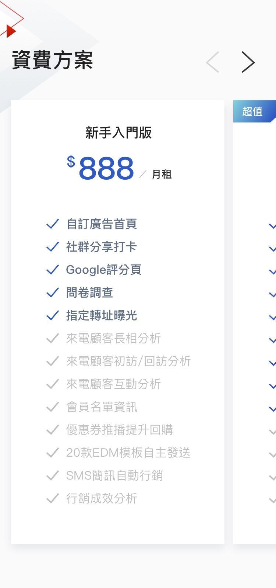
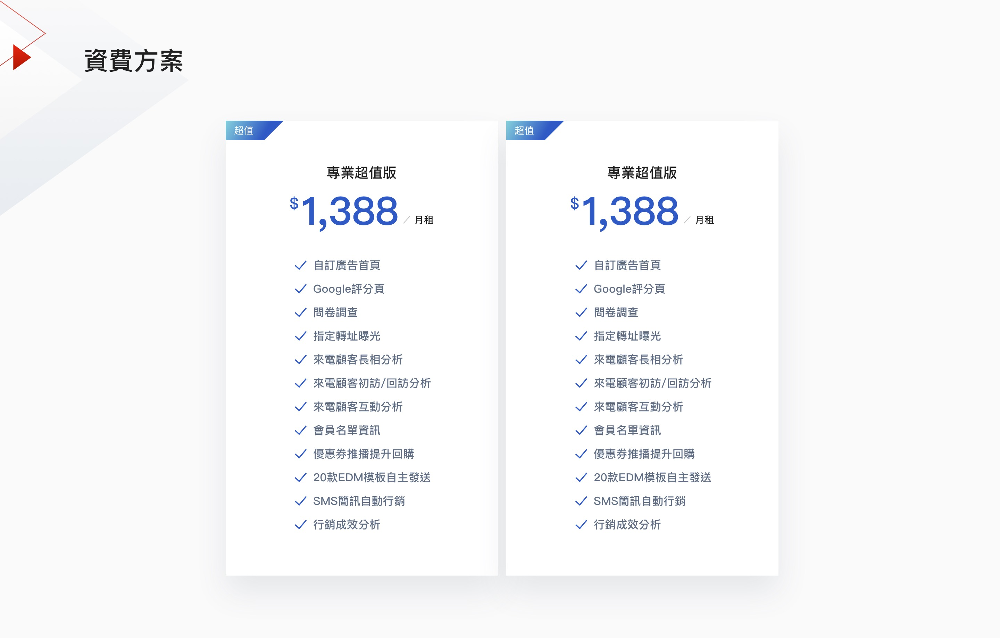
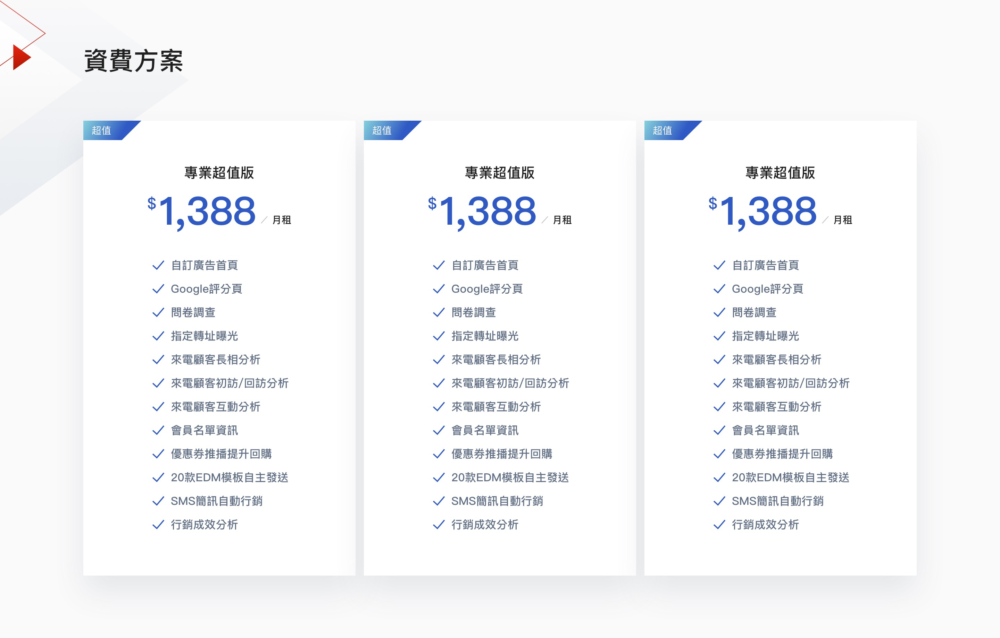
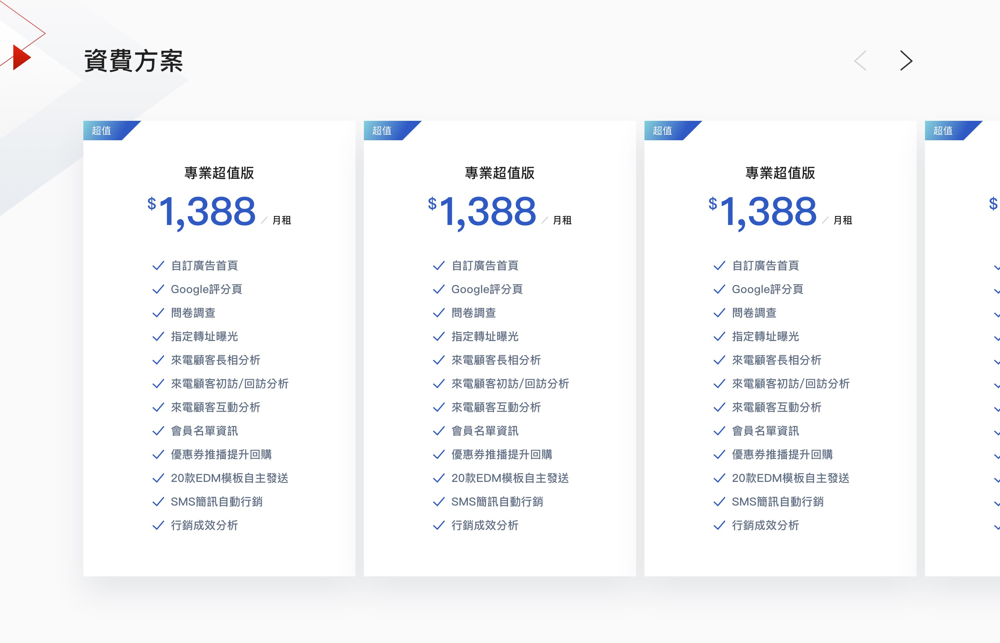

# Cards

### e-card-price

條列項目不限數量，小網變更為可擴展樣式，點選擴展按鈕展開內容，可依需求編輯欄位：

1. 最小標 \(限定字元數=10\)
2. 小標 \(限定字元數=10\)
3. 大標 \(限定字元數=5\)
4. 增減條列項目 \(不限字數, 可選擇樣式default/disable\)


#### card-m-video

影片牌卡樣式，通常包含在e-section-video內，可依需求編輯欄位:   
1. 縮圖 \(16:9\)   
2. 最小標 \(限定字元數=20\)   
3. 小標 \(限定行數=1\)   
4. 大標 \(限定行數=2\)


### **Card-s**

**Style 1**  
標籤+大標+內文樣式,通常配置在輪播或4欄式排版呈現, 可依需求編輯欄位:   
1. 小標 \(限定行數=1\)   
2. 大標 \(限定行數=2\)   
3. 內文 \(限定行數=3\)

**Style 2**  
圖標+大標+內文樣式, 通常配置在輪播或4欄式排版呈現, 可依需求編輯欄位:   
1. 更換圖標 \(48 x 48px\)   
2. 大標 \(限定行數=2\)   
3. 內文 \(限定行數=3\)  
  
**Style 3**  
日期+標籤+標題, 可依需求編輯欄位:  
  


<table>
  <thead>
    <tr>
      <th style="text-align:left">Style 1</th>
      <th style="text-align:left">Style 2</th>
      <th style="text-align:left">Style3</th>
    </tr>
  </thead>
  <tbody>
    <tr>
      <td style="text-align:left">
        
      </td>
      <td style="text-align:left">
        
      </td>
      <td style="text-align:left">
        <p></p>
        <p>
          
        </p>
      </td>
    </tr>
  </tbody>
</table>

|      |
| :--- |


### ESectionCard1

產品分類牌卡組合模組  
大小網限制顯示項目數量=12, 超過出現讀取更多按鈕, 點選後展開其餘的12項.  
  
可依需求編輯欄位: section:   
1. 大標: 最大字符串長度&lt;30 \(30個字元\).   
2. 增加牌卡.

牌卡:   
1. 更換圖標 \(48 x 48px\)   
2. 大標 \(限定行數=2\)   
3. 內文 \(限定行數=3\)














```jsx
import ESectionCard1 from '../components/partials/card/ESectionCard1';

<ESectionCard1
    title='瀏覽適合您的語音服務...'
    list={mock.newsList}
    more={{
      text: '更多語音服務',
      noMore: null
    }}
/>

```



```jsx
import React from 'react';

import ArrowLeftWhite from '../../animateArrow/ArrowLeftWhite';
import ArrowRightWhite from '../../animateArrow/ArrowRightWhite';
import ProductBgArrow from '../../animateArrow/ProductBgArrow';
import LoadMore from '../../LoadMore';
import Card from '../../card/Card';

import PropTypes from 'prop-types';

const ESectionCard1 = props => {
  console.log(props);
  const [currentArticleLoadMore, setCurrentArticleLoadMore] = React.useState(props.list.length > 4);
  const collapseBody = React.useRef(null);

  React.useEffect(() => {
    setCurrentArticleLoadMore(props.list.length > 4);
  }, [props.list.length]);

  const renderBg = () => {
    switch (props.bgStyle) {
      case 'arrow':
        return (
          <div className='section-bg'>
            <ProductBgArrow />
          </div>
        );
      default:
        return (
          <div className='section-bg'>
            <ArrowLeftWhite />
            <ArrowRightWhite />
          </div>
        );
    }
  };

  const loadMore = () => {
    setCurrentArticleLoadMore(false);
  };

  const renderColumn = list => {
    switch (props.list.length) {
      case 2:
        return 'two-card';
      case 3:
        return 'three-card';
      default:
        return 'four-card';
    }
  };

  return (
    <section className='fui-horzonal-cards overflow-visible is-flexible pb-0' id={props.id}>
      {renderBg()}
      <div className='fui-container'>
        <h2 className='section-title'>{props.title}</h2>
        <div className={`fui-cards no-scrollbar pb-0 ${renderColumn(props.list)}`} ref={collapseBody}>
          {props.list.map((card, idx) =>
            (currentArticleLoadMore && idx < 4) || !currentArticleLoadMore ? (
              <Card key={idx} {...card} style={{ width: 270 }} />
            ) : null
          )}
        </div>
        <LoadMore
          click={loadMore}
          load={currentArticleLoadMore}
          moreLabel={props.more.text}
          noMoreLabel={props.more.noMore}
        />
      </div>
    </section>
  );
};

ESectionCard1.propTypes = {
  title: PropTypes.string,
  cards: PropTypes.arrayOf(PropTypes.objectOf(Card)).isRequired,
  bgStyle: PropTypes.string,
  list: PropTypes.array,
  more: PropTypes.shape({
    text: PropTypes.string,
    noMore: PropTypes.string,
  }),
};

export default ESectionCard1;

```



```jsx
export const cards = [
    {
      icon: '/resources/common/images/call-080.png',
      title: '080 免付費電話',
      description: '由受話方來付費的電話服務，通常是運用在企業提供免付費專線給其客戶做...',
    },
    {
      icon: '/resources/common/images/call-449.png',
      title: '449 全省統一代表號',
      description: '提供企業一個「449#」號碼，藉由全省交換機與智慧型網路之設定，讓客戶...',
    },
    {
      icon: '/resources/common/images/call-050.png',
      title: '050 互動語音諮詢',
      description: '互動語音諮詢服務是提供企業用戶以050為開頭的特定電話號碼，以提供...',
    },
    {
      icon: '/resources/common/images/call-0208.png',
      title: '0208 付費語音資訊',
      description: '遠傳0208付費語音服務，歡迎下載相關資訊，若有更多需求，請聯繫我們...',
    },
    {
      icon: '/resources/common/images/call-070.png',
      title: '070企業節費電話',
      description: '遠傳電信／新世紀資通是第一家取得國家通訊傳播委員會(National Communications...',
    },
    {
      icon: '/resources/common/images/call-1807.png',
      title: '1807國內長途電話',
      description: '1807國內長途電話服務架構在光纖網路之上，費率低廉（以秒計費），是企業撥打長途商務電...',
    },
  ]
```



#### Properties

<table>
  <thead>
    <tr>
      <th style="text-align:left">&#x540D;&#x7A31;</th>
      <th style="text-align:left">&#x5C6C;&#x6027;</th>
      <th style="text-align:left">&#x5FC5;&#x586B;</th>
      <th style="text-align:left">&#x9078;&#x9805;</th>
      <th style="text-align:left">&#x8AAA;&#x660E;</th>
    </tr>
  </thead>
  <tbody>
    <tr>
      <td style="text-align:left">title</td>
      <td style="text-align:left">string</td>
      <td style="text-align:left"></td>
      <td style="text-align:left"></td>
      <td style="text-align:left">&#x6A19;&#x984C;</td>
    </tr>
    <tr>
      <td style="text-align:left">more</td>
      <td style="text-align:left"></td>
      <td style="text-align:left"></td>
      <td style="text-align:left">
        <p>{</p>
        <p>text: string,</p>
        <p>noMore: string</p>
        <p>}</p>
      </td>
      <td style="text-align:left">
        <p>text &#x770B;&#x66F4;&#x591A;&#x63D0;&#x793A;&#x6587;&#x5B57;</p>
        <p>noMore &#x6C92;&#x6709;&#x66F4;&#x591A;&#x8CC7;&#x6599;&#x6642;&#x7684;&#x63D0;&#x793A;&#x6587;&#x5B57;</p>
      </td>
    </tr>
    <tr>
      <td style="text-align:left">list</td>
      <td style="text-align:left">array</td>
      <td style="text-align:left"></td>
      <td style="text-align:left">
        <p>{</p>
        <p>icon: string,</p>
        <p>title: string,</p>
        <p>description: string</p>
        <p>}</p>
      </td>
      <td style="text-align:left">&#x53C3;&#x8003; <a href="https://app.gitbook.com/@ajacreative/s/fetnet-1/~/drafts/-M1Yk4ACB0tNiYoMXmmX/components/card">Card</a>
      </td>
    </tr>
  </tbody>
</table>

### ESectionVideo

專門展示影片的section樣式  
可依需求新增影片牌卡元素: card-m-video, 牌卡元素內可依需求編輯欄位:  
• 縮圖  
• 最小標  
• 小標  
• 大標

大小網限制顯示項目數量=12, 超過出現讀取更多按鈕, 點選後展開其餘的12項.











點選牌卡開啟lightbox播放器, 影片區域設定寬度80%, 高度等比. 點選右上角按鈕可關閉. 小網點選後自動開啟全螢幕播放器.













```jsx
import ESectionVideo from '../components/partials/ESectionVideo';

this.state = {
  videos: PerformanceMock.videoCards,
};

videoLoadMore = () => {
    console.log(this.state.videos);
    this.setState({
      videos: [...this.state.videos, ...PerformanceMock.loadMoreVideo],
      canLoadMoreVideo: false,
    });
    // console.log(this.state.videos);
};

<ESectionVideo
    title='影片專區'
    totalPage={1}
    currentPage={0}
    column={'two'}
    loadMore={this.videoLoadMore}
    cards={this.state.videos}
/>
```



```jsx
import React from 'react';
import VideoModal from '../VideoModel';
import LoadMore from '../LoadMore';
import PropTypes from 'prop-types';

const Card = props => {
  return (
    <div className={`fui-card ${props.className ? props.className : ''}`}>
      <div className='fui-card-action' onClick={e => props.onClick(props)}>
        {props.image ? (
          <div className='fui-card-image'>
            
          </div>
        ) : (
          ''
        )}
        <div className='fui-card-caption'>
          <div className='fui-card-content'>
            {!props.meta ? '' : <div className='fui-card-meta'>{props.meta}</div>}
            <h4 className='fui-card-title'>{props.title}</h4>
            {!props.description ? (
              ''
            ) : (
              <p className='fui-card-description' dangerouslySetInnerHTML={{ __html: props.description }}></p>
            )}
          </div>
          <div className='fui-card-extra'>
            <div
              className={`fui-button is-arrow mb-0 ${
                props.className && props.className.indexOf('promotion-article') > -1 ? 'is-reverse' : ''
              }`}>
              {props.action ? props.action.text : '看更多'}
            </div>
          </div>
        </div>
      </div>
    </div>
  );
};

class ESectionVideo extends React.Component {
  constructor(props) {
    super(props);
    this.state = {
      currentPage: 0,
      currentVideo: '',
      modalOpen: false,
      alterVideo: '',
      currentArticleLoadMore: false,
      cards: this.props.cards,
    };

    this.loadMore = this.loadMore.bind(this);
  }

  componentDidMount() {
    this.setState({
      currentArticleLoadMore: this.props.totalPage > 0,
    });
  }

  componentDidUpdate() {
    // 偵測 cards 改變，加入新的 cards
    if (this.props.currentPage !== this.state.currentPage) {
      let oldCard = Object.assign(this.state.cards);
      this.setState({ cards: [] });
      // debugger
      this.setState({
        currentPage: this.props.currentPage,
        currentArticleLoadMore: this.props.currentPage !== this.props.totalPage,
        cards: oldCard.concat(this.props.cards),
      });
    }
  }

  loadMore = () => {
    // call API 取得更多影片，透過 props 傳回新的 card
    if (this.props.loadMore) this.props.loadMore(this.state.currentPage);
  };

  openVideoModal = data => {
    console.log(data);

    this.setState({
      modalOpen: true,
      alterVideo: data.alterVideo,
      currentVideo: data.link,
    });
  };

  closeModal = () => {
    this.setState({
      modalOpen: false,
      alterVideo: '',
      currentVideo: '',
    });
  };
  render() {
    return (
      <section className={`fui-content video-container`}>
        <div className='video-head'>
          <h2 className='m-0'>{this.props.title}</h2>
          <button className='fui-button' onClick={() => console.log('go to somewhere')}>
            <span className='text'>看更多</span>
            <i className='icon-chevron-right' />
          </button>
        </div>
        <div className={`fui-cards ${this.props.column}-card is-video`}>
          {this.state.cards.length
            ? this.state.cards.map((card, i) => (
                <Card key={`video-card-${i}`} className='is-video' {...card} onClick={this.openVideoModal} />
              ))
            : ''}
        </div>

        {this.props.totalPage > 0 ? (
          <LoadMore
            moreLabel='展開看更多'
            noMoreLabel='沒有更多影片'
            click={this.loadMore}
            load={this.state.currentArticleLoadMore}
          />
        ) : (
          ''
        )}
        <VideoModal
          open={this.state.modalOpen}
          alterVideo={this.state.alterVideo}
          videoUrl={this.state.currentVideo}
          onClose={this.closeModal}
        />
      </section>
    );
  }
}

ESectionVideo.defaultProps = {
  column: 'three',
};
ESectionVideo.propTypes = {
  title: PropTypes.string.isRequired,
  cards: PropTypes.arrayOf(Card).isRequired,
  totalPage: PropTypes.number,
  currentPage: PropTypes.number,
  column: PropTypes.string,
  loadMore: PropTypes.func, // get more cards
};

export default ESectionVideo;

```



```jsx
export const videoCards = [
  {
    image: 'https://placeimg.com/1600/900/any',
    title: '無法同步OneDrive時該如何處理？',
    link: 'https://youtu.be/XDN2wbm6zi8',
  },
  {
    image: 'https://placeimg.com/1600/900/any',
    title: 'DNS沒有提供SRV紀錄怎麼辦',
    link: 'https://youtu.be/Q-gcfQhR_9c',
  },
  {
    image: 'https://placeimg.com/1600/900/any',
    title: '如何透過簡易的設定大量匯入舊有的PST檔案至雲端',
    link: 'https://youtu.be/0cn1YTpDIUg',
  },
  {
    image: 'https://placeimg.com/1600/900/any',
    title: '如何透過簡易的設定(POP)進行舊信轉移 - 中小企業',
    link: 'https://youtu.be/eTVHpa6ngcA',
  },
];

```



#### Properties

<table>
  <thead>
    <tr>
      <th style="text-align:left">&#x540D;&#x7A31;</th>
      <th style="text-align:left">&#x5C6C;&#x6027;</th>
      <th style="text-align:left">&#x5FC5;&#x586B;</th>
      <th style="text-align:left">&#x9078;&#x9805;</th>
      <th style="text-align:left">&#x8AAA;&#x660E;</th>
    </tr>
  </thead>
  <tbody>
    <tr>
      <td style="text-align:left">title</td>
      <td style="text-align:left">string</td>
      <td style="text-align:left"></td>
      <td style="text-align:left"></td>
      <td style="text-align:left">&#x6A19;&#x984C;</td>
    </tr>
    <tr>
      <td style="text-align:left">column</td>
      <td style="text-align:left">string</td>
      <td style="text-align:left"></td>
      <td style="text-align:left"></td>
      <td style="text-align:left">&#x724C;&#x5361;&#x5448;&#x73FE;&#x7684;&#x6B04;&#x4F4D;&#x6578;</td>
    </tr>
    <tr>
      <td style="text-align:left">totalPage</td>
      <td style="text-align:left">number</td>
      <td style="text-align:left"></td>
      <td style="text-align:left"></td>
      <td style="text-align:left">&#x7E3D;&#x9801;&#x6578;</td>
    </tr>
    <tr>
      <td style="text-align:left">currentPage</td>
      <td style="text-align:left">number</td>
      <td style="text-align:left"></td>
      <td style="text-align:left"></td>
      <td style="text-align:left">&#x76EE;&#x524D;&#x9801;&#x6578;&#xFF0C;&#x521D;&#x59CB;&#x70BA; 0</td>
    </tr>
    <tr>
      <td style="text-align:left">cards</td>
      <td style="text-align:left">Array</td>
      <td style="text-align:left"></td>
      <td style="text-align:left">
        <p>{</p>
        <p>image: string,</p>
        <p>title: string,</p>
        <p>link: string</p>
        <p>}</p>
      </td>
      <td style="text-align:left">link &#x5E36;&#x5165;youtube &#x9023;&#x7D50;</td>
    </tr>
    <tr>
      <td style="text-align:left">loadMore</td>
      <td style="text-align:left">Function</td>
      <td style="text-align:left"></td>
      <td style="text-align:left"></td>
      <td style="text-align:left">&#x6293;&#x4E0B;&#x4E00;&#x9801;&#x8CC7;&#x6599;</td>
    </tr>
  </tbody>
</table>


### ESectionPrice

欄位樣式限制最低2欄, 可依需求增加欄位. 卡片內條列項目不限數量. ~~小網變更為可擴展樣式, 點選擴展按鈕展開內容.~~





























```jsx
import ESectionPrice from '../components/partials/card/ESectionPrice';

<ESectionPrice 
title='資費方案' 
cards={Mock.card} 
/>
```



```jsx
import React from 'react';
import Slider from "react-slick";
import ECardPrice from '../../card/ECardPrice';

import PropTypes from 'prop-types';

class ESectionPrice extends React.Component {
    constructor(props) {
        super(props);
        this.setting = {
            dots: false,
            infinite: false,
            arrows: true,
            slidesToShow: 3,
            draggable: true,
            responsive: [
                {
                    breakpoint: 960,
                    settings: {
                        slidesToShow: 3,
                        slidesToScroll: 3,
                        infinite: true,
                        dots: false
                    }
                },
                {
                    breakpoint: 768,
                    settings: {
                        arrows: true,
                        slidesToShow: 2,
                        variableWidth: true
                    }
                },
                {
                    breakpoint: 480,
                    settings: {
                        arrows: true,
                        slidesToShow: 1,
                        variableWidth: true
                    }
                }
            ]
        }
    
    }
    render() {
        return (
            <section className={`fui-content bg-arrow`}>
                <div className="fui-container">
                    <h3>{this.props.title}</h3>

                    <Slider {...this.setting} className="horizontal-cards">
                    {
                        this.props.cards ? (
                            this.props.cards.map((card, i) => (
                                <ECardPrice key={`price-card-${i}`} {...card} />
                            ))
                        ) : ''
                    }
                    </Slider>

                </div>
            </section>
        )
    }
}

ESectionPrice.propTypes = {
    title: PropTypes.string,
    cards: PropTypes.arrayOf(
        PropTypes.objectOf(ECardPrice)
    )
}

export default ESectionPrice;
```



```jsx
export const cards = [
  {
    title: '新手入門版',
    price: 888,
    unit: '月租',
    list: [
      { text: '自訂廣告首頁', disabled: false },
      { text: '社群分享打卡', disabled: false },
      { text: 'Google評分頁', disabled: false },
      { text: '問卷調查', disabled: false },
      { text: '指定轉址曝光', disabled: false },
      { text: '來電顧客長相分析', disabled: true },
      { text: '來電顧客初訪/回訪分析', disabled: true },
      { text: '來電顧客互動分析', disabled: true },
      { text: '會員名單資訊', disabled: true },
      { text: '優惠券推播提升回購', disabled: true },
      { text: '20款EDM模板自主發送', disabled: true },
      { text: 'SMS簡訊自動行銷', disabled: true },
      { text: '行銷成效分析', disabled: true },
    ],
  },
]
```



#### Properties

<table>
  <thead>
    <tr>
      <th style="text-align:left">&#x540D;&#x7A31;</th>
      <th style="text-align:left">&#x5C6C;&#x6027;</th>
      <th style="text-align:left">&#x5FC5;&#x586B;</th>
      <th style="text-align:left">&#x9078;&#x9805;</th>
      <th style="text-align:left">&#x8AAA;&#x660E;</th>
    </tr>
  </thead>
  <tbody>
    <tr>
      <td style="text-align:left">title</td>
      <td style="text-align:left">string</td>
      <td style="text-align:left"></td>
      <td style="text-align:left"></td>
      <td style="text-align:left">&#x6A19;&#x984C;</td>
    </tr>
    <tr>
      <td style="text-align:left">cards</td>
      <td style="text-align:left">Array</td>
      <td style="text-align:left"></td>
      <td style="text-align:left">
        <p>{</p>
        <p>title: string,</p>
        <p>price: number</p>
        <p>unit: string</p>
        <p>list: array</p>
        <p>text: string</p>
        <p>disabled: bool</p>
        <p>}</p>
      </td>
      <td style="text-align:left"></td>
    </tr>
  </tbody>
</table>

### ESectionMarquee

圖片數量超過5項以輪播呈現, 不足時平均間距置中靜態顯示. 小網自動輪播圖片 \(跑馬燈樣式\).














```jsx
import ESectionMarquee from '../components/partials/carousel/ESectionMarquee';

export const corp = {
  title: '合作過的企業',
  corps: [
    { img: '/resources/product/images/corp-logo-1.png' }, 
    { img: '/resources/product/images/corp-logo-2.png' }
  ],
};

<ESectionMarquee {...AwsMock.corp} />
```



```jsx
import React from 'react';
import Marquee from '../../Marquee';
import PropTypes from 'prop-types';

class ESectionMarquee extends React.Component {
    render() {
        return (
            <section className={`fui-corp-content`}>
                <div className="fui-container">
                    <h5 className="mt-0">{this.props.title}</h5>
                    <Marquee direction={'landscape'} loopData={this.props.corps}
                    />
                </div>
            </section>
        )
    }
}

ESectionMarquee.propTypes = {
    title: PropTypes.string,
    corps: PropTypes.arrayOf(
        PropTypes.shape({
            img: PropTypes.string
        })
    )
}

export default ESectionMarquee;
```



#### Properties

<table>
  <thead>
    <tr>
      <th style="text-align:left">&#x540D;&#x7A31;</th>
      <th style="text-align:left">&#x5C6C;&#x6027;</th>
      <th style="text-align:left">&#x5FC5;&#x586B;</th>
      <th style="text-align:left">&#x9078;&#x9805;</th>
      <th style="text-align:left">&#x8AAA;&#x660E;</th>
    </tr>
  </thead>
  <tbody>
    <tr>
      <td style="text-align:left">title</td>
      <td style="text-align:left">string</td>
      <td style="text-align:left"></td>
      <td style="text-align:left"></td>
      <td style="text-align:left"></td>
    </tr>
    <tr>
      <td style="text-align:left">corps</td>
      <td style="text-align:left">array</td>
      <td style="text-align:left"></td>
      <td style="text-align:left">
        <p>{</p>
        <p>img: string</p>
        <p>}</p>
      </td>
      <td style="text-align:left"></td>
    </tr>
  </tbody>
</table>

### ESectionMarquee2




```jsx
import ESectionMarquee from '../components/partials/carousel/ESectionMarquee';

export const corp = {
  title: '合作過的企業',
  corps: [
    { img: '/resources/product/images/corp-logo-1.png' }, 
    { img: '/resources/product/images/corp-logo-2.png' }
  ],
};

<ESectionMarquee {...AwsMock.corp} />
```



```jsx
import React from 'react';
import Marquee from '../../Marquee';
import ArrowRightWhite from '../../animateArrow/ArrowRightWhite'
import PropTypes from 'prop-types';

class ESectionMarquee2 extends React.Component {
    render() {
        return (
            <section className={`fui-corp-content is-style-2`}>
                <div className="section-bg">
                    <ArrowRightWhite />
                </div>
                <div className="fui-container">
                    <h2 className="mt-0">{this.props.title}</h2>
                    <Marquee direction={'landscape'} loopData={this.props.corps}
                    />
                </div>
            </section>
        )
    }
}

ESectionMarquee2.propTypes = {
    title: PropTypes.string,
    corps: PropTypes.arrayOf(
        PropTypes.shape({
            img: PropTypes.string
        })
    )
}

export default ESectionMarquee2;
```



#### Properties

<table>
  <thead>
    <tr>
      <th style="text-align:left">&#x540D;&#x7A31;</th>
      <th style="text-align:left">&#x5C6C;&#x6027;</th>
      <th style="text-align:left">&#x5FC5;&#x586B;</th>
      <th style="text-align:left">&#x9078;&#x9805;</th>
      <th style="text-align:left">&#x8AAA;&#x660E;</th>
    </tr>
  </thead>
  <tbody>
    <tr>
      <td style="text-align:left">title</td>
      <td style="text-align:left">string</td>
      <td style="text-align:left"></td>
      <td style="text-align:left"></td>
      <td style="text-align:left"></td>
    </tr>
    <tr>
      <td style="text-align:left">corps</td>
      <td style="text-align:left">array</td>
      <td style="text-align:left"></td>
      <td style="text-align:left">
        <p>{</p>
        <p>img: string</p>
        <p>}</p>
      </td>
      <td style="text-align:left"></td>
    </tr>
  </tbody>
</table>

### NewsCards

帶大標 + 按鈕的3欄式的內容牌卡設計, 讀取3則最新消息, 小網只顯示一則:  
• 日期欄位: 年/月/日 格式   
• 小標: 最大字符串長度&lt;20 \(20個字元\).   
• 大標: 最大字符串長度&lt;50 \(50個字元\), 建議最多2行.













```jsx
import NewsCard from '../components/partials/card/NewsCards';

<NewsCard {...EbuMicro.newsCard} />
```



```jsx
import React from 'react';

import Card from '../../card/Card';
import PropTypes from 'prop-types';

const NewsCard = (props) => {
    return (
        <section className="pb-0">
            <div className="fui-container">
                <div className="fui-section-header">
                    <h2 className="section-title">
                        {props.title}
                    </h2>
                    {
                        props.more ? (
                            <a href={props.more.link} className="fui-button is-text">
                                {props.more.text}
                                <i className='icon-chevron-right'></i>
                            </a>
                        ) : ''
                    }
                </div>
                <div className="fui-cards news three-card">
                    {
                        props.cards.map((card, idx) => (
                            <Card key={idx} {...card} />
                        ))
                    }
                </div>
            </div>
        </section>
    );
}

NewsCard.propTypes = {
    title: PropTypes.string,
    cards: PropTypes.arrayOf(
        PropTypes.shape({
            title: PropTypes.string, 
            public_at: PropTypes.string, 
            meta: PropTypes.string, 
            link: PropTypes.string
        })
    ),
    more: PropTypes.shape({
        link: PropTypes.string,
        text: PropTypes.string
    })
}

export default NewsCard;
```



```jsx
export const newsCard = {
  title: '消息與公告',
  more: {
    link: '#',
    text: '看更多',
  },
  cards: [
    {
      public_at: '2019/10/4',
      meta: '最新消息',
      title: '遠傳5G再秀創舉 攜手北市府打造全臺雙第一 率先啟動...',
      link: '#',
    },
    {
      public_at: '2019/10/4',
      meta: '最新消息',
      title: '遠傳攜手經濟部水利署 發表全國首例「線上崩塌與濁...',
      link: '#',
    },
    {
      public_at: '2019/10/4',
      meta: '服務公告',
      title: '.tw/.台灣網域名稱註冊服務系統維護通知',
      link: '#',
    },
  ],
};

```



#### Properties

<table>
  <thead>
    <tr>
      <th style="text-align:left">&#x540D;&#x7A31;</th>
      <th style="text-align:left">&#x5C6C;&#x6027;</th>
      <th style="text-align:left">&#x5FC5;&#x586B;</th>
      <th style="text-align:left">&#x9078;&#x9805;</th>
      <th style="text-align:left">&#x8AAA;&#x660E;</th>
    </tr>
  </thead>
  <tbody>
    <tr>
      <td style="text-align:left">title</td>
      <td style="text-align:left">string</td>
      <td style="text-align:left"></td>
      <td style="text-align:left"></td>
      <td style="text-align:left"></td>
    </tr>
    <tr>
      <td style="text-align:left">more</td>
      <td style="text-align:left">object</td>
      <td style="text-align:left"></td>
      <td style="text-align:left">
        <p>{</p>
        <p>text: string
          <br />link: string</p>
        <p>}</p>
      </td>
      <td style="text-align:left"></td>
    </tr>
    <tr>
      <td style="text-align:left">cards</td>
      <td style="text-align:left">Object</td>
      <td style="text-align:left"></td>
      <td style="text-align:left">
        <p>{
          <br />public_at: string
          <br />meta: string
          <br />title: string
          <br />link: string</p>
        <p>}</p>
      </td>
      <td style="text-align:left">&#x8ACB;&#x53C3;&#x8003; <a href="https://app.gitbook.com/@ajacreative/s/fetnet-1/~/drafts/-M1Yk4ACB0tNiYoMXmmX/components/card">Card</a>
      </td>
    </tr>
  </tbody>
</table>

### SectionCards1

3欄式的內容牌卡設計, 讀取3則牌卡內容, 小網可左右滑動:  
• 日期欄位: 年/月/日 格式   
• 小標: 最大字符串長度&lt;20 \(20個字元\).   
• 大標: 最大字符串長度&lt;50 \(50個字元\), 建議最多2行.













```jsx

import SectionCards1 from '../components/card/SectionCards1';

<SectionCards1 newsCard={Mock.newsCard} />
```



```jsx
import React, { Component } from 'react';
import Card from '../../components/card/Card';
import PropTypes from 'prop-types';
export class SectionCards1 extends Component {

  render() {
    return (
      <section className="p-0">
        <div className="fui-container news-wrapper">
          {!!this.props.newsCard.title ? <div className="fui-section-header">
            <h2 className="section-title">
              {this.props.newsCard.title}
            </h2>
            {
              this.props.newsCard.more ? (
                <a href={this.props.newsCard.more.link} className="fui-button is-text">
                  {this.props.newsCard.more.text}
                  <i className='icon-chevron-right'></i>
                </a>
              ) : ''
            }
          </div> : null}
          <div className="fui-cards three-card">
            {
              this.props.newsCard.cards.map((card, idx) => (
                <Card key={idx} {...card} />
              ))
            }
          </div>
        </div>
      </section>
    );
  }
}

SectionCards1.propTypes = {
  title: PropTypes.string,
  more: PropTypes.object,
  cards: PropTypes.array,
}

export default SectionCards1;

```



```jsx
export const newsCard = {
  cards: [
    {
      public_at: '2019/10/4',
      meta: '最新消息',
      title: '遠傳5G再秀創舉 攜手北市府打造全臺雙第一 率先啟動...',
      link: '/ebu/news/newsContent',
    },
    {
      public_at: '2019/10/4',
      meta: '最新消息',
      title: '遠傳攜手經濟部水利署 發表全國首例「線上崩塌與濁...',
      link: '/ebu/news/newsContent2',
    },
    {
      public_at: '2019/10/4',
      meta: '服務公告',
      title: '.tw/.台灣網域名稱註冊服務系統維護通知',
      link: '/ebu/news/newsContent2',
    },
  ]
};
```



#### Properties

<table>
  <thead>
    <tr>
      <th style="text-align:left">&#x540D;&#x7A31;</th>
      <th style="text-align:left">&#x5C6C;&#x6027;</th>
      <th style="text-align:left">&#x5FC5;&#x586B;</th>
      <th style="text-align:left">&#x9078;&#x9805;</th>
      <th style="text-align:left">&#x8AAA;&#x660E;</th>
    </tr>
  </thead>
  <tbody>
    <tr>
      <td style="text-align:left">newsCard</td>
      <td style="text-align:left">Object</td>
      <td style="text-align:left"></td>
      <td style="text-align:left">
        <p>{</p>
        <p>title: string
          <br />more: object
          <br />text: string
          <br />link: string
          <br />cards: Array
          <br />public_at: string
          <br />meta: string
          <br />title: string
          <br />link: string</p>
        <p>}</p>
      </td>
      <td style="text-align:left"></td>
    </tr>
  </tbody>
</table>

### TabArticle

tab切換牌卡樣式, 欄位內規則 :

Tab:   
• 依需求增減項目數量 最少2項, 超過5項會在最後的選項以收和方式下拉呈現  
• Tab小網超過5項會自動收合成下拉選單

牌卡:   
• 更換長寬比16:9縮圖  
• 小標: 字符串長度&lt;20 \(20個字元\)  
• 大標: 字符串長度&lt;40 \(40個字元\)  
• 內文: 字符串長度&lt;120 \(120個字元\)  
• 最多顯示5個牌卡, 可點擊展開讀取更多













### FaqCollapse

幫助中心收合牌卡樣式, 欄位內規則:

牌卡:   
• 大標: 字符串長度&lt;40 \(40個字元\)   
• 大標右側可選擇增加看更多按鈕

收合型條列:   
• 可增加條列項目, 不限制數量和字元長度.   
• 大標: 不限制字元長度  
• 內文: 字符串長度&lt;600 \(600個字元\), 超過會在內文下方顯示“更多詳細說明”按鈕. • 點選問題按鈕後展開單選列表  
• 單選列表文字限制行數=1, 不限制問題數量





點選按鈕：否後展開


點選“送出”按鈕後


點選“是”後  











```jsx
import FaqCollapse from '../components/collapse/FaqCollapse';
import * as Mock from '../mock/Mock';


highlightKeyword = (word) => {
  if (!this.state.keyword) return word;

  let value = this.state.keyword.toLowerCase();
  let index = word.toLowerCase().indexOf(value);

  if (index === -1 || value.value === '') {
    return word;
  } else {
    return (
      word.substring(0, index) +
      "<span class='highlight'>" +
      word.substring(index, index + value.length) +
      '</span>' +
      word.substring(index + value.length)
    );
  }
}


{Mock.searchResult.map((faq, j) => (
  <FaqCollapse
    key={`faq-collapse-${j}`}
    title={this.highlightKeyword(faq.title)}
    content={this.highlightKeyword(faq.content)}
    detailLink={faq.detailLink}
    open={j === 0}
    feedback={e => console.log(e)}
  />
))}
```



```jsx
import React from 'react';
import {Link} from 'react-router-dom'
import RadioButtons from '../form/RadioButtons'
import LabelTextarea from '../form/LabelTextarea'
import Formsy from 'formsy-react';
import PropTypes from 'prop-types';

class FaqCollapse extends React.Component {
    constructor(props) {
        super(props);
        this.body = React.createRef();
        this.form = React.createRef();
        this.state = {
            contentHeight: 0,
            editForm: false,
            feedbackCompelete: false,
            commentShow: false,
            open: false,
            feedbackForm: {
              feedbackOption: '',
              comment: ''
            }
        }

        this.collapseOpen = this.collapseOpen.bind(this)
        this.storeForm = this.storeForm.bind(this)
        this.returnFeedback = this.returnFeedback.bind(this)
        this.setContentHeight = this.setContentHeight.bind(this)
        this.updateContentHeight = this.updateContentHeight.bind(this)
        this.disableButton = this.disableButton.bind(this)
        this.enableButton = this.enableButton.bind(this)
    }

    setContentHeight() {
        this.setState({
          open: this.props.open,
          contentHeight: this.body.current ? this.body.current.clientHeight : 0
        })
    }

    componentDidMount() {
      if(this.props.open) {
        this.setState({
          open: this.props.open,
        })
        this.collapseOpen()
      }

      window.addEventListener('resize', e => {
        this.updateContentHeight();
        this.forceUpdate();
      })
    }

    componentDidUpdate(nextProps) {
        if(this.props.onChange && (nextProps.open !== this.state.open || this.props.open !==this.state.open)) {
          this.setState({
              open: this.props.open
          })
        } 
    }

    returnFeedback (val) {
      if (val === 0) {
        this.setState({
          editForm: true
        })
      } else {
        this.setState({
          feedbackCompelete: true
        })

        if (val === -1) {
          if(this.props.feedback) {
            this.props.feedback({
              help: 'no',
              form: this.state.feedbackForm
            })
          }
        }

        if (val === 1) {
          if(this.props.feedback) {
            this.props.feedback({
              help: 'yes'
            })
          }
        }

      }

      this.forceUpdate();
      this.updateContentHeight();
    }

    collapseOpen() {
        this.setContentHeight()
        if (this.props.onChange) {
            this.props.onChange(!this.state.open)
        } else {
            this.setState({
                open: !this.state.open
            })
        }
        
        this.forceUpdate();
    }

    storeForm (name, value) {
      let form = Object.assign(this.state.feedbackForm);
      form[name] = value;

      this.setState({
        feedbackForm: form,
        commentShow: ((name === 'feedbackOption' && value==='4') || name === 'comment')
      })

      this.forceUpdate();
      this.updateContentHeight();
    }

    updateContentHeight () {
      setTimeout(() => {
        this.setState({
          contentHeight: this.body.current ? this.body.current.clientHeight + (window.isIE ? 100 : 0) : 0
        })
      }, 50)
    }

    resetFeedback = () => {
      this.setState({
        editForm: false,
        feedbackForm: {
          feedbackOption: '',
          comment: ''
        }
      })
      this.forceUpdate();
      this.updateContentHeight();
    }

    disableButton = (model, resetForm, invalidateForm) => {
      // debugger
      setTimeout(() => {
        if(window.isIE) {
          let elem = window || document.documentElement
          elem.scroll(0, document.getElementsByClassName('is-invalid')[0].offsetTop);
        } else
          window.scrollTo(0, document.getElementsByClassName('is-invalid')[0].offsetTop);
      }, 100);
      this.setState({ canSubmit: false });
    }
  
    enableButton = (model, resetForm, invalidateForm) => {
      // debugger
      this.setState({ canSubmit: true });
    }
  
    submit = (model) => {
      console.log('submitted');
    }
  
    feedbackRender () {
      if (this.state.feedbackCompelete) {
        return (
          <div className='is-text-darkgray50'>
            <i className='icon-check'></i> 感謝您的回應！
          </div>
        )
      } 
      if (this.state.editForm) {
        return (
          <Formsy className=""
              onValidSubmit={this.submit}
              onValid={this.enableButton}
              onInvalidSubmit={this.disableButton}
              noValidate
              ref={this.form}>
            <div className='is-text-darkgray50'>
              為什麼沒有幫助？
            </div>
            
            <RadioButtons 
            name='feedbackOption'
            options={[
              {value: '1', label: '這說明沒有解決我的問題'},
              {value: '2', label: '這些資訊不正確'},
              {value: '3', label: '我看不懂'},
              {value: '4', label: '其它'},
            ]}
            selected={this.state.feedbackForm.feedbackOption.value}
            getSelected={e => this.storeForm('feedbackOption', e)}/>
            {
              this.state.commentShow ? (
                <LabelTextarea 
                placeholder='若您對此解答有其他意見，請說明。幫助我們提供更佳服務，謝謝！' 
                label='' 
                name='comment'
                value={this.state.feedbackForm.comment}
                onChange={this.storeForm} />
              ) : null
            }
            
            <div className="input-group">
              <button className='fui-button is-secondary' onClick={e => this.returnFeedback(-1)}>
                <span className='text'>送出</span>
              </button>
              <button className='fui-button is-secondary' onClick={e => this.resetFeedback()}>
                <span className='text'>取消</span>
              </button>
            </div>
          </Formsy>
        )
      }

      return (
        <div>
          <span className="text is-text-darkgray50">答案有幫助嗎？</span>
          <button className='fui-button is-secondary' onClick={e => this.returnFeedback(1)}>
            <span className='text'>是</span>
          </button>
          <button className='fui-button is-secondary' onClick={e => this.returnFeedback(0)}>
            <span className='text'>否</span>
          </button>
        </div>
      )
    }


    render() {
        return (
            <div className={`fui-collapse is-faq ${this.state.open ? 'is-open' : ''}`}>
                <div 
                role="button"
                onClick={this.collapseOpen} 
                className={`collapse-header`}
                dangerouslySetInnerHTML={{__html: this.props.title}}>
                </div>
                <div 
                className="collapse-body" 
                style={{
                    height: this.state.open ? this.state.contentHeight : 0
                }}>
                  <div ref={this.body}>
                    <article dangerouslySetInnerHTML={{__html: this.props.content}}></article>
                    <Link to={this.props.detailLink} className="fui-button is-text mb-0">
                      <span className="text">更多詳細說明</span>
                      <i className='icon-chevron-right'></i>
                    </Link>
                    <hr/>
                    <div className='feedback'>
                      {
                        this.feedbackRender()
                      }
                    </div>
                  </div>
                </div>
            </div>
        )
    }
}

FaqCollapse.propTypes = {
    title: PropTypes.string.isRequired,
    content: PropTypes.string.isRequired,
    detailLink: PropTypes.string,
    feedback: PropTypes.func,
    open: PropTypes.bool, // default false
}

export default FaqCollapse
```



```javascript
export const searchResult = [
    {
      title: '如何申請NB-IoT服務?',
      content: `
        <p>新世紀資通股份有限公司(下稱"本公司")，因經營雲端運算服務業務而蒐集、處理或利用之個人資料時，皆以尊重 <a href='#' target="_blank">您的權益</a> 為基礎，並以誠實信用之方式及以下原則為之：</p>
        <p>本公司蒐集您個人資料之目的係為行銷、 非公務機關依法定義務所進行個人資料之蒐集處理及利用、信用卡、現金卡、轉帳卡或電子票證業務、契約、類似契約或其他法律關係事務、政令宣導、個人資料之 合法交易業務、旅外國人急難救助、消費者、客戶管理與服務、消費者保護、帳務管理及債權交易業務、會計與相關服務、經營電信業務與電信加值網路業務、資 （通）訊服務、資（通）訊與資料庫管理、資通安全與管理、網路購物及其他電子商務服務、廣告或商業行為管理、影視、音樂與媒…</p>
      `,
      detailLink: '/help-center/faq/detail/1',
    },
    {
      title: 'NB-IoT適用的服務類型?',
      content: `
        <p>新世紀資通股份有限公司(下稱"本公司")，因經營雲端運算服務業務而蒐集、處理或利用之個人資料時，皆以尊重 <a href='#' target="_blank">您的權益</a> 為基礎，並以誠實信用之方式及以下原則為之：</p>
        <p>本公司蒐集您個人資料之目的係為行銷、 非公務機關依法定義務所進行個人資料之蒐集處理及利用、信用卡、現金卡、轉帳卡或電子票證業務、契約、類似契約或其他法律關係事務、政令宣導、個人資料之 合法交易業務、旅外國人急難救助、消費者、客戶管理與服務、消費者保護、帳務管理及債權交易業務、會計與相關服務、經營電信業務與電信加值網路業務、資 （通）訊服務、資（通）訊與資料庫管理、資通安全與管理、網路購物及其他電子商務服務、廣告或商業行為管理、影視、音樂與媒…</p>
      `,
      detailLink: '/help-center/faq/detail/1',
    },
    {
      title: '要新增SSL 加密憑證時，是否可申請額外的IP?',
      content: `
        <p>新世紀資通股份有限公司(下稱"本公司")，因經營雲端運算服務業務而蒐集、處理或利用之個人資料時，皆以尊重 <a href='#' target="_blank">您的權益</a> 為基礎，並以誠實信用之方式及以下原則為之：</p>
        <p>本公司蒐集您個人資料之目的係為行銷、 非公務機關依法定義務所進行個人資料之蒐集處理及利用、信用卡、現金卡、轉帳卡或電子票證業務、契約、類似契約或其他法律關係事務、政令宣導、個人資料之 合法交易業務、旅外國人急難救助、消費者、客戶管理與服務、消費者保護、帳務管理及債權交易業務、會計與相關服務、經營電信業務與電信加值網路業務、資 （通）訊服務、資（通）訊與資料庫管理、資通安全與管理、網路購物及其他電子商務服務、廣告或商業行為管理、影視、音樂與媒…</p>
      `,
      detailLink: '/help-center/faq/detail/1',
    },
    {
      title: '有關遠傳雲端運算服務，相關的隱私權保護政策為何?',
      content: `
        <p>新世紀資通股份有限公司(下稱"本公司")，因經營雲端運算服務業務而蒐集、處理或利用之個人資料時，皆以尊重 <a href='#' target="_blank">您的權益</a> 為基礎，並以誠實信用之方式及以下原則為之：</p>
        <p>本公司蒐集您個人資料之目的係為行銷、 非公務機關依法定義務所進行個人資料之蒐集處理及利用、信用卡、現金卡、轉帳卡或電子票證業務、契約、類似契約或其他法律關係事務、政令宣導、個人資料之 合法交易業務、旅外國人急難救助、消費者、客戶管理與服務、消費者保護、帳務管理及債權交易業務、會計與相關服務、經營電信業務與電信加值網路業務、資 （通）訊服務、資（通）訊與資料庫管理、資通安全與管理、網路購物及其他電子商務服務、廣告或商業行為管理、影視、音樂與媒…</p>
      `,
      detailLink: '/help-center/faq/detail/1',
    }
];
```



#### Properties

<table>
  <thead>
    <tr>
      <th style="text-align:left">&#x540D;&#x7A31;</th>
      <th style="text-align:left">&#x5C6C;&#x6027;</th>
      <th style="text-align:left">&#x5FC5;&#x586B;</th>
      <th style="text-align:left">&#x9078;&#x9805;</th>
      <th style="text-align:left">&#x8AAA;&#x660E;</th>
    </tr>
  </thead>
  <tbody>
    <tr>
      <td style="text-align:left">title</td>
      <td style="text-align:left">String</td>
      <td style="text-align:left">true</td>
      <td style="text-align:left"></td>
      <td style="text-align:left">&#x6A19;&#x984C;</td>
    </tr>
    <tr>
      <td style="text-align:left">content</td>
      <td style="text-align:left">String</td>
      <td style="text-align:left">true</td>
      <td style="text-align:left"></td>
      <td style="text-align:left">&#x63CF;&#x8FF0;</td>
    </tr>
    <tr>
      <td style="text-align:left">detailLink</td>
      <td style="text-align:left">String</td>
      <td style="text-align:left"></td>
      <td style="text-align:left"></td>
      <td style="text-align:left">&#x5B8C;&#x6574;&#x5167;&#x5BB9;&#x9023;&#x7D50;</td>
    </tr>
    <tr>
      <td style="text-align:left">open</td>
      <td style="text-align:left">Boolean</td>
      <td style="text-align:left"></td>
      <td style="text-align:left"></td>
      <td style="text-align:left">&#x662F;&#x5426;&#x70BA;&#x6253;&#x958B;&#x72C0;&#x614B;</td>
    </tr>
    <tr>
      <td style="text-align:left">feedback</td>
      <td style="text-align:left">Function</td>
      <td style="text-align:left"></td>
      <td style="text-align:left"></td>
      <td style="text-align:left">
        <p>&#x56DE;&#x50B3;&#x662F;&#x5426;&#x6709;&#x6548;&#xFF0C;&#x53C3;&#x6578;&#xFF1A;</p>
        <p>{</p>
        <p>help: &apos;yes&#x2018; or &#x2018;no&#x2018;,</p>
        <p>form: {</p>
        <p>feedbackOption,
          <br />1: &#x9019;&#x8AAA;&#x660E;&#x6C92;&#x6709;&#x89E3;&#x6C7A;&#x6211;&#x7684;&#x554F;&#x984C;
          <br
          />2: &#x9019;&#x4E9B;&#x8CC7;&#x8A0A;&#x4E0D;&#x6B63;&#x78BA;
          <br />3: &#x6211;&#x770B;&#x4E0D;&#x61C2;
          <br />4: &#x5176;&#x5B83;</p>
        <p>comment: &#x610F;&#x898B;</p>
        <p>}</p>
        <p>}</p>
        <p></p>
      </td>
    </tr>
  </tbody>
</table>

## 

### PromotionArticle













```javascript
import PromotionArticle from '../components/partials/card/PromotionArticle';

<PromotionArticle {...promotionArticle} />

export const promotionArticle = {
  title: '開業技法新知',
  moreLink: '#',
  tabs: {
    name: 'tab-micro',
    list: [
      { name: 'tab-1', label: '全部' },
      { name: 'tab-2', label: '餐飲業' },
      { name: 'tab-3', label: '零售業' },
      { name: 'tab-4', label: '美容業' },
    ],
  },
  data: [
    [
      {
        meta: '高效經營',
        image: '/resources/ebu/images/ebu-micro-article-banner.jpg',
        title: '餐廳經營數位化！怎麼從線上增加來客數？用網路行銷增加客群！',
        description:
          '在數位工具盛行的時代，每間餐廳都會開始經營網路社群，但因為不懂如何做行銷操作，常常在網路行銷上花上很多冤枉錢，開了粉絲團...',
        link: '#',
      },
      {
        meta: '高效經營',
        title: '開餐廳必備｜提高淨利小心機-翻桌率、出餐效率提升技巧',
        description: '',
        link: '#',
      },
      {
        meta: '開店引路',
        title: '沒經驗想開餐廳？開店新手要注意選店、規模、成本、定位，準備好不怕失敗！',
        description: '',
        link: '#',
      },
    ],
    [
      {
        meta: '高效經營',
        image: '/resources/ebu/images/ebu-micro-article-banner.png',
        title: '餐廳經營數位化！怎麼從線上增加來客數？用網路行銷增加客群！',
        description:
          '在數位工具盛行的時代，每間餐廳都會開始經營網路社群，但因為不懂如何做行銷操作，常常在網路行銷上花上很多冤枉錢，開了粉絲團...',
        link: '#',
      },
      {
        meta: '高效經營',
        title: '開餐廳必備｜提高淨利小心機-翻桌率、出餐效率提升技巧',
        description: '',
        link: '#',
      },
      {
        meta: '開店引路',
        title: '沒經驗想開餐廳？開店新手要注意選店、規模、成本、定位，準備好不怕失敗！',
        description: '',
        link: '#',
      },
    ],
    [
      {
        meta: '高效經營',
        image: '/resources/ebu/images/ebu-micro-article-banner.png',
        title: '餐廳經營數位化！怎麼從線上增加來客數？用網路行銷增加客群！',
        description:
          '在數位工具盛行的時代，每間餐廳都會開始經營網路社群，但因為不懂如何做行銷操作，常常在網路行銷上花上很多冤枉錢，開了粉絲團...',
        link: '#',
      },
      {
        meta: '高效經營',
        title: '開餐廳必備｜提高淨利小心機-翻桌率、出餐效率提升技巧',
        description: '',
        link: '#',
      },
      {
        meta: '開店引路',
        title: '沒經驗想開餐廳？開店新手要注意選店、規模、成本、定位，準備好不怕失敗！',
        description: '',
        link: '#',
      },
    ],
  ],
  ad: {
    image: {
      md: '/resources/ebu/images/ebu-micro-ad-01.jpg',
      sm: '/resources/ebu/images/ebu-micro-ad-01-sm.jpg',
    },
    title: '低成本自動蒐集顧客數據，攬客、行銷、會員管理，不再是難事！',
    action: [
      {
        text: '了解集客行銷',
        link: '#',
      },
    ],
  },
};
```



```javascript
import React from 'react';
import { Grid } from '@material-ui/core';
import Tab from '../../tab/Tab';
import Card from '../../card/Card';
import PropTypes from 'prop-types';

const PromotionArticle = props => {
  const [tabIndex, setTabIndex] = React.useState(0);

  const handleChange = idx => {
    setTabIndex(idx);
  };

  const renderTabContent = props.data.map((item, idx) =>
    tabIndex === idx ? (
      <Grid key={`promotion-article-container-${idx}`} container spacing={2}>
        <Grid item xs={12} sm={12} md={9}>
          <Card {...item[0]} className='promotion-article is-blue is-main' />
        </Grid>
        <Grid container item xs={12} sm={12} md={3}>
          <div className='promotion-article-list'>
            <Card {...item[1]} className='promotion-article is-blue' />
            <Card {...item[2]} className='promotion-article is-blue' />
          </div>
        </Grid>
      </Grid>
    ) : (
      ''
    )
  );

  return (
    <section className='promotion-article'>
      <div className='fui-container promotion-article-container'>
        <div className='fui-section-header'>
          <h2 className='section-title'>{props.title}</h2>
          <a href={props.moreLink} className='fui-button is-text'>
            <span>看更多</span>
            <i className='icon-chevron-right' />
          </a>
        </div>
        {props.tabs ? <Tab {...props.tabs} onChange={handleChange} /> : ''}
        {props.tabs ? (
          renderTabContent
        ) : (
          <Grid container spacing={2}>
            <Grid item xs={12} sm={12} md={9}>
              <Card {...props.data[0]} className='promotion-article is-blue is-main' />
            </Grid>
            <Grid container item xs={12} sm={12} md={3}>
              <div className='promotion-article-list'>
                <Card {...props.data[1]} className='promotion-article is-blue' />
                <Card {...props.data[2]} className='promotion-article is-blue' />
              </div>
            </Grid>
          </Grid>
        )}
      </div>
    </section>
  );
};

PromotionArticle.propTypes = {
  tabs: PropTypes.shape({
    name: PropTypes.string,
    list: PropTypes.arrayOf(
      PropTypes.shape({
        label: PropTypes.string.isRequired,
      })
    ),
  }),
  data: PropTypes.arrayOf(
    PropTypes.arrayOf(
      PropTypes.shape({
        image: PropTypes.string,
        meta: PropTypes.string,
        title: PropTypes.string,
        description: PropTypes.string,
      })
    )
  ),
  moreLink: PropTypes.string,
};

export default PromotionArticle;

```



#### Properties

<table>
  <thead>
    <tr>
      <th style="text-align:left">&#x540D;&#x7A31;</th>
      <th style="text-align:left">&#x5C6C;&#x6027;</th>
      <th style="text-align:left">&#x5FC5;&#x586B;</th>
      <th style="text-align:left">&#x9078;&#x9805;</th>
      <th style="text-align:left">&#x8AAA;&#x660E;</th>
    </tr>
  </thead>
  <tbody>
    <tr>
      <td style="text-align:left">tabs</td>
      <td style="text-align:left">object</td>
      <td style="text-align:left"></td>
      <td style="text-align:left">
        <p>{</p>
        <p>name: string,</p>
        <p>list: array
          <br />name: string
          <br />label: string
          <br />}</p>
      </td>
      <td style="text-align:left">&#x5206;&#x9801;&#x5167;&#x5BB9;&#xFF0C;&#x6B04;&#x4F4D;&#x53EF;&#x53C3;&#x8003;
        <a
        href="https://app.gitbook.com/@ajacreative/s/fetnet-1/~/drafts/-M1YVRo58SiEuMWYnb-X/components/tab">Tab</a>
      </td>
    </tr>
    <tr>
      <td style="text-align:left">data</td>
      <td style="text-align:left">array</td>
      <td style="text-align:left"></td>
      <td style="text-align:left">
        <p>{</p>
        <p>meta: string</p>
        <p>image: string</p>
        <p>title: string</p>
        <p>description: string</p>
        <p>link: string</p>
        <p>}</p>
      </td>
      <td style="text-align:left">
        <p>&#x724C;&#x5361;&#x9700;&#x5E36;&#x53C3;&#x6578;</p>
        <p>meta &#x5C0F;&#x6A19;</p>
        <p>title &#x6A19;&#x984C;</p>
        <p>description &#x63CF;&#x8FF0;</p>
        <p>image &#x5716;&#x6A94;</p>
        <p>link &#x6587;&#x7AE0;&#x9023;&#x7D50;</p>
      </td>
    </tr>
    <tr>
      <td style="text-align:left">moreLink</td>
      <td style="text-align:left">string</td>
      <td style="text-align:left"></td>
      <td style="text-align:left"></td>
      <td style="text-align:left">&#x770B;&#x66F4;&#x591A;&#x9023;&#x7D50;&#x8DEF;&#x5F91;</td>
    </tr>
  </tbody>
</table>


### ServiceEntry













```javascript
import ServiceEntry from '../components/partials/card/ServiceEntry';
<ServiceEntry {...EbuMicro.serviceCard} />

```



```javascript
import React from 'react';
import RedArrow from '../../animateArrow/RedArrow';
import Card from '../../card/Card';

import PropTypes from 'prop-types';

const ServiceEntry = (props) => {
    return (
        <section className="service-entry">
            <RedArrow/>
            <div className="fui-container">
                <h2 className="section-title">{props.title}</h2>
                <div className="fui-cards four-card py-0 mt-2">
                    {
                        props.cards.map((item, key) => (
                            <Card className='service-entry' {...item} key={key} />
                        ))
                    }
                </div>
            </div>
        </section>
    )
}

ServiceEntry.propTypes = {
    title: PropTypes.string,
    cards: PropTypes.arrayOf(
        PropTypes.shape({
            title: PropTypes.string,
            link: PropTypes.string
        })
    )
}

export default ServiceEntry;
```



```javascript
export const serviceCard = {
  title: '線上申辦',
  cards: [
    {
      title: '企業行動優惠',
      link: '#',
    },
    {
      title: '文件下載',
      link: '#',
    },
    {
      title: '大寬頻企業光纖',
      link: '#',
    },
    {
      title: ' 域名服務',
      link: '#',
    },
  ],
};

```



#### Properties

<table>
  <thead>
    <tr>
      <th style="text-align:left">&#x540D;&#x7A31;</th>
      <th style="text-align:left">&#x5C6C;&#x6027;</th>
      <th style="text-align:left">&#x5FC5;&#x586B;</th>
      <th style="text-align:left">&#x9078;&#x9805;</th>
      <th style="text-align:left">&#x8AAA;&#x660E;</th>
    </tr>
  </thead>
  <tbody>
    <tr>
      <td style="text-align:left">title</td>
      <td style="text-align:left">string</td>
      <td style="text-align:left"></td>
      <td style="text-align:left"></td>
      <td style="text-align:left">&#x6A19;&#x984C;</td>
    </tr>
    <tr>
      <td style="text-align:left">cards</td>
      <td style="text-align:left">array</td>
      <td style="text-align:left"></td>
      <td style="text-align:left">
        <p>{</p>
        <p>title: string,</p>
        <p>link: string
          <br />}</p>
      </td>
      <td style="text-align:left">&#x53C3;&#x8003;<a href="https://app.gitbook.com/@ajacreative/s/fetnet-1/~/drafts/-M1Yk4ACB0tNiYoMXmmX/components/card">Card</a>
      </td>
    </tr>
  </tbody>
</table>

### ProductMap













```javascript
import ProductMap from '../components/partials/ProductMap';
<ProductMap id='product-map' {...EbuMicro.productMapData} />

```



```javascript
import React from 'react';
import Item from '../item/Item';
import { Grid } from '@material-ui/core';
import ResponseCollapse from '../collapse/ResponseCollapse';

import PropTypes from 'prop-types';

class ProductMap extends React.Component {
  constructor(props) {
    super(props);
    this.collapse = React.createRef();
    this.state = {
      collapseHeight: 256,
      bodyHeight: 0,
      collapse: false,
    };
  }

  componentDidMount() {
    this.setState({
      bodyHeight: this.collapse.current.children[0].clientHeight,
    });
  }

  toggleCollapse = () => {
    this.setState({
      collapse: !this.state.collapse,
    });
  };

  renderItem = menu =>
    menu.list.map((item, idx) => (
      <Item key={`prod-map-${idx}`} className='paded' target={'_blank'} icon={'chevron-right'} link={item.link}>
        {item.name}
      </Item>
    ));

  renderColumn = len => {
    if (len <= 2) return 6;
    if (len === 3) return 4;
    return 3;
  };

  render() {
    return (
      <section className='product-map' id={this.props.id}>
        <div className='fui-container'>
          <h4 className='align-center'>{this.props.title}</h4>
          <div className={`fui-collapse ${this.state.collapse ? 'is-open' : ''}`}>
            <div
              className='collapse-body'
              ref={this.collapse}
              style={{
                height: this.state.collapse ? this.state.bodyHeight : this.state.collapseHeight,
              }}>
              <Grid container>
                {this.props.data.map((menu, i) => (
                  <Grid
                    item
                    key={i}
                    xs={12}
                    sm={12}
                    md={this.props.data.length > 4 ? 3 : 12 / this.props.data.length}
                    className='p-md-3'>
                    <ResponseCollapse title={menu.title} list={menu.list} open={i === 0 ? true : false} />
                  </Grid>
                ))}
              </Grid>
            </div>
            {this.props.data.length > 4 ? (
              <div className='collapse-trigger align-center'>
                <button className='fui-button is-text' onClick={this.toggleCollapse}>
                  <span className='text'>{this.props.more ? this.props.more.text : '展開看更多'}</span>
                  <i className='icon-plus'></i>
                </button>
              </div>
            ) : null}
          </div>
        </div>
      </section>
    );
  }
}

ProductMap.propTypes = {
  id: PropTypes.string,
  title: PropTypes.string,
  data: PropTypes.arrayOf(
    PropTypes.shape({
      title: PropTypes.string,
      list: PropTypes.arrayOf(Item),
    })
  ),
  more: PropTypes.shape({
    text: PropTypes.string,
  }),
};

export default ProductMap;

```



```javascript
export const productMapData = {
  title: '微型店家全系列產品',
  data: [
    {
      title: '頭家經營管理',
      list: [
        {
          text: '智能開店選址',
          icon: 'chevron-right',
          link: '#',
        },
        {
          text: '中小企業小額貸款',
          icon: 'chevron-right',
          link: '#',
        },
        {
          text: '遠傳企業Office 365',
          icon: 'chevron-right',
          link: '#',
        },
        {
          text: '雲端資料託管',
          icon: 'chevron-right',
          link: '#',
        },
      ],
    },
    {
      title: '銷售與金物流',
      list: [
        {
          text: '無紙化菜單',
          icon: 'chevron-right',
          link: '#',
        },
        {
          text: 'iPad POS收銀系統',
          icon: 'chevron-right',
          link: '#',
        },
        {
          text: 'Smart WiFi',
          icon: 'chevron-right',
          link: '#',
        },
        {
          text: '電信大數據精準行銷',
          icon: 'chevron-right',
          link: '#',
        },
      ],
    },
    {
      title: '顧客關係經營',
      list: [
        {
          text: 'CRM顧客經營管理系統',
          icon: 'chevron-right',
          link: '#',
        },
        {
          text: 'LINE 官方帳號',
          icon: 'chevron-right',
          link: '#',
        },
        {
          text: '頭家行動服務',
          icon: 'chevron-right',
          link: '#',
        },
        {
          text: '企業簡訊服務',
          icon: 'chevron-right',
          link: '#',
        },
      ],
    },
    {
      title: '辦公設備',
      list: [
        {
          text: 'CRM顧客經營管理系統',
          icon: 'chevron-right',
          link: '#',
        },
        {
          text: '大寬頻光纖',
          icon: 'chevron-right',
          link: '#',
        },
        {
          text: '多功無線路由器',
          icon: 'chevron-right',
          link: '#',
        },
        {
          text: '音樂公播系統',
          icon: 'chevron-right',
          link: '#',
        },
      ],
    },
    {
      title: '辦公設備',
      list: [
        {
          text: 'CRM顧客經營管理系統',
          icon: 'chevron-right',
          link: '#',
        },
        {
          text: '大寬頻光纖',
          icon: 'chevron-right',
          link: '#',
        },
        {
          text: '多功無線路由器',
          icon: 'chevron-right',
          link: '#',
        },
        {
          text: '音樂公播系統',
          icon: 'chevron-right',
          link: '#',
        },
      ],
    },
  ],
};
```



#### Properties

| 名稱  | 屬性   | 選項                                                           | 必填 | 說明           |
| :---- | :----- | :------------------------------------------------------------- | :--- | :------------- |
| id    | string |                                                                |      | \#id           |
| title | string |                                                                |      | 標題           |
| data  | array  | \[{title: PropTypes.string, list: PropTypes.arrayOf\(Item\)}\] |      | 列表標題與內容 |
| more  | obj    | text: PropTypes.string                                         |      | 展開看更多連結 |

### ExtraLinkCard




```jsx
import ExtraLinkCard from '../components/partials/card/ExtraLinkCard';

<ExtraLinkCard 
content={TechMock.techContent.mainContent} 
cardType='default' 
/>
```



```jsx
import React from 'react';
import Button from '../../Button';
import PropTypes from 'prop-types';

class ExtraLinkCard extends React.Component {
  openFbLink = link => {
    console.log(link);
  };
  openLineLink = link => {
    console.log(link);
  };
  render() {
    return (
      <div className='group-extra-link-card'>
        {this.props.article.map((article, index) => {
          return (
            <div className='fui-card single-extra-link-card' key={article.title + index}>
              <div className='article-img' style={{ backgroundImage: `url(${article.img})` }}>
                {/*  */}
              </div>
              <div className='article-content'>
                {!!article.period ? <small className='periodical'>第{article.period}期</small> : null}
                {!!article.articleType ? <small>{article.articleType}</small> : null}
                {!!article.date ? <small className='date'>{article.date}</small> : null}
                <h4>{article.title}</h4>
                <p>{article.brief}</p>
                <div className='fui-card-extra'>
                  <Button to={article.link} className='fui-button is-arrow mb-0'>
                    看更多
                  </Button>
                  <div className='social'>
                    <i onClick={() => this.openFbLink(article.fbLink)} className={`icon-facebook-sm`}></i>
                    <i onClick={() => this.openLineLink(article.lineLink)} className={`icon-line-sm`}></i>
                    {/* <i className={`icon-facebook-sm`}></i>
                    <i className={`icon-line-sm`}></i> */}
                  </div>
                </div>
              </div>
            </div>
          );
        })}
      </div>
    );
  }
}

ExtraLinkCard.propTypes = {
  article: PropTypes.arrayOf(
    PropTypes.shape({
      img: PropTypes.string,
      retinaImg: PropTypes.string,
      period: PropTypes.string,
      date: PropTypes.string,
      title: PropTypes.string,
      brief: PropTypes.string,
      link: PropTypes.string,
    })
  ),
};
export default ExtraLinkCard;

```



```jsx
export const techContent = {
  mainContent: [
    {
      id: 'topic-01',
      period: '25',
      date: '2019.12.12',
      title: '智慧城市 Level Up 電信商營運大進化',
      imgVertical: '/resources/ebu/images/ebu-medium-ad-01-600x600.jpg',
      imgHorizontal: '/resources/ebu/images/ebu-medium-ad-01-600x260.jpg',
      brief: '靈活運用大(大數據)、人(人工智慧)、物(物聯網)技術者，將是個人、企業與國家永續成長的決勝關鍵。',
      link: '#',
      fbLink: '#fb',
      lineLink: '#line',
    },
    ...
  ]
}
```



#### Properties

| 名稱          | 屬性   | 選項 | 必填 | 說明 |
| :------------ | :----- | :--- | :--- | :--- |
| id            | string |      |      | \#id |
| period        | string |      |      |      |
| date          | string |      |      |      |
| title         | string |      |      | 標題 |
| imgVertical   | string |      |      |      |
| imgHorizontal | string |      |      |      |
| brief         | string |      |      |      |
| link          | string |      |      |      |
| fbLink        | string |      |      |      |
| lineLink      | string |      |      |      |

### GroupExtraLinkCard













```javascript
import GroupExtraLinkCard from '../components/partials/card/GroupExtraLinkCard';

<GroupExtraLinkCard article={techArticle} />
```



```javascript
import React from 'react';
import Button from '../../Button';
import PropTypes from 'prop-types';

class GroupExtraLinkCard extends React.Component {
  openFbLink = link => {
    console.log(link);
  };
  openLineLink = link => {
    console.log(link);
  };
  render() {
    return (
      <div className='group-extra-link-card'>
        {this.props.article.map((article, index) => {
          return (
            <div className='fui-card single-extra-link-card' key={article.title + index}>
              <div className='article-img' style={{ backgroundImage: `url(${article.img})` }}>
                {/*  */}
              </div>
              <div className='article-content'>
                {!!article.period ? <small className='periodical'>第{article.period}期</small> : null}
                {!!article.articleType ? <small>{article.articleType}</small> : null}
                {!!article.date ? <small className='date'>{article.date}</small> : null}
                <h4>{article.title}</h4>
                <p>{article.brief}</p>
                <div className='fui-card-extra'>
                  <Button to={article.link} className='fui-button is-arrow mb-0'>
                    看更多
                  </Button>
                  <div className='social'>
                    <i onClick={() => this.openFbLink(article.fbLink)} className={`icon-facebook-sm`}></i>
                    <i onClick={() => this.openLineLink(article.lineLink)} className={`icon-line-sm`}></i>
                    {/* <i className={`icon-facebook-sm`}></i>
                    <i className={`icon-line-sm`}></i> */}
                  </div>
                </div>
              </div>
            </div>
          );
        })}
      </div>
    );
  }
}

GroupExtraLinkCard.propTypes = {
  article: PropTypes.arrayOf(
    PropTypes.shape({
      img: PropTypes.string,
      retinaImg: PropTypes.string,
      period: PropTypes.string,
      date: PropTypes.string,
      title: PropTypes.string,
      brief: PropTypes.string,
      link: PropTypes.string,
    })
  ),
};
export default GroupExtraLinkCard;

```



```javascript
list: [
  {
    id: 'topic-01',
    period: '25',
    date: '2019.12.12',
    title: '遠傳大人物',
    img: '/resources/ebu/images/ebu-medium-article-banner-crop.jpg',
    brief: '靈活運用大(大數據)、人(人工智慧)、物(物聯網)技術者，將是個人、企業與國家永續成長的決勝關鍵。',
    link: '#',
    fbLink: '#',
    lineLink: '#',
  },
  {
    id: 'topic-02',
    period: '25',
    date: '2019.12.12',
    title: '智慧城市 Level Up 電信商營運大進化',
    img: '/resources/ebu/images/ebu-medium-article-banner-crop.jpg',
    brief: '靈活運用大(大數據)、人(人工智慧)、物(物聯網)技術者，將是個人、企業與國家永續成長的決勝關鍵。',
    link: '#',
    fbLink: '#',
    lineLink: '#',
  },
],
```




#### Properties

| 名稱    | 屬性  | 選項 | 必填 | 說明                                                                                                                                                                                                                                                                                             |
| :------ | :---- | :--- | :--- | :----------------------------------------------------------------------------------------------------------------------------------------------------------------------------------------------------------------------------------------------------------------------------------------------- |
| article | array |      |      | { id: 'topic-01', period: '15', date: '2019.12.12', title: '醫療商機', img: '/resources/ebu/images/ebu-medium-article-banner-crop.jpg', brief: '靈活運用大\(大數據\)、人\(人工智慧\)、物\(物聯網\)技術者，將是個人、企業與國家永續成長的決勝關鍵。', link: '\#', fbLink: '\#', lineLink: '\#', } |
|         |       |      |      |                                                                                                                                                                                                                                                                                                  |

## CardPlanBasic


#### 



```javascript
import CardPlanBasic from '../../components/card/CardPlanBasic';
<CardPlanBasic
    title="不用支付太多，共享騎乘輕體驗"
    list={this.state.cityRoadProgram}
    bottomBg={this.state.cityRoad}
/>
```



    import React, { Component } from 'react'
    import LoadMore from '../LoadMore'
    import Button from '../../components/Button';
    import { Grid } from '@material-ui/core';
    import Slider from 'react-slick';
    import PropTypes from 'prop-types';
    import * as formatNumber from '../../utils/numberFormatter';
    class CardPlanBasic extends Component {
      constructor(props) {
        super(props);
        this.state = {}
      }
      getColumns = () => {
        let length = this.props.list.length;
        console.log(length);
        if (length < 5) {
          return length
        } else {
          return 4
        }
      }
      loadMore = () => {
        // call API 取得更多影片，透過 props 傳回新的 card
        if (this.props.loadMore) this.props.loadMore(this.props.currentPage);
      };
      render() {
        return (
          <section className='promotion-card pb-0' style={!!this.props.topBg ? { backgroundImage: `url(${this.props.topBg})` } : null}>
            <div className='fui-container promotion-card-title mt-4'>
              <h2 className="mt-0 ">{this.props.title}</h2>
              <Slider {...{
                dots: false,
                infinite: false,
                arrows: true,
                slidesToShow: this.getColumns(),
                draggable: true,
                responsive: [
                  {
                    breakpoint: 1440,
                    settings: {
                      arrows: true,
                      slidesToShow: 2,
                      variableWidth: true,
                    },
                  },
                  {
                    breakpoint: 960,
                    settings: {
                      arrows: true,
                      slidesToShow: 2,
                      variableWidth: true,
                    },
                  },

                  {
                    breakpoint: 768,
                    settings: {
                      arrows: true,
                      slidesToShow: 1,
                      variableWidth: true
                    }
                  },
                  {
                    breakpoint: 480,
                    settings: {
                      arrows: true,
                      slidesToShow: 1,
                      variableWidth: true
                    }
                  }
                ],
              }}
                className='horizontal-cards is-program pb-md-9 mb-0'>
                {this.props.list.map((card, idx) => (
                  <div key={idx} className='fui-card is-card-program'>
                    {card.tag ? <div className={`tag tag-${card.tag.color}`}>{card.tag.text}</div> : null}
                    <h3 className="mt-2 mb-0">{card.title}</h3>
                    <h1 className='mt-2 mb-1'>
                      <small className='mr-1'>{card.unit}</small>
                      <span className="price is-text-error">
                        <span>$</span>{formatNumber.default(card.price)}
                      </span>
                    </h1>
                    <ul>
                      {card.list.map(item => (
                        <li className='' key={item}>
                          <i className="icon-check is-text-accent" />
                          <div className='subtitle is-text-darkgray50'>{item}</div>
                        </li>
                      ))}
                    </ul>
                    {card.button.length > 1 ? <div className="form-group two-buttons">
                      <Button btnStyle='primary' size='medium' link={card.button[0].link}>{card.button[0].title}</Button>
                      <Button btnStyle='secondary' size='medium' link={card.button[1].link}>{card.button[1].title}</Button>
                    </div> : <div className="form-group m-0">
                        <Button btnStyle='primary' size='medium' className='mb-0' link={card.button[0].link}>{card.button[0].title}</Button>
                      </div>}
                  </div>
                ))}
              </Slider>
            </div>
            <div
              className='bottom-bg'
              style={this.props.bottomBg ? { backgroundImage: `url(${this.props.bottomBg})` } : null}
            />
          </section>
        )
      }
    }

    CardPlanBasic.propTypes = {
      title: PropTypes.string,
      hasMore: PropTypes.bool,
      list: PropTypes.arrayOf(
        PropTypes.shape({
          name: PropTypes.string,
          content: PropTypes.string,
        })
      ),
      bottomBg: PropTypes.string,
      topBg: PropTypes.string,
      loadMore: PropTypes.func
    }
    export default CardPlanBasic;



#### Properties

| 名稱     | 屬性   | 選項                                                                          | 必填 | 說明 |
| :------- | :----- | :---------------------------------------------------------------------------- | :--- | :--- |
| list     | array  | name: PropTypes.string, content: PropTypes.string, tooltip: PropTypes.string, |      |      |
| topBg    | string |                                                                               |      |      |
| bottomBg | string |                                                                               |      |      |
| title    | string |                                                                               |      |      |
|          |        |                                                                               |      |      |

## CardRoamingSingle




```jsx
import CardRoamingSingle from '../components/partials/CardRoamingSingle';
<CardRoamingSingle
          title="CardRoamingSingle"
          image='/resources/cbu/img/section-product-card.png'
          imgAlt=''
          price='月付<span class="">$1399</span><br/>專案價<span class="is-text-error">$0</span>'
          meta='5日上網不限速'
          coupon={{
            name: "優惠序號",
            code: "CH88"
          }}
          button={{
            name: '立即購買',
            target: '_blank',
            link: '#'
          }}
          hottag={
            {
              text: '0元拿手機',
              color: 'red'
            }
          }
          name='遠遊卡2.0 日本5日不降速上網卡'
          content='<div class="body-1">商品價<del>$1,299</del>再享<span>88折</span></div>'
        />
```



```jsx
import React, { Component } from 'react'
import Button from '../../components/Button';
import PropTypes from 'prop-types';
class CardRoamingSingle extends Component {
  constructor(props) {
    super(props);
    this.state = {}
  }
  render() {
    console.log(this.props);
    return (
      <section className='card-roaming-single'>
        <div className='fui-container'>
          <h2 className="mt-0">{this.props.title}</h2>
          <div className='fui-card'>
            {this.props.hottag ? <div className={`fui-tag fui-tag-${this.props.hottag.color}`}>{this.props.hottag.text}</div> : null}
            <div className='fui-card-image'>
              
            </div>
            <div className='fui-card-caption'>
              <div className="fui-card-meta is-text-darkgray50">{this.props.meta}</div>
              <h3 className="">
                {this.props.name}
              </h3>
              <div className='fui-card-price' dangerouslySetInnerHTML={{ __html: this.props.content }}></div>
            </div>
            <div className="fui-card-action">
              <div className="d-block align-right">
                <small className="d-inline-block">{this.props.coupon.name}</small>
                <h1 className="d-inline-block is-text-error">{this.props.coupon.code}</h1>
              </div>
              <Button btnStyle='primary' className='m-0 w-100' link={this.props.button.link} target={this.props.button.target}>{this.props.button.name}</Button>
            </div>
          </div>
        </div>
      </section>
    );
  }
}
CardRoamingSingle.propTypes = {
  title: PropTypes.string,
  image: PropTypes.string,
  imgAlt: PropTypes.string,
  price: PropTypes.string,
  meta: PropTypes.string,
  coupon: PropTypes.shape({
    name: PropTypes.string,
    code: PropTypes.string,
  }),
  button: PropTypes.PropTypes.shape({
    name: PropTypes.string,
    target: PropTypes.string,
    link: PropTypes.string,
  }),
  hottag: PropTypes.shape({
    text: PropTypes.string,
    color: PropTypes.string,
  }),
}
export default CardRoamingSingle;
```




#### Properties

| 名稱   | 屬性   | 選項                                                                      | 必填 | 說明 |
| :----- | :----- | :------------------------------------------------------------------------ | :--- | :--- |
| title  | string |                                                                           |      |      |
| image  | string |                                                                           |      |      |
| imgAlt | string |                                                                           |      |      |
| price  | string |                                                                           |      |      |
| meta   | string |                                                                           |      |      |
| coupon | object | name: PropTypes.string, code: PropTypes.string,                           |      |      |
| button | object | name: PropTypes.string, target: PropTypes.string, link: PropTypes.string, |      |      |
| hottag | object | text: PropTypes.string, color: PropTypes.string,                          |      |      |
|        |        |                                                                           |      |      |

## SectionProductCard




```jsx
import SectionProductCard from '../components/partials/SectionProductCard';
<SectionProductCard
          {...{
        title: 'SectionProductCard',
        hasMore: true,
        loadMore: {
          label: '展開看更多',
          noMore: '已經沒有更多內容囉！'
        },
        list: [
          {
            type: 'product',
            link: '/',
            image: '/resources/cbu/img/section-product-card.png',
            meta: 'APPLE',
            prodhottag: {
              color: 'red',
              text: '熱銷'
            },
            title: 'iPhone 11 Pro Max 256GB',
            content: '<div class="body-1">商品價<del>$1,299</del>再享<span>88折</span></div><div class="d-block body-1">優惠卷序號 <span class="is-text-error">J589</span></div>'
          },
          {
            type: 'product',
            link: '/',
            image: '/resources/cbu/img/section-product-card.png',
            meta: 'APPLE',
            title: 'iPhone 11 Pro Max 256GB',
            content: '<div class="body-1">商品價<del>$1,299</del>再享<span>88折</span></div><div class="d-block body-1">優惠卷序號 <span class="is-text-error">J589</span></div>'
          },
          {
            type: 'product',
            link: '/',
            image: '/resources/cbu/img/section-product-card.png',
            meta: 'APPLE',
            title: 'iPhone 11 Pro Max 256GB',
            content: '<div class="body-1">商品價<del>$1,299</del>再享<span>88折</span></div><div class="d-block body-1">優惠卷序號 <span class="is-text-error">J589</span></div>'
          },
          {
            type: 'product',
            link: '/',
            image: '/resources/cbu/img/section-product-card.png',
            meta: 'APPLE',
            title: 'iPhone 11 Pro Max 256GB',
            content: '<div class="body-1">商品價<del>$1,299</del>再享<span>88折</span></div><div class="d-block body-1">優惠卷序號 <span class="is-text-error">J589</span></div>'
          }
        ]
      }}
          loadMoreFunc={this.ProductCardLoadMore}
        />
```



```jsx
import React, { Component } from 'react'
import ProductCard from '../../components/card/ProductCard';
import LoadMore from '../../components/LoadMore';
import Button from '../../components/Button';
import PropTypes from 'prop-types';
class SectionProductCard extends Component {
  constructor(props) {
    super(props);
    this.state = {}
  }
  render() {
    return (
      <section className='section-product-card'>
        <div className="fui-container">
          <h2>
            {this.props.title}
          </h2>
          <div className="fui-cards four-card is-product no-scrollbar py-0 mb-1">
            {
              this.props.list.map((prod, i) => {
                return (
                  <div key={prod.meta + i} className="fui-card is-product">
                    {prod.prodhottag ? <div className={`tag tag-${prod.prodhottag.color}`}>{prod.prodhottag.text}</div> : null}
                    <div className='fui-card-image'>
                      
                    </div>
                    <div className='fui-card-caption'>

                      <div className="fui-card-meta">{prod.meta}</div>
                      <div className="body">
                        {prod.title}
                      </div>
                      <div className='fui-card-price' dangerouslySetInnerHTML={{ __html: prod.content }}></div>
                      <Button btnStyle='secondary' className='m-0 w-100' link={prod.link} target="_blank">立即購買</Button>
                    </div>
                  </div>
                )
              })
            }
          </div>
          <LoadMore
            className='mb-0'
            moreLabel={this.props.loadMore.label}
            noMoreLabel={this.props.loadMore.noMore}
            load={this.props.hasMore}
            click={() => this.props.loadMoreFunc()}
          />
        </div>
      </section>
    );
  }
}
SectionProductCard.propTypes = {
  title: PropTypes.string,
  list: PropTypes.array,
  hasMore: PropTypes.bool,
  loadMore: PropTypes.shape({
    label: PropTypes.string,
    noMore: PropTypes.string,
  }),
  loadMoreFunc: PropTypes.func,
}
export default SectionProductCard;
```




#### Properties

| 名稱         | 屬性   | 選項                                               | 必填 | 說明 |
| :----------- | :----- | :------------------------------------------------- | :--- | :--- |
| title        | string |                                                    |      |      |
| list         | string |                                                    |      |      |
| hasMore      | bool   |                                                    |      |      |
| loadMore     | object | label: PropTypes.string, noMore: PropTypes.string, |      |      |
| loadMoreFunc | func   |                                                    |      |      |

## CardProduct

根據資料長度判斷要render CardProductSingle或是MuCardProductMultiple




```jsx
import CardProduct from '../components/partials/CardProduct';

<CardProduct
          title='CardProduct'
          // list={[
          //   {
          //     hotTag: '熱門商品',
          //     tag: ['5G手機'],
          //     name: 'iPhone SE 紅色',
          //     list: [
          //       { value: '0', text: '128 GB' },
          //       { value: '1', text: '256 GB' },
          //     ],
          //     brand: 'APPLE',
          //     image: [
          //       '/resources/cbu/img/estore-product-thumb-01@2x.jpg',
          //       '/resources/cbu/img/estore-product-thumb-01@2x.jpg',
          //       '/resources/cbu/img/estore-product-thumb-01@2x.jpg',
          //       '/resources/cbu/img/estore-product-thumb-01@2x.jpg'
          //     ]
          //   }
          // ]}
          list={[
            {
              title: '宅在家，微上網',
              img: '/resources/cbu/img/pms-1569413376-36787289@2x.jpg',
              imgAlt: '',
              price: '月付<span class="">$1,399</span><br/>專案價<span class="is-text-error">$0</span>',
              brand: 'SAMSUNG',
              name: 'SAMSUNG Galaxy A20',
              hottag: {
                text: '0元拿手機',
                color: 'red'
              },
              tag: ['福利A品'],
              specList: [
                { value: '0', text: '128 GB' },
                { value: '1', text: '256 GB' },
              ]
            },
            {
              title: '吃到飽，小寒暄',
              img: '/resources/cbu/img/cbu-promotion-product-1@2x.jpg',
              imgAlt: '',
              price: '專案價 <span class="is-text-error">$0</span>',
              brand: 'Xiaomi',
              name: '紅米 NOTE 8T 64GB',
              hottag: {
                text: '0元拿手機',
                color: 'red'
              },
              tag: [],
              specList: [
                { value: '0', text: '128 GB' },
                { value: '1', text: '256 GB' },
              ]
            },
            {
              title: '吃到飽，暢快聊',
              img: '/resources/cbu/img/pms-1569413376-36787289@2x.jpg',
              imgAlt: '',
              unit: '專案價',
              price: '<span>專案價</span><div class="price is-text-error">$9,500</div>',
              brand: 'APPLE',
              name: 'iPhone SE 64G',
              hottag: {
                text: '熱門方案',
                color: 'red'
              },
              tag: [],
              specList: [
                { value: '0', text: '128 GB' },
                { value: '1', text: '256 GB' },
              ]
            },
            {
              title: '吃到飽，暢快聊',
              img: '/resources/cbu/img/pms-1569413376-36787289@2x.jpg',
              imgAlt: '',
              unit: '專案價',
              price: '<span>專案價</span><div class="price is-text-error">$9,500</div>',
              brand: 'APPLE',
              name: 'iPhone SE 64G',
              hottag: {
                text: '熱門方案',
                color: 'red'
              },
              tag: [],
              specList: [
                { value: '0', text: '128 GB' },
                { value: '1', text: '256 GB' },
              ]
            },
            {
              title: '吃到飽，暢快聊',
              img: '/resources/cbu/img/pms-1569413376-36787289@2x.jpg',
              imgAlt: '',
              unit: '專案價',
              price: '<span>專案價</span><div class="price is-text-error">$9,500</div>',
              brand: 'APPLE',
              name: 'iPhone SE 64G',
              hottag: {
                text: '熱門方案',
                color: 'red'
              },
              tag: [],
              specList: [
                { value: '0', text: '128 GB' },
                { value: '1', text: '256 GB' },
              ]
            },
          ]}
          onChange={(e) => this.onChange(e)}
        />
```


#### Properties

| 名稱     | 屬性   | 選項 | 必填 | 說明 |
| :------- | :----- | :--- | :--- | :--- |
| title    | string |      |      |      |
| list     | array  |      |      |      |
| onChange | func   |      |      |      |



```
import React, { Component } from 'react';
import PropTypes from 'prop-types';
import CardProductSingle from './CardProductSingle';
import CardProductMultiple from './CardProductMultiple';
class CardProduct extends Component {
    constructor(props) {
        super(props);
        this.state = {}
    }
    render() {
        return (
            <div>
                {this.props.list.length === 1 ? <CardProductSingle
                    title={this.props.title}
                    list={this.props.list}
                    onChange={(e) => this.props.onChange(e)}
                /> :
                    <CardProductMultiple
                        title={this.props.title}
                        list={this.props.list}
                        onChange={(e) => this.props.onChange(e)}
                    />}
            </div>
        );
    }
}
CardProduct.propTypes = {
    title: PropTypes.string,
    onChange: PropTypes.func,
    list: PropTypes.array,
}
export default CardProduct;
```



## CardProductSingle




```jsx
import CardProductSingle from './CardProductSingle';

<CardProductSingle
    title="CardProduct"
    list={[
            {
              hotTag: '熱門商品',
              tag: ['5G手機'],
              name: 'iPhone SE 紅色',
              list: [
                { value: '0', text: '128 GB' },
                { value: '1', text: '256 GB' },
              ],
              brand: 'APPLE',
              image: [
                '/resources/cbu/img/estore-product-thumb-01@2x.jpg',
                '/resources/cbu/img/estore-product-thumb-01@2x.jpg',
                '/resources/cbu/img/estore-product-thumb-01@2x.jpg',
                '/resources/cbu/img/estore-product-thumb-01@2x.jpg'
              ]
            }
          ]}
    onChange={(e) => this.props.onChange(e)}
/>
```


#### Properties

| 名稱     | 屬性   | 選項 | 必填 | 說明 |
| :------- | :----- | :--- | :--- | :--- |
| title    | string |      |      |      |
| list     | array  |      |      |      |
| onChange | func   |      |      |      |



```jsx
import React, { Component } from 'react'
import Formsy from 'formsy-react';
import { Grid } from '@material-ui/core';
import Slider from 'react-slick';
import Dropdown from "../../components/Dropdown";
import Button from '../../components/Button';
import PropTypes from 'prop-types';
class CardProductSingle extends Component {
  constructor(props) {
    super(props);
    this.state = {
      sldierSetting: {
        dots: true,
        infinite: false,
        arrows: true,
        slidesToShow: 1,
        draggable: true,
        adaptiveHeight: false,
      },
      selectedList: this.props.list[0].list[0].text
    }
  }
  spec = (item, idx, e) => {
    this.setState({
      selectedList: item.text
    })
    this.props.onChange(item)
  }
  render() {
    return (
      <section className='fui-product-section pb-0 pt-7 mb-4'>
        <Formsy onValid={this.enableButton} onInvalid={this.disableButton}>
          <div className="fui-container">
            <h2 className="mb-6">{this.props.title}</h2>
            <div className='fui-panel position-relative main-shadow'>
              <div className="tag tag-red">{this.props.list[0].hotTag}</div>
              <Grid container className='pt-md-2 pb-md-6 pb-4'>
                <Grid item xs={12} sm={12} md={6}>
                  {/* 產品圖 */}
                  <Slider {...this.state.sldierSetting} className='fui-product-slider'>
                    {this.props.list[0].image.map((img, i) => (
                      
                    ))}
                  </Slider>
                </Grid>
                <Grid item xs={12} sm={12} md={6} className='px-lg-0 px-4'>
                  {/* 產品內容 */}
                  <h6 className="is-text-darkgray50 is-text-regular m-0">
                    {this.props.list[0].brand}
                  </h6>
                  <h2>
                    {this.props.list[0].tag.map((tag, i) => (
                      <span className='inline-tag' key={`product-tag-${i}`}>
                        {tag}
                      </span>
                    ))}
                    {this.props.list[0].name}
                  </h2>
                  <div className="product-spec d-flex flex-align-center">
                    <p className='d-inline-block m-0' style={{ flex: '1 1 64px' }}>規格</p>
                    <Dropdown
                      className="is-button ml-0 d-inline-block"
                      list={this.props.list[0].list}
                      label={this.state.selectedList}
                      arrow={true}
                      hasCheck={false}
                      onChange={(e, item, idx) => this.spec(e, item, idx)}
                    />
                  </div>
                  <div className="page-action mt-2">
                    <Button btnStyle='primary' className='mb-0' link="#" target="_blank">立即購買</Button>
                  </div>
                </Grid>
              </Grid>
            </div>
          </div>
        </Formsy>
      </section>
    );
  }
}
CardProductSingle.propTypes = {
  title: PropTypes.string,
  hotTag: PropTypes.string,
  tag: PropTypes.array,
  name: PropTypes.string,
  list: PropTypes.array,
  brand: PropTypes.string,
  image: PropTypes.array,
}
export default CardProductSingle;
```



## CardProductMultiple




```jsx
import CardProductMultiple from '../components/partials/CardProductMultiple';
<CardProductMultiple
          {...{
            title: 'CardProductMultiple',
            list: [
              {
                title: '宅在家，微上網',
                img: '/resources/cbu/img/pms-1569413376-36787289@2x.jpg',
                imgAlt: '',
                price: '月付<span class="">$1,399</span><br/>專案價<span class="is-text-error">$0</span>',
                brand: 'SAMSUNG',
                name: 'SAMSUNG Galaxy A20',
                hottag: {
                  text: '0元拿手機',
                  color: 'red'
                },
                tag: ['福利A品'],
              },
              {
                title: '吃到飽，小寒暄',
                img: '/resources/cbu/img/cbu-promotion-product-1@2x.jpg',
                imgAlt: '',
                price: '專案價 <span class="is-text-error">$0</span>',
                brand: 'Xiaomi',
                name: '紅米 NOTE 8T 64GB',
                hottag: {
                  text: '0元拿手機',
                  color: 'red'
                },
                tag: [],
              },
              {
                title: '吃到飽，暢快聊',
                img: '/resources/cbu/img/pms-1569413376-36787289@2x.jpg',
                imgAlt: '',
                unit: '專案價',
                price: '<span>專案價</span><div class="price is-text-error">$9,500</div>',
                brand: 'APPLE',
                name: 'iPhone SE 64G',
                hottag: {
                  text: '熱門方案',
                  color: 'red'
                },
                tag: [],
              },
              {
                title: '吃到飽，暢快聊',
                img: '/resources/cbu/img/pms-1569413376-36787289@2x.jpg',
                imgAlt: '',
                unit: '專案價',
                price: '<span>專案價</span><div class="price is-text-error">$9,500</div>',
                brand: 'APPLE',
                name: 'iPhone SE 64G',
                hottag: {
                  text: '熱門方案',
                  color: 'red'
                },
                tag: [],
              },
              {
                title: '吃到飽，暢快聊',
                img: '/resources/cbu/img/pms-1569413376-36787289@2x.jpg',
                imgAlt: '',
                unit: '專案價',
                price: '<span>專案價</span><div class="price is-text-error">$9,500</div>',
                brand: 'APPLE',
                name: 'iPhone SE 64G',
                hottag: {
                  text: '熱門方案',
                  color: 'red'
                },
                tag: [],
              },
            ],
            specList: [
              { value: '0', text: '128 GB' },
              { value: '1', text: '256 GB' },
            ]
          }}
        />
```



```jsx
import React, { Component } from 'react'
import Slider from 'react-slick';
import Dropdown from "../../components/Dropdown";
import Button from '../../components/Button';
import PropTypes from 'prop-types';
class CardProductMultiple extends Component {
  constructor(props) {
    super(props);
    this.state = {
      selected: this.props.specList[0].text,
      rentalSlideSetting: {
        dots: false,
        infinite: false,
        arrows: true,
        slidesToShow: this.props.list.length > 3 ? 4 : this.props.list.length,
        draggable: true,
        responsive: [
          {
            breakpoint: 960,
            settings: {
              arrows: true,
              slidesToShow: 1,
              variableWidth: true,
            },
          },
          {
            breakpoint: 480,
            settings: {
              arrows: true,
              slidesToShow: 1,
              variableWidth: true
            }
          }
        ],
      }
    }
  }
  render() {
    return (
      <section className='fui-product-section card-product-multiple pb-5'>
        <div className='fui-container mt-md-2 mt-4'>
          <h2 className="mt-0 mb-0">{this.props.title}</h2>
          <Slider {...this.state.rentalSlideSetting}
            className='horizontal-cards is-program mb-0'>
            {this.props.list.map((card, idx) => (
              <div key={idx} className='fui-card is-card-program mb-0 is-height-460'>
                {card.hottag ? <div className={`tag tag-${card.hottag.color}`}>{card.hottag.text}</div> : null}
                

                <div className="d-inline">
                  <div className="body-2 is-text-darkgray50 is-text-regular m-0">
                    {card.brand}
                  </div>
                  {card.tag.map((tag, i) => (
                    <span className='fui-tag' key={`product-tag-${i}`}>
                      {tag}
                    </span>
                  ))}
                  <h6 className='m-0 is-text-regular'>{card.name}</h6>
                </div>
                <div className="product-spec d-flex flex-align-center">
                  <p className='d-inline-block m-0' style={{ flex: '1 1 64px' }}>規格</p>
                  <Dropdown
                    className="is-button ml-0 d-inline-block"
                    list={this.props.specList}
                    label={this.state.selected}
                    arrow={true}
                    hasCheck={false}
                    onChange={(e, item, idx) => this.spec(e, item, idx)}
                  />
                </div>
                <Button btnStyle='primary' className='m-0 w-100' link="#" target="_blank">立即購買</Button>
              </div>
            ))}
          </Slider>
        </div>
      </section>
    );
  }
}
CardProductMultiple.propTypes = {
  title: PropTypes.string,
  list: PropTypes.array,
  specList: PropTypes.array,
}
export default CardProductMultiple;
```




#### Properties

| 名稱     | 屬性   | 選項 | 必填 | 說明 |
| :------- | :----- | :--- | :--- | :--- |
| title    | string |      |      |      |
| list     | array  |      |      |      |
| specList | array  |      |      |      |

## CardPhonePlan




```jsx
import CardPhonePlan from '../components/card/CardPhonePlan';
<CardPhonePlan
          title="CardPhonePlan"
          list={[
            {
              title: '宅在家，微上網',
              img: '/resources/cbu/img/pms-1569413376-36787289@2x.jpg',
              imgAlt: '',
              price: '月付<span class="">$1,399</span><br/>專案價<span class="is-text-error">$0</span>',
              brand: 'SAMSUNG',
              name: 'SAMSUNG Galaxy A20',
              hottag: {
                text: '0元拿手機',
                color: 'red'
              },
              tag: ['福利A品'],
            },
            {
              title: '吃到飽，小寒暄',
              img: '/resources/cbu/img/cbu-promotion-product-1@2x.jpg',
              imgAlt: '',
              price: '專案價 <span class="is-text-error">$0</span>',
              brand: 'Xiaomi',
              name: '紅米 NOTE 8T 64GB',
              hottag: {
                text: '0元拿手機',
                color: 'red'
              },
              tag: [],
            },
            {
              title: '吃到飽，暢快聊',
              img: '/resources/cbu/img/pms-1569413376-36787289@2x.jpg',
              imgAlt: '',
              unit: '專案價',
              price: '<span>專案價</span><div class="price is-text-error">$9,500</div>',
              brand: 'APPLE',
              name: 'iPhone SE 64G',
              hottag: {
                text: '熱門方案',
                color: 'red'
              },
              tag: [],
            },
            {
              title: '吃到飽，暢快聊',
              img: '/resources/cbu/img/pms-1569413376-36787289@2x.jpg',
              imgAlt: '',
              unit: '專案價',
              price: '<span class="label">商品價</span><del>$5,600</del><b class="price is-text-error">$10,500</b></div>',
              brand: 'SAMSUNG',
              name: 'SAMSUNG Galaxy A20',
              hottag: {
                text: '熱門方案',
                color: 'red'
              },
              tag: [],
            },
          ]}
        /><CardPhonePlan
          title="CardPhonePlan"
          list={[
            {
              title: '宅在家，微上網',
              img: '/resources/cbu/img/pms-1569413376-36787289@2x.jpg',
              imgAlt: '',
              price: '月付<span class="">$1,399</span><br/>專案價<span class="is-text-error">$0</span>',
              brand: 'SAMSUNG',
              name: 'SAMSUNG Galaxy A20',
              hottag: {
                text: '0元拿手機',
                color: 'red'
              },
              tag: ['福利A品'],
            },
            {
              title: '吃到飽，小寒暄',
              img: '/resources/cbu/img/cbu-promotion-product-1@2x.jpg',
              imgAlt: '',
              price: '專案價 <span class="is-text-error">$0</span>',
              brand: 'Xiaomi',
              name: '紅米 NOTE 8T 64GB',
              hottag: {
                text: '0元拿手機',
                color: 'red'
              },
              tag: [],
            },
            {
              title: '吃到飽，暢快聊',
              img: '/resources/cbu/img/pms-1569413376-36787289@2x.jpg',
              imgAlt: '',
              unit: '專案價',
              price: '<span>專案價</span><div class="price is-text-error">$9,500</div>',
              brand: 'APPLE',
              name: 'iPhone SE 64G',
              hottag: {
                text: '熱門方案',
                color: 'red'
              },
              tag: [],
            },
            {
              title: '吃到飽，暢快聊',
              img: '/resources/cbu/img/pms-1569413376-36787289@2x.jpg',
              imgAlt: '',
              unit: '專案價',
              price: '<span class="label">商品價</span><del>$5,600</del><b class="price is-text-error">$10,500</b></div>',
              brand: 'SAMSUNG',
              name: 'SAMSUNG Galaxy A20',
              hottag: {
                text: '熱門方案',
                color: 'red'
              },
              tag: [],
            },
          ]}
        />
```



```jsx
import React, { Component } from 'react'
import PropTypes from 'prop-types';
import Slider from 'react-slick';
class CardPhonePlan extends Component {
  constructor(props) {
    super(props);
    this.state = {}
  }
  render() {
    return (
      <section className='fui-product-section pb-5'>
        <div className='fui-container mt-md-2 mt-4'>
          <h2 className="mt-0 mb-0">{this.props.title}</h2>
          <Slider {...{
            dots: false,
            infinite: false,
            arrows: true,
            slidesToShow: 4,
            draggable: true,
            responsive: [
              {
                breakpoint: 960,
                settings: {
                  arrows: true,
                  slidesToShow: 1,
                  variableWidth: true,
                },
              },

              {
                breakpoint: 768,
                settings: {
                  arrows: true,
                  slidesToShow: 2,
                  variableWidth: true
                }
              },
              {
                breakpoint: 480,
                settings: {
                  arrows: true,
                  slidesToShow: 1,
                  variableWidth: true
                }
              }
            ],
          }}
            className='horizontal-cards is-program mb-0 width-166'>
            {this.props.list.map((card, idx) => (
              <div key={idx} className='fui-card is-card-program mb-0 is-height-382'>
                {card.hottag ? <div className={`tag tag-${card.hottag.color}`}>{card.hottag.text}</div> : null}
                

                <div className="d-inline">
                  <div className="body-2 is-text-darkgray50 is-text-regular m-0">
                    {card.brand}
                  </div>
                  {card.tag.map((tag, i) => (
                    <span className='inline-tag' key={`product-tag-${i}`}>
                      {tag}
                    </span>
                  ))}
                  <h6 className='m-0 is-text-regular'>{card.name}</h6>
                </div>
                <div className='price-wrapper'>
                  <div dangerouslySetInnerHTML={{ __html: card.price }} />
                </div>
              </div>
            ))}
          </Slider>
        </div>
      </section>
    );
  }
}

CardPhonePlan.propTypes = {
  title: PropTypes.string,
  className: PropTypes.string,
  list: PropTypes.array
}
export default CardPhonePlan;
```




#### Properties

| 名稱      | 屬性   | 選項 | 必填 | 說明 |
| :-------- | :----- | :--- | :--- | :--- |
| title     | string |      |      |      |
| list      | array  |      |      |      |
| className | string |      |      |      |

## CardRecommend




```jsx
import CardRecommend from '../components/partials/CardRecommend';
<CardRecommend
          program={[
            {
              icon: '/resources/cbu/img/cbu-promotion-plan-1@2x.png',
              iconAlt: 'program1',
              name: 'iPhoneSE',
              title: '０元拿手機',
              list: [
                '吃到飽不降速',
                '每月網外送200分鐘'
              ],
              tag: {
                text: '最經濟',
                color: 'red'
              },
              button: [
                {
                  title: '了解更多',
                  link: '#',
                  target: '_self'
                }
              ]
            },
            {
              icon: '/resources/cbu/img/cbu-promotion-plan-2@2x.png',
              iconAlt: 'program1',
              name: 'iPhone11 ',
              title: '好禮1+1 輕鬆帶走AirPods',
              list: [
                '搭配無限充電盒',
                '會員續約再折$5,000'
              ],
              tag: {
                text: '最佳續約',
                color: 'red'
              },
              button: [
                {
                  title: '了解更多',
                  link: '#',
                  target: '_self'
                }
              ]
            },
            {
              icon: '/resources/cbu/img/cbu-promotion-plan-3@2x.png',
              iconAlt: 'program1',
              name: 'iPhoneSE ',
              title: '最省荷包拿大容量',
              list: [
                '專案價只貼$8,400',
                '送$500配件購物金'
              ],
              tag: {
                text: '最熱門',
                color: 'red'
              },
              button: [
                {
                  title: '了解更多',
                  link: '#',
                  target: '_self'
                }
              ]
            },
            {
              icon: '/resources/cbu/img/cbu-promotion-plan-3@2x.png',
              iconAlt: 'program1',
              name: 'iPhoneSE ',
              title: '輕量版',
              list: [
                '加量不加價，升級4GB',
                '流量可自動無限展延'
              ],
              tag: {
                text: '最熱門',
                color: 'red'
              },
              button: [
                {
                  title: '了解更多',
                  link: '#',
                  target: '_self'
                }
              ]
            }
          ]}
          title="CardRecommend"
        />
```



```jsx
import React, { Component } from 'react'
import Button from '../../components/Button';
import Slider from 'react-slick';
import PropTypes from 'prop-types';
class CardRecommend extends Component {
  constructor(props) {
    super(props);
    this.state = {}
  }
  render() {
    return (
      <div className='fui-container mt-md-0 mt-4'>
        <h2 className="mt-0">{this.props.title}</h2>
        <Slider {...{
          dots: false,
          infinite: false,
          arrows: true,
          slidesToShow: 3,
          draggable: true,
          responsive: [
            {
              breakpoint: 960,
              settings: {
                arrows: true,
                slidesToShow: 1,
                variableWidth: true,
              },
            },

            {
              breakpoint: 768,
              settings: {
                arrows: true,
                slidesToShow: 2,
                variableWidth: true
              }
            },
            {
              breakpoint: 480,
              settings: {
                arrows: true,
                slidesToShow: 1,
                variableWidth: true
              }
            }
          ],
        }} className='horizontal-cards is-program pb-9'>
          {this.props.program.map((card, idx) => (
            <div key={idx} className='fui-card is-card-program'>
              {card.tag ? <div className={`tag tag-${card.tag.color}`}>{card.tag.text}</div> : null}
              
              <h5 className="m-0">{card.name}</h5>
              <h3 className="m-0">{card.title}</h3>
              <ul>
                {card.list.map(item => (
                  <li key={item}>
                    <i className="icon-check is-text-accent" />
                    <div className='subtitle is-text-darkgray50'>{item}</div>
                  </li>
                ))}
              </ul>
              {card.button.length > 1 ? <div className="form-group two-buttons">
                <Button btnStyle='primary' size='medium' link={card.button[0].link}>{card.button[0].title}</Button>
                <Button btnStyle='secondary' size='medium' link={card.button[1].link}>{card.button[1].title}</Button>
              </div> : <div className="form-group m-0">
                  <Button btnStyle='primary' size='medium' className='mb-0' link={card.button[0].link}>{card.button[0].title}</Button>
                </div>}
            </div>
          ))}
        </Slider>
      </div>
    );
  }
}
CardRecommend.propTypes = {
  title: PropTypes.string,
  program: PropTypes.array
}
export default CardRecommend;
```




#### Properties

| 名稱      | 屬性   | 選項 | 必填 | 說明 |
| :-------- | :----- | :--- | :--- | :--- |
| title     | string |      |      |      |
| program   | array  |      |      |      |
| className | string |      |      |      |

