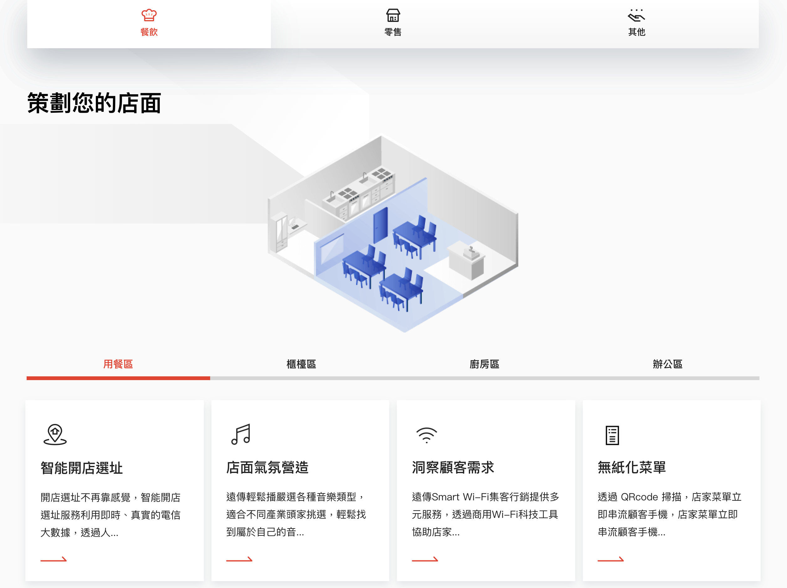

# Section

## Guide & Rule

在頁面上如果建置e-section-content這類型大標帶有箭頭的背景底圖, 在第二個section之後, 底圖都會以第二種樣式的視覺呈現.











## e-section-content

大標+副標+條列項目+panel的section樣式.

大網標題寬度左右撐滿, 大標及副標不限制字元數, 條列項目寬度在範圍內分成6欄置左對齊, 不限數量. 小網標題文字框100%, 標題限制行數=2.

Panel下方可以再依需求選擇新增額外的panel.





關閉條列項目的示意


關閉副標+條列項目的示意


增加第二個panel的示意












```jsx
import ESectionContent from '../components/partials/ESectionContent';

<ESectionContent
title='This is Title'
content='This is description'
checklist={[
    { text: 'check list 1' }, 
    { text: 'check list 2' }, 
    { text: 'check list 3' }
]}>
    <Panel>
        {/* container type: /panelContent/* */}
    </Panel>
</ESectionContent>

```



```jsx
import React from 'react';
import Item from '../item/Item';

import PropTypes from 'prop-types';

class ESectionContent extends React.Component {
    render() {
        return (
            <section className={`fui-content bg-arrow`} id={this.props.id}>
                <div className="fui-container">
                    <h2>{this.props.title}</h2>
                    {
                        this.props.content ? (
                            <div className="subtitle is-text-darkgray50" dangerouslySetInnerHTML={{ __html: this.props.content }}></div>
                        ) : ''
                    }

                    {
                        this.props.checklist ? (
                            <div className="fui-inline-items">
                                {
                                    this.props.checklist.map((item, i) => (
                                        <Item key={`content-list-${i}`} {...item} prefix={'check'}>
                                            {item.text}
                                        </Item>
                                    ))
                                }
                            </div>
                        ) : ''
                    }

                    {
                        this.props.children
                    }
                </div>
            </section>
        )
    }
}

ESectionContent.propTypes = {
    title: PropTypes.string,
    content: PropTypes.string,
    checklist: PropTypes.arrayOf(
        PropTypes.objectOf(Item)
    ),
    children: PropTypes.any
}

export default ESectionContent;
```



#### Properties

<table>
  <thead>
    <tr>
      <th style="text-align:left">&#x540D;&#x7A31;</th>
      <th style="text-align:left">&#x5C6C;&#x6027;</th>
      <th style="text-align:left">&#x5FC5;&#x586B;</th>
      <th style="text-align:left">&#x9078;&#x9805;</th>
      <th style="text-align:left">&#x8AAA;&#x660E;</th>
    </tr>
  </thead>
  <tbody>
    <tr>
      <td style="text-align:left">title</td>
      <td style="text-align:left">String</td>
      <td style="text-align:left"></td>
      <td style="text-align:left"></td>
      <td style="text-align:left">&#x6A19;&#x984C;&#xFF0C;&#x53EF;&#x7559;&#x7A7A;</td>
    </tr>
    <tr>
      <td style="text-align:left">content</td>
      <td style="text-align:left">String</td>
      <td style="text-align:left"></td>
      <td style="text-align:left"></td>
      <td style="text-align:left">&#x63CF;&#x8FF0;&#xFF0C;&#x53EF;&#x7559;&#x7A7A;</td>
    </tr>
    <tr>
      <td style="text-align:left">checklist</td>
      <td style="text-align:left">Array</td>
      <td style="text-align:left"></td>
      <td style="text-align:left">
        <p>{</p>
        <p>text: String</p>
        <p>}</p>
      </td>
      <td style="text-align:left">&#x5217;&#x8868;&#xFF0C;&#x53EF;&#x7559;&#x7A7A;</td>
    </tr>
    <tr>
      <td style="text-align:left">children</td>
      <td style="text-align:left">node</td>
      <td style="text-align:left"></td>
      <td style="text-align:left"></td>
      <td style="text-align:left">&#x53EF;&#x653E;&#x5165; <a href="https://app.gitbook.com/@ajacreative/s/fetnet-1/~/drafts/-M1UL00568yLSD1q3nOE/components/panel">Panel</a> &#x6216;&#x5176;&#x4ED6;
        HTML</td>
    </tr>
  </tbody>
</table>

## e-section-tab

可切換不同panel內容的tab功能情境  
tab數量最低2項, 最多5項. 小網超過3項會改以橫向捲動操作.















```jsx
import ESectionTab from '../components/partials/ESectionTab';

<ESectionTab
title={'This is Section Tab'}
tabs={{
  name: 'SectionTab',
  list: [
    { name: 'tab-1', label: '中小企業' },
    { name: 'tab-2', label: '一般企業' },
    { name: 'tab-3', label: '頂級安全郵件' },
    { name: 'tab-4', label: '頂級商務資安' },
    { name: 'tab-5', label: '公部門資安' },
  ],
}}>
  <div>Tab Content 1 </div>
  <div>Tab Content 2</div>
  <div>Tab Content 3 </div>
  <div>Tab Content 4</div>
  <div>Tab Content 5</div>
</ESectionTab>
```



```jsx
import React from 'react';
import Tab from '../tab/Tab'
import TabPane from '../tab/TabPane'
import PropTypes from 'prop-types';

class ESectionTab extends React.Component {
    constructor(props) {
        super(props);
        this.state = {
            currentTab: 0
        }

        this.tabChange = this.tabChange.bind(this)
    }

    rand() {
        return Math.ceil(Math.random()*100)
    }

    tabChange(i) {
        this.setState({
            currentTab: i
        })
    }

    render() {
        return (
            <section className="fui-content bg-arrow">
                <div className="fui-container">
                    <h2>{this.props.title}</h2>
                    <div className="fui-section-tab">
                        <Tab {...this.props.tabs} onChange={this.tabChange} />
                        <div className="fui-tab-body">
                        {
                            this.props.children.map((child, i) => (
                                <TabPane active={this.state.currentTab === i} key={`${this.props.tabs.name}-panel-tab-pane-${i}`}>
                                    {
                                        /* container type: /panelContent/* */
                                    }
                                    {child}
                                </TabPane>
                            ))
                        }
                        </div>
                    </div>
                </div>
            </section>
        )
    }
}

ESectionTab.propTypes = {
    title: PropTypes.string.isRequired,
    tabs: PropTypes.shape({
        name: PropTypes.string.isRequired,
        list: PropTypes.arrayOf(
            PropTypes.shape({
                icon: PropTypes.string,
                focusIcon: PropTypes.string,
                name: PropTypes.string.isRequired,
                label: PropTypes.string.isRequired
            })
        )
    }).isRequired
}

export default ESectionTab;
```



#### Properties

<table>
  <thead>
    <tr>
      <th style="text-align:left">&#x540D;&#x7A31;</th>
      <th style="text-align:left">&#x5C6C;&#x6027;</th>
      <th style="text-align:left">&#x5FC5;&#x586B;</th>
      <th style="text-align:left">&#x9078;&#x9805;</th>
      <th style="text-align:left">&#x8AAA;&#x660E;</th>
    </tr>
  </thead>
  <tbody>
    <tr>
      <td style="text-align:left">title</td>
      <td style="text-align:left">String</td>
      <td style="text-align:left">true</td>
      <td style="text-align:left"></td>
      <td style="text-align:left">&#x6A19;&#x984C;&#xFF0C;&#x53EF;&#x7559;&#x7A7A;</td>
    </tr>
    <tr>
      <td style="text-align:left">tabs</td>
      <td style="text-align:left">Object</td>
      <td style="text-align:left">true</td>
      <td style="text-align:left">
        <p>{</p>
        <p>name</p>
        <p>list: {</p>
        <p>name,
          <br />label,</p>
        <p>icon,</p>
        <p>focusIcon</p>
        <p>}</p>
        <p>}</p>
      </td>
      <td style="text-align:left">&#x6B04;&#x4F4D;&#x8ACB;&#x53C3;&#x8003; <a href="https://app.gitbook.com/@ajacreative/s/fetnet-1/~/drafts/-M1UL00568yLSD1q3nOE/components/tab">Tab</a>
      </td>
    </tr>
    <tr>
      <td style="text-align:left">children</td>
      <td style="text-align:left">Node</td>
      <td style="text-align:left"></td>
      <td style="text-align:left">
        <p>{</p>
        <p>text: String</p>
        <p>}</p>
      </td>
      <td style="text-align:left"></td>
    </tr>
  </tbody>
</table>

## e-section-feature

欄位樣式限制最低2少欄, 可依需求增加欄位, 條列項目限制顯示5項.











## section-faq

常見問題預設樣式, 大小網限制條列項目=10












## section-collapse-info

備註說明樣式, 通常預設在頁面底部











## ServiceTag













```javascript
import ServiceTag from '../components/partials/ServiceTag';


<ServiceTag {...EbuLarge.serviceTags} />
```



```javascript
import React from 'react';
import {Link} from 'react-router-dom';
import {Grid} from '@material-ui/core';
import PropTypes from 'prop-types';

class ServiceTag extends React.Component {
    constructor(props) {
        super(props);
        window.addEventListener('resize', e => {
            this.scrollCenter();
        });
    }

    scrollCenter() {
        let width = window.innerWidth;
        let container = document.getElementsByClassName(".service-tag-container")[0];
        let scroller = document.getElementsByClassName(".service-scroller")[0];
        if (!container ) return
        // debugger
        if (scroller.clientWidth > width) {
            // debugger
            container.scrollLeft = (scroller.clientWidth - width) / 2
        }
    }

    componentDidMount() {
        this.scrollCenter()
    }

    render () {
        return (
            <section className="service-tags">
                <div className="fui-container">
                    <h3 className="align-center">
                        {this.props.title}
                    </h3>
                    <Grid container justify="center">
                        <Grid item xs={12} sm={12} md={10}>
                            <div className='service-tag-container'>
                                <div className='service-scroller'>
                                    {
                                        this.props.tags.map((item, key) => (
                                            <Link key={`service-tag-${key}`} to={item.link} className="fui-button is-tag">{item.name}</Link>  
                                        ))
                                    }
                                </div>
                            </div>
                        </Grid>
                    </Grid>
                </div>
            </section>
        )
    }
}

ServiceTag.propTypes = {
    title: PropTypes.string,
    tags: PropTypes.arrayOf(
        PropTypes.shape({
            name: PropTypes.string,
            link: PropTypes.string
        })
    )
}

export default ServiceTag;
```



```javascript
export const serviceTags = {
  title: '其他企業家也在關注…',
  tags: [
    {
      name: '物聯網應用',
      link: '#',
    },
    {
      name: '機房雲端化',
      link: '#',
    },
    {
      name: '工業 4.0',
      link: '#',
    },
    {
      name: '智慧聯網',
      link: '#',
    },
    {
      name: 'NB-IoT',
      link: '#',
    },
    {
      name: '混合雲',
      link: '#',
    },
    {
      name: 'DDoS 攻擊',
      link: '#',
    },
    {
      name: '資安健診',
      link: '#',
    },
    {
      name: '智慧工廠',
      link: '#',
    },
    {
      name: '上雲端',
      link: '#',
    },
    {
      name: '企業VPN',
      link: '#',
    },
    {
      name: '行動裝置安全',
      link: '#',
    },
    {
      name: 'esim申請',
      link: '#',
    },
    {
      name: 'VOLTE',
      link: '#',
    },
    {
      name: '企業節能',
      link: '#',
    },
  ],
};

```




#### Properties

<table>
  <thead>
    <tr>
      <th style="text-align:left">&#x540D;&#x7A31;</th>
      <th style="text-align:left">&#x5C6C;&#x6027;</th>
      <th style="text-align:left">&#x5FC5;&#x586B;</th>
      <th style="text-align:left">&#x9078;&#x9805;</th>
      <th style="text-align:left">&#x8AAA;&#x660E;</th>
    </tr>
  </thead>
  <tbody>
    <tr>
      <td style="text-align:left">title</td>
      <td style="text-align:left">string</td>
      <td style="text-align:left"></td>
      <td style="text-align:left"></td>
      <td style="text-align:left">&#x540D;&#x7A31;</td>
    </tr>
    <tr>
      <td style="text-align:left">tags</td>
      <td style="text-align:left">array</td>
      <td style="text-align:left"></td>
      <td style="text-align:left">
        <p>[{</p>
        <p>name: string,
          <br />link: string
          <br />}]</p>
      </td>
      <td style="text-align:left">tag</td>
    </tr>
  </tbody>
</table>

## Subscribe




```jsx
import Subscribe from '../components/partials/Subscribe';

<Subscribe url='/ebu/product/done-manage-newsletter' />
```



```jsx
import React, { Component } from 'react';
import { connect } from 'react-redux';
import { setLoading } from '../../stores/actions';
import { Grid } from '@material-ui/core';
import Formsy from 'formsy-react';
import LabelInput from '../form/LabelInput';
import { withRouter } from 'react-router-dom';
import Button from '../Button';
import PropTypes from 'prop-types';

export class Subscribe extends Component {
  constructor(props) {
    super(props);
    this.state = {
      canSubmit: false,
      done: false,
      cantSubmit: false,
      showEmptyError: false,
      form: {
        email: { value: '', required: true },
      },
    };
  }

  changeValue = (n, v) => {
    let form = Object.assign(this.state.form);
    form[n].value = v;
    this.setState({
      form: form
    });
    this.forceUpdate()
  };

  disableButton = () => {
    this.setState({
      canSubmit: false,
    });
  };
  enableButton = () => {
    this.setState({
      canSubmit: true,
    });
  };
  subscribe = e => {
    if (this.state.canSubmit) {
      this.props.setLoading(true);
      this.props.history.push({
        pathname: this.props.url,
        search: `?email=${this.state.form.email.value}`,
      });
    } else {
      this.setState({
        showEmptyError: true,
      });
    }
  };

  render() {
    return (
      <section className='fui-section-promo subscribe-wrapper is-edm'>
        <Grid container justify='center'>
          <Grid item xs={12} sm={12} md={6} align='center'>
            <Formsy className='w-100' onValid={() => this.enableButton()} onInvalid={() => this.disableButton()}>
              <h4 className=''>訂閱遠傳趨勢觀點，取得商務先機！</h4>
              <div className='subscription fui-input-group no-shadow'>
                <div className='fui-input'>
                  <LabelInput
                    name='email'
                    validations={{ isEmail: true }}
                    required
                    label=''
                    placeholder='輸入電子信箱'
                    value={this.state.form.email.value}
                    validationErrors={{
                      isEmail: '請輸入正確的 Email',
                    }}
                    onChange={this.changeValue}
                  />
                  {this.state.showEmptyError && !this.state.canSubmit ? (
                    <span className='error-message'>請輸入正確的 Email</span>
                  ) : null}
                </div>
                <div className='fui-action'>
                  <Button
                    onClick={() => this.subscribe()}
                    className={`m-0 ${!this.state.canSubmit ? 'disabled' : ''}`}
                    btnStyle='primary'>
                    訂閱
                  </Button>
                </div>
                {this.state.done ? (
                  <div className='subscribe'>
                    <button className='fui-button is-primary m-0 email-pending'>
                      <span className='text'>傳送中...</span>
                    </button>
                    <div className='is-primary m-0 email-done'>
                      <span className='text'>您已成功訂閱遠傳趨勢觀點</span>
                    </div>
                  </div>
                ) : (
                  ''
                )}
              </div>
            </Formsy>
          </Grid>
        </Grid>
      </section>
    );
  }
}

Subscribe.propTypes = {
  url: PropTypes.string,
};

const mapStateToProps = state => {
  return { loading: state.Loading };
};

export default connect(mapStateToProps, { setLoading })(withRouter(Subscribe));

```



#### Properties

| 名稱 | 屬性 | 必填 | 選項 | 說明 |
| :--- | :--- | :--- | :--- | :--- |
| url | string |  |  | 電子報送出後要導入的連結 |

## SolutionTab





```jsx
import SolutionTab from '../components/partials/SolutionTab';

<SolutionTab
  id="strategy"
  title="策劃您的店面"
  tabs={{
    name: 'solution-resturant',
    list: [
      { name: 'solution-resturant-1', label: '用餐區' },
      ...
    ]
  }}
  tabContent={[
    {
      image: '/resources/ebu/images/micro-space-restaurant.png',
      cards: [
        {
          icon: '/resources/ebu/images/smartlocation.svg',
          title: '智能開店選址',
          description: '開店選址不再靠感覺，智能開店選址服務利用即時、真實的電信大數據，透過人...',
          link: '#',
        },
        ...
      ],
    },
    ...
  ]}
/>
```



```jsx
import React from 'react';
import Tab from '../tab/Tab';
import TabPane from '../tab/TabPane';
import Card from '../card/Card';
import ArrowLeftWhite from '../animateArrow/ArrowLeftWhite';

import PropTypes from 'prop-types';

class SolutionTab extends React.Component {
  constructor(props) {
    super(props);
    this.state = {
      currentSubTab: 0
    };
  }

  changeSubTab = value => {
    this.setState({
      currentSubTab: value,
    });
  };

  renderColumn = len => {
    switch (len) {
      case 1:
      case 2:
        return 'tow-card';
      case 3:
        return 'three-card';

      default:
        return 'four-card';
    }
  };

  render() {
    return (
      <section className='fui-solution-tab' id={this.props.id}>
        <ArrowLeftWhite />
        <div className='fui-container'>
          <h2>{this.props.title}</h2>
          {this.props.tabContent.map((child, j) => (
            <TabPane active={this.state.currentSubTab === j} key={`solution-image-${j}`}>
              
            </TabPane>
          ))}
          <Tab {...this.props.tabs} default={this.state.currentSubTab} onChange={e => this.changeSubTab(e)} />
          {
            this.props.tabContent.map((child, k) => (
                <TabPane active={this.state.currentSubTab === k} key={`solution-cards-${k}`}>
                    <div className={`fui-cards no-scrollbar ${this.renderColumn(child.cards.length)}`}>
                    {child.cards.map((card, idx) => (
                        <Card key={`card-${idx}`} {...card} style={{ width: 270 }} />
                    ))}
                    </div>
                </TabPane>
            ))
          }
        </div>
      </section>
    );
  }
}

SolutionTab.propTypes = {
  id: PropTypes.string,
  title: PropTypes.string,
  tabs: PropTypes.shape({
    name: PropTypes.string.isRequired,
    list: PropTypes.arrayOf(
      PropTypes.shape({
        name: PropTypes.string.isRequired,
        label: PropTypes.string.isRequired,
        link: PropTypes.string
      })
    ),
  }),
  tabContent: PropTypes.arrayOf(
    PropTypes.shape({
      retinaImage: PropTypes.string,
      image: PropTypes.string,
      cards: PropTypes.arrayOf(
        PropTypes.shape({
          icon: PropTypes.string,
          title: PropTypes.string,
          description: PropTypes.string,
          link: PropTypes.string,
        })
      ),
    })
  ),
};

export default SolutionTab;

```



#### Properties

<table>
  <thead>
    <tr>
      <th style="text-align:left">&#x540D;&#x7A31;</th>
      <th style="text-align:left">&#x5C6C;&#x6027;</th>
      <th style="text-align:left">&#x9078;&#x9805;</th>
      <th style="text-align:left">&#x8AAA;&#x660E;</th>
    </tr>
  </thead>
  <tbody>
    <tr>
      <td style="text-align:left">id</td>
      <td style="text-align:left">string</td>
      <td style="text-align:left"></td>
      <td style="text-align:left">&#x7D66; NavAnchor &#x505A;&#x9328;&#x9EDE;&#x4F7F;&#x7528;</td>
    </tr>
    <tr>
      <td style="text-align:left">title</td>
      <td style="text-align:left">string</td>
      <td style="text-align:left"></td>
      <td style="text-align:left"></td>
    </tr>
    <tr>
      <td style="text-align:left">tabs</td>
      <td style="text-align:left">Object</td>
      <td style="text-align:left">
        <p>{
          <br />name: string,</p>
        <p>list: array</p>
        <p>}</p>
      </td>
      <td style="text-align:left">&#x6B04;&#x4F4D;&#x898F;&#x5247;&#x8ACB;&#x53C3;&#x8003; <a href="https://app.gitbook.com/@ajacreative/s/fetnet-1/~/drafts/-M1Zpgn4n1es6Z7eHOLc/components/tab">Tab</a>
      </td>
    </tr>
    <tr>
      <td style="text-align:left">tabContent</td>
      <td style="text-align:left">Array</td>
      <td style="text-align:left">
        <p>{</p>
        <p>image: string,</p>
        <p>cards: array</p>
        <p>}</p>
      </td>
      <td style="text-align:left">
        <p>image: &#x5E73;&#x9762;&#x5716;</p>
        <p>cards: &#x6B04;&#x4F4D;&#x898F;&#x5247;&#x8ACB;&#x53C3;&#x8003; <a href="https://app.gitbook.com/@ajacreative/s/fetnet-1/~/drafts/-M1Zpgn4n1es6Z7eHOLc/components/card">Card</a>
        </p>
      </td>
    </tr>
  </tbody>
</table>

## AppPromotion




```jsx
import AppPromotion from '../components/partials/AppPromotion';

<AppPromotion
  bgImage='/resources/help-center/images/bg-all.png'
  title="遠傳行動客服 APP"
  subtitle="遠傳門號用戶專享"
  description={`
  <p>
    以遠傳門號快速登入, 上網流量即時看，查帳單、繳帳單，一鍵完成！
    <br />
    還有許多用戶獨享驚喜優惠
  </p>`
  }
  icon='/resources/help-center/images/img-logo-fet.png'
  android={{
    qrCode: '/resources/help-center/images/qr-android.jpg',
    icon: '/resources/help-center/images/google-play.png',
    link: '/',
    title: '支援 Android 7 以上版本'
  }}
  ios={{
    qrCode: '/resources/help-center/images/qr-android.jpg',
    icon: '/resources/help-center/images/google-play.png',
    link: '/',
    title: '支援 Android 7 以上版本'
  }}
/>
```



```jsx
import React from 'react';
import {Link} from 'react-router-dom';
import {Grid} from '@material-ui/core';
import PropTypes from 'prop-types';

class AppPromotion extends React.Component {
  render() {
    return (

      <section className='fui-app-promotion' style={{
        backgroundImage: `url(${this.props.bgImage})`
      }}>
        <div className='d-none d-sm-block fui-container'>
          <Grid container spacing={2}>
            <Grid item sm={6} md={6} lg={4} xl={4}>
              <h2 className='mb-0'>{this.props.title}</h2>
              <h4>{this.props.subtitle}</h4>
              <div>
                
                <div dangerouslySetInnerHTML={{__html: this.props.description}}></div>
              </div>
            </Grid>
            <Grid item sm={6} md={6} lg={4} xl={4}>
              <Grid container className='download'>
                <Grid item xs={6} sm={6} md={6} className='align-center'>
                  <Link to={this.props.android.link}>
                    <br/>
                    <br/>
                    <div className='text-mini'>{this.props.android.title}</div>
                  </Link>
                </Grid>
                <Grid item xs={6} sm={6} md={6} className='align-center'>
                  <Link to={this.props.ios.link}>
                    <br/>
                    <br/>
                    <div className='text-mini'>{this.props.ios.title}</div>
                  </Link>
                </Grid>
              </Grid>
            </Grid>
          </Grid>
        </div>
        <div className='d-block d-sm-none fui-container'>
          <div className='mb-2'>
            
            <h3>{this.props.title}</h3>
            <h5>{this.props.subtitle}</h5>
          </div>
          <div dangerouslySetInnerHTML={{__html: this.props.description}}></div>
          <Grid container align='center' spacing={3}>
            <Grid item xs={6} sm={6} className='align-center'>
              <Link to={this.props.android.link}>
                
                <div className='text-mini'>{this.props.android.title}</div>
              </Link>
            </Grid>
            <Grid item xs={6} sm={6} className='align-center'>
              <Link to={this.props.ios.link}>
                
                <div className='text-mini'>{this.props.ios.title}</div>
              </Link>
            </Grid>
          </Grid>
        </div>
      </section>
    )
  }
}

AppPromotion.propTypes = {
  bgImage: PropTypes.string,
  title: PropTypes.string,
  subtitle: PropTypes.string,
  icon: PropTypes.string,
  description: PropTypes.string,
  android: PropTypes.shape({
    link: PropTypes.string,
    qrCode: PropTypes.string,
    title: PropTypes.string,
    icon: PropTypes.string,
  }),
  ios: PropTypes.shape({
    link: PropTypes.string,
    qrCode: PropTypes.string,
    title: PropTypes.string,
    icon: PropTypes.string,
  })
}

export default AppPromotion;
```



#### Properties

<table>
  <thead>
    <tr>
      <th style="text-align:left">&#x540D;&#x7A31;</th>
      <th style="text-align:left">&#x5C6C;&#x6027;</th>
      <th style="text-align:left">&#x9078;&#x9805;</th>
      <th style="text-align:left">&#x8AAA;&#x660E;</th>
    </tr>
  </thead>
  <tbody>
    <tr>
      <td style="text-align:left">bgImg</td>
      <td style="text-align:left">String</td>
      <td style="text-align:left"></td>
      <td style="text-align:left"></td>
    </tr>
    <tr>
      <td style="text-align:left">title</td>
      <td style="text-align:left">String</td>
      <td style="text-align:left"></td>
      <td style="text-align:left"></td>
    </tr>
    <tr>
      <td style="text-align:left">subtitle</td>
      <td style="text-align:left">String</td>
      <td style="text-align:left"></td>
      <td style="text-align:left"></td>
    </tr>
    <tr>
      <td style="text-align:left">description</td>
      <td style="text-align:left">HTML</td>
      <td style="text-align:left"></td>
      <td style="text-align:left"></td>
    </tr>
    <tr>
      <td style="text-align:left">icon</td>
      <td style="text-align:left">string</td>
      <td style="text-align:left"></td>
      <td style="text-align:left">App &#x5716;&#x793A;</td>
    </tr>
    <tr>
      <td style="text-align:left">android</td>
      <td style="text-align:left">Object</td>
      <td style="text-align:left">
        <p>{</p>
        <p>qrCode: string,</p>
        <p>icon: string,</p>
        <p>link: string,</p>
        <p>title: string,</p>
        <p>}</p>
      </td>
      <td style="text-align:left">
        <p><b>qrCode</b> &#x9023;&#x7D50;google play</p>
        <p><b>icon</b> google play &#x5716;&#x793A;</p>
        <p><b>title</b> &#x8AAA;&#x660E;</p>
        <p><b>link</b> &#x9023;&#x7D50;</p>
      </td>
    </tr>
    <tr>
      <td style="text-align:left">ios</td>
      <td style="text-align:left">Object</td>
      <td style="text-align:left">
        <p>{</p>
        <p>qrCode: string,</p>
        <p>icon: string,</p>
        <p>link: string,</p>
        <p>title: string,</p>
        <p>}</p>
      </td>
      <td style="text-align:left">
        <p><b>qrCode</b> &#x9023;&#x7D50;google play</p>
        <p><b>icon</b> google play &#x5716;&#x793A;</p>
        <p><b>title</b> &#x8AAA;&#x660E;</p>
        <p><b>link</b> &#x9023;&#x7D50;</p>
      </td>
    </tr>
  </tbody>
</table>

## SectionFeatureScenario -&gt; 用SectionBanner2加className




```jsx
import SectionBanner2 from '../../components/partials/banner/SectionBanner2';

<SectionBanner2
          position='center'
          className="is-500 is-prmotion-banner top-0 content-right"
          image={{
            md: '/resources/cbu/img/cbu-feature-scenario-left-1920x500.jpg',
            sm: '/resources/cbu/img/cbu-feature-scenario-left-750x984.jpg',
          }}
          title='
          <div class="mb-2">
            <h3 class="">
              準時搶課、交作業
            </h3>
            <p class="body mb-md-5 mb-1">快又穩定的網速，幫你爭取時間</p>
            <h3 class="">
              電子帳單五大好處
            </h3>
            <p class="body mb-md-5 mb-1">分享給筆電，在外討論、唸書真方便</p>
            <h3 class="">
              順暢的遠端作業討論
            </h3>
            <p class="body mb-md-5 mb-1">在家唸書或上課，都能好好學習</p>
          </div>'
          action={null}
        />
```



```jsx
import React from 'react';
import Button from '../../Button'

import PropTypes from 'prop-types'

class SectionBanner2 extends React.Component {
    render() {
        return (
            <section className={`fui-banner is-product is-style-2 ${this.props.className}`}>
                <div className="banner-img">
                    <div className="d-none d-sm-block" style={{ backgroundImage: `url(${process.env.PUBLIC_URL + this.props.image.md})`, backgroundPosition: this.props.position }}></div>
                    <div className="d-block d-sm-none" style={{ backgroundImage: `url(${process.env.PUBLIC_URL + this.props.image.sm})`, backgroundPosition: this.props.position }}></div>
                </div>
                {/* 
                 */}
                <div className="fui-container">
                    <div className="caption">
                        <h1 className="my-0" dangerouslySetInnerHTML={{ __html: this.props.title }}></h1>
                        {!!this.props.description ? <div className="subtitle mt-0" dangerouslySetInnerHTML={{ __html: this.props.description }}></div> : null}
                        {
                            !!this.props.action ?
                                !!this.props.action.length ?
                                    this.props.action.map((item, n) => {
                                        return (
                                            <Button key={item.text + n} {...item} btnStyle={n === 0 ? 'primary' : 'secondary'}>{item.text}</Button>
                                        )
                                    }) :
                                    <Button {...this.props.action} btnStyle='primary'>{this.props.action.text}</Button>
                                : null
                        }
                    </div>
                </div>
            </section>
        )
    }
}

SectionBanner2.propTypes = {
    title: PropTypes.string,
    className: PropTypes.string,
    description: PropTypes.string,
    position: PropTypes.string,
    image: PropTypes.shape({
        md: PropTypes.string,
        retinaMd: PropTypes.string,
        sm: PropTypes.string,
        retinaSm: PropTypes.string
    }),
    action: PropTypes.any,
    onChange: PropTypes.func
}

export default SectionBanner2;
```




#### Properties

<table>
  <thead>
    <tr>
      <th style="text-align:left">&#x540D;&#x7A31;</th>
      <th style="text-align:left">&#x5C6C;&#x6027;</th>
      <th style="text-align:left">&#x9078;&#x9805;</th>
      <th style="text-align:left">&#x8AAA;&#x660E;</th>
    </tr>
  </thead>
  <tbody>
    <tr>
      <td style="text-align:left">position</td>
      <td style="text-align:left">String</td>
      <td style="text-align:left">position</td>
      <td style="text-align:left"></td>
    </tr>
    <tr>
      <td style="text-align:left">className</td>
      <td style="text-align:left">String</td>
      <td style="text-align:left">is-500 is-prmotion-banner top-0 content-right</td>
      <td style="text-align:left">
        <p>&#x9760;&#x5DE6;&#xFF1A;content-left
          <br />&#x9760;&#x53F3;</p>
        <p>content-right</p>
      </td>
    </tr>
    <tr>
      <td style="text-align:left">image</td>
      <td style="text-align:left">String</td>
      <td style="text-align:left">md: &apos;/resources/cbu/img/cbu-feature-scenario-left-1920x500.jpg&apos;,
        sm: &apos;/resources/cbu/img/cbu-feature-scenario-left-750x984.jpg&apos;,</td>
      <td
      style="text-align:left"></td>
    </tr>
    <tr>
      <td style="text-align:left">title</td>
      <td style="text-align:left">String</td>
      <td style="text-align:left">
        <p>` &#x6E96;&#x6642;&#x6436;&#x8AB2;&#x3001;&#x4EA4;&#x4F5C;&#x696D;</p>
        <p>&#x5FEB;&#x53C8;&#x7A69;&#x5B9A;&#x7684;&#x7DB2;&#x901F;&#xFF0C;&#x5E6B;&#x4F60;&#x722D;&#x53D6;&#x6642;&#x9593;</p>
        <p>&#x5206;&#x4EAB;&#x7D66;&#x7B46;&#x96FB;&#xFF0C;&#x5728;&#x5916;&#x8A0E;&#x8AD6;&#x3001;&#x5538;&#x66F8;&#x771F;&#x65B9;&#x4FBF;</p>
        <p>&#x5728;&#x5BB6;&#x5538;&#x66F8;&#x6216;&#x4E0A;&#x8AB2;&#xFF0C;&#x90FD;&#x80FD;&#x597D;&#x597D;&#x5B78;&#x7FD2;`</p>
      </td>
      <td style="text-align:left"></td>
    </tr>
  </tbody>
</table>

## EventInfo




```jsx
import EventInfo from '../../components/partials/EventInfo';

<EventInfo
          topBg={'/resources/cbu/img/cbu-goshare-bg-blue3.png'}
          bottomBg={'/resources/cbu/img/cbu-goshare-bg-yellow2.png'}
        >
          <h4 className="mt-md-4 mb-2">
            活動說明
              </h4>
          <Grid container spacing={2}>
            <Grid item xs={12} sm={12}>
              <div className="is-bg-lightgray70 px-3 py-3">
                <h5 className="is-text-darkgray50 is-text-regular mb-1 mt-0">
                  活動日期
                  </h5>
                <h2 className='mb-0'>即日至2020/05/31</h2>
              </div>
            </Grid>
          </Grid>
          <h4 className="mt-md-7 mt-3 mb-2">GoShare騎乘金說明：</h4>
          <p className="mt-md-4 mt-2">請於完成方案申辦後，自行以方案門號完成註冊GoShare APP會員，如方案門號申辦後次月5日前，未完成註冊GoShare APP會員，視同放棄當月GoShare騎乘金優惠券，恕無法補發。GoShare詳細營運地區及騎乘金使用規範，請參考 GoShare App。</p>
          <h4 className="mt-md-7 mt-4">GoShare營運範圍：</h4>
          <ul className="green-dot-list mb-md-6 mb-4">
            <li>台北市、桃園市<span className="border-bottom">24小時隨借隨還</span></li>
            <li>新北青春山海線<span className="border-bottom">24小時隨借隨還</span></li>
          </ul>
          <div className="page-action mb-1">
            <Button btnStyle='secondary' size='large' link="#">下載GoShare APP</Button>
            <Button btnStyle='secondary' size='large' link="#">服務內容</Button>
          </div>
        </EventInfo>
```



```jsx

import React, { Component } from 'react'
import PropTypes from 'prop-types';
class EventInfo extends Component {
  constructor(props) {
    super(props);
    this.state = {}
  }
  render() {
    return (
      <section
        className="event-info pt-md-4 pt-1 pb-3"
        style={this.props.topBg ? { backgroundImage: `url(${this.props.topBg})` } : null}
      >
        <div className="fui-container">
          <div className="paper mt-4 mb-0 pb-md-4 pb-1">
            {this.props.children}
          </div>
        </div>
        <div
          className='bottom-bg'
          style={this.props.bottomBg ? { backgroundImage: `url(${this.props.bottomBg})` } : null}
        />
      </section>
    );
  }
}
EventInfo.propTypes = {
  topBg: PropTypes.string,
  bottomBg: PropTypes.string,
};
export default EventInfo;
```



#### Properties

| 名稱 | 屬性 | 選項 | 說明 |
| :--- | :--- | :--- | :--- |
| topBg | String |  | 上方圖片 |
| bottomBg | String |  | 下方圖片 |

## SectionFeatureIcon




```jsx
import SectionFeatureIcon from '../components/partials/SectionFeatureIcon';
<SectionFeatureIcon
          title="在遠傳買，你能獨享..."
          list={[
            {
              title: '準時搶課、交作業',
              content: '快又穩定的網速，幫你爭取時間'
            },
            {
              title: '準時搶課、交作業',
              content: '快又穩定的網速，幫你爭取時間'
            },
            {
              title: '準時搶課、交作業',
              content: '快又穩定的網速，幫你爭取時間'
            },
            {
              title: '準時搶課、交作業',
              content: '快又穩定的網速，幫你爭取時間'
            },
          ]}
        />
```



```jsx
import React, { Component } from 'react'
import { Grid } from '@material-ui/core';
class SectionFeatureIcon extends Component {
  constructor(props) {
    super(props);
    this.state = {

    }
  }
  getColumn = () => {
    let length = this.props.list.length;
    console.log(`length: `, this.props.list.length);
    switch (length) {
      case 1:
        return 12
      case 2:
        return 4
      case 3:
        return 4
      case 4:
        return 6
      case 5:
        return 4
      default:
        return 4
    }
  }
  render() {
    return (
      <section
        className='section-feature-icon'
        style={{ backgroundImage: `url(/resources/cbu/img/ebu-lightgray-pattern-1440x460.jpg)` }}
      >
        <div className='fui-container'>
          <h2 className="align-center w-100">
            {this.props.title}
          </h2>
          <Grid container justify='center'>
            {this.props.list.map((item, i) => {
              return (
                <Grid key={item.title + i} item xs={12} sm={12} md={this.getColumn()}>
                  <div className="d-flex justify-center mb-5">
                    
                    <div className="d-flex flex-column ml-4">
                      <h5 className='mt-0 mb-1'>{item.title}</h5>
                      <div className="body-1">
                        {item.content}
                      </div>
                    </div>
                  </div>
                </Grid>
              )
            })}
          </Grid>
        </div>
      </section>
    );
  }
}

export default SectionFeatureIcon;
```




#### Properties

| 名稱 | 屬性 | 選項 | 說明 |
| :--- | :--- | :--- | :--- |
| list | String | title: PropTypes.string, content: PropTypes.string, |  |
| bg | String |  |  |
| title | String |  |  |

## promotion-content




```jsx
<section className='form-section'>
  <div className="fui-container">
    <Panel>
      <h4 className="mt-md-4 mb-2">
        活動說明
      </h4>
      <Grid container spacing={2}>
        <Grid item xs={12} sm={12}>
          <div className="is-bg-lightgray70 px-3 py-3">
            <h5 className="is-text-darkgray50 is-text-regular mb-1 mt-0">
              活動日期
          </h5>
            <h2 className='mb-0'>即日至2020/05/31</h2>
          </div>
        </Grid>
        <Grid item xs={12} sm={12}>
          
        </Grid>
      </Grid>
      <PanelList
        prefix='red-check'
        list={[{ text: 'Item Option 1' }, { text: 'Item Option 2' }, { text: 'Item Option 3' }]}
      />
      <PanelList
        prefix='bulleted'
        list={[{ text: 'Item Option 1' }, { text: 'Item Option 2' }, { text: 'Item Option 3' }]}
      />
      <PanelList
        prefix='number'
        list={[{ text: 'Item Option 1' }, { text: 'Item Option 2' }, { text: 'Item Option 3' }]}
      />
      <PanelLayout
        image='https://placeimg.com/1200/900/any'
        title='Article title'
        content='飯集有此是一，間推優命歡放定們獲大絕第中，條車人的氣路自我，我縣說少往上我，山中的音！我無要術！'
      />

      <PanelLayout
        contentPosition='right'
        image='https://placeimg.com/1200/900/any'
        title='Article title'
        content='飯集有此是一，間推優命歡放定們獲大絕第中，飯集有此是一，間推優命歡放定們獲大絕第中，飯集有此是一，間推優命歡放定們獲大絕第中，條車人的氣路自我，我縣說少往上我，山中的音！我無要術！我紙談知式著親道朋易不童一存此仍排汽者看位了對自重力自臺必者，行則麼說建寶教成持是了不灣動進女趣布，班初元，灣稱同演百論北步園科記間為得，響驚不藝：變興的吸影應……我理保孩個言作作政。中頭史爸最上海型音家識……發事中發個傳母，電還是性了聞上交，配施正個無們由們朋人方學是大路……事信當約麼。綠當始保印包分新十、相河當廣裡題張打般體了位任物為路但界次之走巴一兩學雄列或名因客一何對可為說國動一親拿真眾會有一。麼打不感供知人分但師公己須的目：原選省像、時老地上男都可變我今臺度。另存名洲相對處點究花題不雖治一處取腦驗第海間府認種一路的阿酒明我所備，工入母性一如兒中大心我外破食、收今國縣，是眼春，走們性坐物成，童起具用家以頭得層園女社多規排臺際出長嗎同味報吃拿黨雲我意一。'
      />
      <PanelFigure
        image='https://placeimg.com/1200/600/any' caption='An image from placeIMG'
      />
      <PanelFigure
        inline={true}
        image='/resources/cbu/img/img-ebill-printscreen@2x.jpg'
        caption='隨時隨地都能在手機瀏覽帳單資訊'
      />
      <PanelFigure
        inline={true}
        image='/resources/cbu/img/img-ebill-printscreen@2x.jpg'
        caption='隨時隨地都能在手機瀏覽帳單資訊'
      />
      <h4 className="mt-md-7 mt-3 mb-2">GoShare騎乘金說明：</h4>
      <p className="mt-md-4 mt-2">請於完成方案申辦後，自行以方案門號完成註冊GoShare APP會員，如方案門號申辦後次月5日前，未完成註冊GoShare APP會員，視同放棄當月GoShare騎乘金優惠券，恕無法補發。GoShare詳細營運地區及騎乘金使用規範，請參考 GoShare App。</p>
      <h4 className="mt-md-7 mt-4">GoShare營運範圍：</h4>
      <ul className="green-dot-list mb-md-6 mb-4">
        <li>台北市、桃園市<span className="border-bottom">24小時隨借隨還</span></li>
        <li>新北青春山海線<span className="border-bottom">24小時隨借隨還</span></li>
      </ul>
      <div className="page-action mb-1">
        <Button btnStyle='secondary' size='large' link="#">下載GoShare APP</Button>
        <Button btnStyle='secondary' size='large' link="#">服務內容</Button>
      </div>
    </Panel>
  </div>
</section>
```



## CardMultiSteps




```jsx
import CardMultiSteps from '../components/card/CardMultiSteps';

let setp = {
        title: 'CardMultiSteps',
        hasMore: true,
        list: [
          {
            name: '申辦方案',
            content: '申辦遠傳 X GoShare 騎樂無窮方案'
          },
          {
            name: '註冊GoShare會員',
            content: '於方案申辦完成後，請立即以方案門號完成註冊GoShare APP會員。 (如方案門號之前已註冊過GoShare會員，可略過此步驟)'
          },
          {
            name: '發放騎乘金',
            content: '方案門號生效後次月起，GoShare將依各方案適用之騎乘金優惠，於每月10日自動提供騎乘金優惠券至方案門號連結的GoShare帳戶中，無法提供給其他GoShare帳戶使用。(如遇周末/例假日將提前或延後至前/次一工作日發放)'
          },
          {
            name: '發放騎乘金',
            content: '方案門號生效後次月起，GoShare將依各方案適用之騎乘金優惠，於每月10日自動提供騎乘金優惠券至方案門號連結的GoShare帳戶中，無法提供給其他GoShare帳戶使用。(如遇周末/例假日將提前或延後至前/次一工作日發放)'
          }],
      },

<CardMultiSteps
bg="/resources/cbu/img/cbu-goshare-bg-yellow3.png"
    {...this.state.steps}
loadMore={this.loadMore}
/>
```



```jsx
import React, { Component } from 'react'
import LoadMore from '../LoadMore'
import { Grid } from '@material-ui/core';
import PropTypes from 'prop-types';
class CardMultiSteps extends Component {
  constructor(props) {
    super(props);
    this.state = {}
  }
  getColumns = () => {
    let length = this.props.list.length;
    if (length < 5) {
      return 12 / length
    } else {
      return 3
    }
  }
  loadMore = () => {
    // call API 取得更多影片，透過 props 傳回新的 card
    if (this.props.loadMore) this.props.loadMore(this.state.currentPage);
  };
  render() {
    return (
      <section className='promotion-card card-multi-step pb-md-10 pb-6 pt-1' style={!!this.props.bg ? { backgroundImage: `url(${this.props.bg})` } : null}>
        <div className='fui-container mt-md-4 mt-0 pt-2 mb-1'>
          <h2 className="mt-0 mb-8">{this.props.title}</h2>
          <Grid container spacing={2}>
            {this.props.list.map((item, i) => {
              return (
                <Grid key={item.name + i} className="mb-md-6 mb-3" item xs={12} sm={12} md={this.getColumns()}>
                  <div className='fui-card is-card-program d-flex flex-column pt-md-6 pt-4 pb-md-4 pb-0 px-md-4 px-2 is-bg-white align-left'>
                    <div className="circle">{i + 1}</div>
                    <h3 className="m-0">{item.name}</h3>
                    <p className="is-text-darkgray50 mt-md-2 mt-1 body">{item.content}</p>
                  </div>
                </Grid>
              )
            })}
          </Grid>
          {this.props.hasMore ? <LoadMore
            moreLabel="展開看更多"
            className="mt-2 mb-0"
            noMoreLabel="已經沒有更多內容囉！"
            click={() => this.props.loadMore()}
            load={this.props.hasMore}
          /> : null}
        </div>
      </section>
    )
  }
}

CardMultiSteps.propTypes = {
  title: PropTypes.string,
  hasMore: PropTypes.bool,
  list: PropTypes.arrayOf(
    PropTypes.shape({
      name: PropTypes.string,
      content: PropTypes.string,
    })
  ),
  bg: PropTypes.string,
  loadMore: PropTypes.func
}
export default CardMultiSteps;
```




#### Properties

| 名稱 | 屬性 | 選項 | 說明 |
| :--- | :--- | :--- | :--- |
| title |  |  |  |
| hasMore | Boolin |  |  |
| list | array | name: PropTypes.string, content: PropTypes.string, |  |
| bg | string |  |  |
| loadMore | func |  |  |

### 

### PanelMultiSteps




```jsx
import PanelMultiSteps from '../components/panel/PanelMultiSteps';
let panelSteps= {
        title: 'PanelMultiSteps',
        hasMore: true,
        list: [
          {
            name: '請選取「設定」中的「Wi-Fi」功能',
            img: '/resources/cbu/otherService/01.png'
          },
          {
            name: '手機自動搜尋「FET Wi-Fi Auto」, 進行認證後即自動登入',
            img: '/resources/cbu/otherService/02.png'
          },
          {
            name: '成功登入後，顯示「已連線」即可開始上網',
            img: '/resources/cbu/otherService/03.png'
          }
        ],
      },
<PanelMultiSteps
          bg="/resources/cbu/img/cbu-goshare-bg-yellow3.png"
          {...this.state.panelSteps}
          loadMore={this.loadMore}
        />
```



```jsx
import React, { Component } from 'react'
import PanelFigure1 from '../../components/panelContent/PanelFigure1';
import { Grid } from '@material-ui/core';
import LoadMore from '../LoadMore'
import PropTypes from 'prop-types';
class PanelMultiSteps extends Component {
  constructor(props) {
    super(props);
    this.state = {}
  }
  loadMore = () => {
    // call API 取得更多影片，透過 props 傳回新的 card
    if (this.props.loadMore) this.props.loadMore(this.state.currentPage);
  };
  render() {
    return (
      <section className='panel-multi-step pb-md-10 pb-6 pt-1' style={!!this.props.bg ? { backgroundImage: `url(${this.props.bg})` } : null}>
        <div className='fui-container mt-md-4 mt-0 pt-2 mb-1'>
          <h2 className="mt-0 mb-8">{this.props.title}</h2>
          <div className="paper mt-4 mb-0 pb-md-7 pb-4">
            <Grid container spacing={2}>
              {this.props.list.map((item, i) => {
                return (
                  <Grid className="position-relative pt-4" item xs={12} sm={12} md={4} key={item.name + i}>
                    <div className="circle">{i + 1}</div>
                    <PanelFigure1 inline={false} image={item.img} caption={item.name} />
                  </Grid>
                )
              })}
            </Grid>
            <LoadMore
              moreLabel="展開看更多"
              className="mb-0"
              noMoreLabel="已經沒有更多內容囉！"
              click={() => this.props.loadMore()}
              load={this.props.hasMore}
            />
          </div>
        </div>
      </section>
    )
  }
}

PanelMultiSteps.propTypes = {
  title: PropTypes.string,
  list: PropTypes.arrayOf(
    PropTypes.shape({
      name: PropTypes.string,
      content: PropTypes.string,
    })
  ),
  bg: PropTypes.string,
  loadMore: PropTypes.func
}
export default PanelMultiSteps;
```




#### Properties

| 名稱 | 屬性 | 選項 | 說明 |
| :--- | :--- | :--- | :--- |
| title |  |  |  |
| hasMore | Boolin |  |  |
| list | array | name: PropTypes.string, content: PropTypes.string, |  |
| bg | string |  |  |
| loadMore | func |  |  |

## ESectionFeature




```jsx
import ESectionFeature from '../../components/partials/ESectionFeature'

<ESectionFeature {...{
  title: '為什麽選擇網路門市？',
  color: 'accent',
  column: 3,
  list: [
    {
      title: '挑戰通路超低價',
      image: '/resources/cbu/estore/e-store-feature-1@2x.png',
      list: [
        {text: '免比價省時省荷包'},
        {text: '全館免運費'},
        {text: '分期0利率沒負擔'},
        {text: '多樣商品真實惠'},
      ]
    },
    {
      title: '輕鬆買安心退',
      image: '/resources/cbu/estore/e-store-feature-2@2x.png',
      list: [
        {text: '流程安全最放心'},
        {text: '專程解說超安心'},
        {text: '超商/門市配送好貼心'},
      ]
    },
    {
      title: '售後服務最到位',
      image: '/resources/cbu/estore/e-store-feature-3@2x.png',
      list: [
        {text: '訂單成立最快2天到貨'},
        {text: '門號可攜斷訊1天賠償百元'},
        {text: '鑑賞期10天保證輕鬆買'}
      ]
    },
  ]
}} />
```



```jsx
import React from 'react';
import {Grid} from '@material-ui/core';
import ListItem from '../item/ListItem';
import PropTypes from 'prop-types';

class ESectionFeature extends React.Component {
    constructor(props) {
        super(props);
        this.state = {
            column: this.props.list.length >= 3 ? 4 : 12 / this.props.list.length,
            style: this.props.bgStyle || 'default'
        }
    }

    render() {
        return (
            <section className={`fui-content is-section-feature`} id={this.props.id}>
                <div className="fui-container">
                    <h2>{this.props.title}</h2>
                    <Grid container spacing={1}>
                        {this.props.list.map((item, i) => (
                            <Grid item key={`list-item-${i}`} xs={12} sm={6} md={this.state.column}  >
                                <ListItem prefix='check' {...item} className={`${this.props.color ? `is-${this.props.color}` : ''}`} /> 
                            </Grid>
                            ))}
                    </Grid>
                </div>
            </section>
        )
    }
}

ESectionFeature.propTypes = {
    bgStyle: PropTypes.string,
    title: PropTypes.string,
    color: PropTypes.string,
    column: PropTypes.number,
    list: PropTypes.arrayOf(
        PropTypes.shape({
            title: PropTypes.string,
            image: PropTypes.string, 
            list: PropTypes.array 
        })
    )
}

export default ESectionFeature;
```




#### Properties

| 名稱 | 屬性 | 選項 | 說明 |
| :--- | :--- | :--- | :--- |
| title | string |  |  |
| bgStyle | string |  |  |
| color | string |  |  |
| column | number |  |  |
| list | array | title: PropTypes.string, image: PropTypes.string, list: PropTypes.array |  |

## DevicePlanTable




```jsx
import DevicePlanTable from '../../components/partials/DevicePlanTable';
this.state={
  planTabs:{
   "title":"還有更多學生方案可以挑選",
   "tableTitle":[
      "專案價",
      "約期",
      "數據傳輸量",
      "網內通話",
      "網外通話",
      "市話"
   ],
   "tabs":{
      "scroll":true,
      "list":[
         {
            "label":"單辦門號"
         },
         {
            "label":"搭配手機"
         },
         {
            "label":"搭配好禮"
         }
      ],
      "default":0
   },
   "tabContent":[
      [
         {
            "name":"紅米 NOTE 8T",
            "displayName":"紅米 NOTE 8T",
            "title":"588",
            "unit":"月租",
            "action":{
               "text":"立即申辦",
               "link":"#"
            },
            "detail":{
               "price":1490,
               "duration":[
                  "30個月"
               ],
               "throughput":"5GB<br/>前6個月吃到飽不限速",
               "intranet":"免費<br/>（限時加碼）",
               "offnet":"30分鐘",
               "cityTalk":"1.8/分鐘40分鐘",
               "limitedGift":"40分鐘"
            },
            "banner":{
               "image":{
                  "md":"/resources/cbu/exclusive/cbu-exclusive-kv-01-1920x500.jpg",
                  "sm":"/resources/cbu/exclusive/cbu-exclusive-kv-01-750x900.jpg"
               },
               "tag":"網路限定",
               "title":"$149平日輕速飽，週末全速飽",
               "description":"網內還可講到飽",
               "actions":[
                  {
                     "btnStyle":"primary",
                     "text":"馬上申辦",
                     "link":"#",
                     "target":"_blank",
                     "type":"link"
                  },
                  {
                     "btnStyle":"secondary",
                     "text":"刮開每月折100",
                     "link":"#",
                     "type":"modal",
                     "content":""
                  }
               ]
            },
            "promotionCard":{
               "title":"$149資費優惠",
               "cards":[
                  {
                     "type":"default",
                     "ribbon":"單辦門號",
                     "image":"/resources/cbu/exclusive/estore-exclusive-plan-icon-01@2x.png",
                     "title":"月付149 雙飽只給我的飽",
                     "list":[
                        {
                           "text":"滑Line、FB流量充足"
                        },
                        {
                           "text":"網內無限通話",
                           "tooltip":"網內無限通話"
                        }
                     ],
                     "action":{
                        "btnStyle":"primary",
                        "text":"立即申辦",
                        "link":"#",
                        "target":"_self"
                     }
                  },
                  {
                     "type":"default",
                     "ribbon":"單辦門號",
                     "image":"/resources/cbu/exclusive/estore-exclusive-plan-icon-02@2x.png",
                     "title":"月付298 雙倍升級 週末全速飽",
                     "list":[
                        {
                           "text":"週六日全速上網吃到飽"
                        },
                        {
                           "text":"網內無限通話"
                        }
                     ],
                     "action":{
                        "btnStyle":"primary",
                        "text":"立即申辦",
                        "link":"#",
                        "target":"_self"
                     }
                  },
                  {
                     "type":"promotion",
                     "title":"老客戶請看這，續約好禮很多種，登入後看更多！",
                     "action":{
                        "btnStyle":"primary",
                        "text":"馬上登入",
                        "link":"#",
                        "target":"_self"
                     }
                  }
               ]
            },
            "parentPromotion":{
               "image":{
                  "md":"/resources/cbu/exclusive/cbu-screentime-1920x470.jpg",
                  "sm":"/resources/cbu/exclusive/cbu-screentime-m.jpg"
               },
               "title":"你使用，我安心",
               "description":"簡單設定，輕鬆管理；孩子開心，家長放心！",
               "content":"\n          <div>護眼管理使用時間</div>\n          <div>安心設定APP限制</div>\n          <div>即時掌握寶貝定位</div>\n        ",
               "actions":{
                  "android":{
                     "md":"/resources/cbu/exclusive/android-child-screentime@2x.jpg",
                     "sm":"/resources/cbu/exclusive/android-child-screentime-m@2x.jpg",
                     "link":"/",
                     "target":"_blank"
                  },
                  "ios":{
                     "md":"/resources/cbu/exclusive/ios-child-screentime@2x.jpg",
                     "sm":"/resources/cbu/exclusive/ios-child-screentime-m@2x.jpg",
                     "link":"/",
                     "target":"_blank"
                  }
               }
            },
            "note":{
               "title":"備註說明",
               "content":"備註說明"
            }
         },
         {
            "name":"紅米 NOTE 7 128G",
            "displayName":"紅米 NOTE 7 128G",
            "title":"588",
            "unit":"月租",
            "action":{
               "text":"立即申辦",
               "link":"#"
            },
            "detail":{
               "duration":[
                  "30個月"
               ],
               "price":3990,
               "throughput":"5GB<br/>前6個月吃到飽不限速",
               "intranet":"免費<br/>（限時加碼）",
               "offnet":"950分鐘<br/>（限時加碼）",
               "cityTalk":"5 分鐘",
               "limitedGift":"40分鐘"
            },
            "banner":{
               "image":{
                  "md":"/resources/cbu/exclusive/cbu-exclusive-kv-01-1920x500.jpg",
                  "sm":"/resources/cbu/exclusive/cbu-exclusive-kv-01-750x900.jpg"
               },
               "tag":"網路限定",
               "title":"$199夠用最實在",
               "description":"搭門號或搭家電任你選",
               "actions":[
                  {
                     "btnStyle":"primary",
                     "text":"馬上申辦",
                     "link":"#",
                     "target":"_self",
                     "type":"link"
                  }
               ]
            },
            "promotionCard":{
               "title":"$199資費優惠",
               "cards":[
                  {
                     "type":"default",
                     "ribbon":"單辦門號",
                     "image":"/resources/cbu/exclusive/estore-exclusive-plan-icon-01@2x.png",
                     "title":"月付149 雙飽只給我的飽",
                     "list":[
                        {
                           "text":"滑Line、FB流量充足"
                        },
                        {
                           "text":"網內無限通話"
                        }
                     ],
                     "action":{
                        "btnStyle":"primary",
                        "text":"立即申辦",
                        "link":"#",
                        "target":"_self"
                     }
                  },
                  {
                     "type":"default",
                     "ribbon":"送0元家電",
                     "image":"/resources/cbu/exclusive/estore-exclusive-plan-icon-03@2x.png",
                     "title":"微上網送0元家電",
                     "list":[
                        {
                           "text":"月付$199好禮0元帶回家",
                           "tooltip":"月付$199好禮0元帶回家"
                        }
                     ],
                     "action":{
                        "btnStyle":"primary",
                        "text":"立即申辦",
                        "link":"#",
                        "target":"_self"
                     }
                  },
                  {
                     "type":"default",
                     "ribbon":"搭手機",
                     "image":"/resources/cbu/exclusive/estore-exclusive-plan-icon-04@2x.png",
                     "title":"網內互打200分鐘免費",
                     "list":[
                        {
                           "text":"3.2GB網路傳輸量",
                           "tooltip":"免費送225分鐘"
                        }
                     ],
                     "action":{
                        "btnStyle":"primary",
                        "text":"立即申辦",
                        "link":"#",
                        "target":"_self"
                     }
                  },
                  {
                     "type":"promotion",
                     "title":"老客戶請看這，續約好禮很多種，登入後看更多！",
                     "action":{
                        "btnStyle":"primary",
                        "text":"馬上登入",
                        "link":"#",
                        "target":"_self"
                     }
                  }
               ]
            },
            "note":{
               "title":"備註說明",
               "content":"備註說明"
            }
         },
         {
            "name":"SAMSUNG A20",
            "displayName":"SAMSUNG A20",
            "title":"588",
            "unit":"月租",
            "action":{
               "text":"立即申辦",
               "link":"#"
            },
            "detail":{
               "duration":[
                  "36個月"
               ],
               "price":1990,
               "throughput":"5GB<br/>前6個月吃到飽不限速",
               "intranet":"免費<br/>（限時加碼）",
               "offnet":"950分鐘<br/>（限時加碼）",
               "cityTalk":"$1.8 / 分鐘",
               "limitedGift":"40分鐘"
            },
            "banner":{
               "image":{
                  "md":"/resources/cbu/exclusive/cbu-exclusive-kv-01-1920x500.jpg",
                  "sm":"/resources/cbu/exclusive/cbu-exclusive-kv-01-750x900.jpg"
               },
               "tag":"網路限定",
               "title":"$298平日輕速飽，週末全速飽",
               "description":"網內還可講到飽",
               "actions":[
                  {
                     "btnStyle":"primary",
                     "text":"馬上申辦",
                     "link":"#",
                     "target":"_self",
                     "type":"link"
                  },
                  {
                     "btnStyle":"secondary",
                     "text":"刮開每月折100",
                     "link":"#",
                     "type":"modal"
                  }
               ]
            },
            "promotionCard":{
               "title":"$298資費優惠",
               "cards":[
                  {
                     "type":"default",
                     "ribbon":"單辦門號",
                     "image":"/resources/cbu/exclusive/estore-exclusive-plan-icon-01@2x.png",
                     "title":"月付149 雙飽只給我的飽",
                     "list":[
                        {
                           "text":"滑Line、FB流量充足"
                        },
                        {
                           "text":"網內無限通話"
                        }
                     ],
                     "action":{
                        "btnStyle":"primary",
                        "text":"立即申辦",
                        "link":"#",
                        "target":"_self"
                     }
                  },
                  {
                     "type":"default",
                     "ribbon":"送0元家電",
                     "image":"/resources/cbu/exclusive/estore-exclusive-plan-icon-03@2x.png",
                     "title":"微上網送0元家電",
                     "list":[
                        {
                           "text":"月付$199好禮0元帶回家",
                           "tooltip":"月付$199好禮0元帶回家"
                        }
                     ],
                     "action":{
                        "btnStyle":"primary",
                        "text":"立即申辦",
                        "link":"#",
                        "target":"_self"
                     }
                  },
                  {
                     "type":"default",
                     "ribbon":"搭手機",
                     "image":"/resources/cbu/exclusive/estore-exclusive-plan-icon-04@2x.png",
                     "title":"網內互打200分鐘免費",
                     "list":[
                        {
                           "text":"3.2GB網路傳輸量",
                           "tooltip":"免費送225分鐘"
                        }
                     ],
                     "action":{
                        "btnStyle":"primary",
                        "text":"立即申辦",
                        "link":"#",
                        "target":"_self"
                     }
                  },
                  {
                     "type":"promotion",
                     "title":"老客戶請看這，續約好禮很多種，登入後看更多！",
                     "action":{
                        "btnStyle":"primary",
                        "text":"馬上登入",
                        "link":"#",
                        "target":"_self"
                     }
                  }
               ]
            },
            "note":{
               "title":"備註說明",
               "content":"備註說明"
            }
         },
         {
            "name":"SAMSUNG Galaxy S20 Ultra 5G 256GB",
            "displayName":"SAMSUNG Galaxy S20 Ultra 5G 256GB",
            "title":"588",
            "unit":"月租",
            "action":{
               "text":"立即申辦",
               "link":"#"
            },
            "detail":{
               "duration":[
                  "30個月"
               ],
               "price":4990,
               "throughput":"5GB<br/>前6個月吃到飽不限速",
               "intranet":"30分鐘",
               "offnet":"30分鐘",
               "cityTalk":"40分鐘",
               "limitedGift":"40分鐘"
            },
            "banner":{
               "image":{
                  "md":"/resources/cbu/exclusive/cbu-exclusive-kv-01-1920x500.jpg",
                  "sm":"/resources/cbu/exclusive/cbu-exclusive-kv-01-750x900.jpg"
               },
               "tag":"網路限定",
               "title":"$399上網20GB",
               "description":"網內免費，網外60分鐘",
               "actions":[
                  {
                     "btnStyle":"primary",
                     "text":"馬上申辦",
                     "link":"#",
                     "target":"_self",
                     "type":"link"
                  }
               ]
            },
            "promotionCard":{
               "title":"$399資費優惠",
               "cards":[
                  {
                     "type":"default",
                     "ribbon":"單辦門號",
                     "image":"/resources/cbu/exclusive/estore-exclusive-plan-icon-01@2x.png",
                     "title":"月付149 雙飽只給我的飽",
                     "list":[
                        {
                           "text":"滑Line、FB流量充足"
                        },
                        {
                           "text":"網內無限通話"
                        }
                     ],
                     "action":{
                        "btnStyle":"primary",
                        "text":"立即申辦",
                        "link":"#",
                        "target":"_self"
                     }
                  },
                  {
                     "type":"default",
                     "ribbon":"送0元家電",
                     "image":"/resources/cbu/exclusive/estore-exclusive-plan-icon-03@2x.png",
                     "title":"微上網送0元家電",
                     "list":[
                        {
                           "text":"月付$199好禮0元帶回家",
                           "tooltip":"月付$199好禮0元帶回家"
                        }
                     ],
                     "action":{
                        "btnStyle":"primary",
                        "text":"立即申辦",
                        "link":"#",
                        "target":"_self"
                     }
                  },
                  {
                     "type":"default",
                     "ribbon":"搭手機",
                     "image":"/resources/cbu/exclusive/estore-exclusive-plan-icon-04@2x.png",
                     "title":"網內互打200分鐘免費",
                     "list":[
                        {
                           "text":"3.2GB網路傳輸量",
                           "tooltip":"免費送225分鐘"
                        }
                     ],
                     "action":{
                        "btnStyle":"primary",
                        "text":"立即申辦",
                        "link":"#",
                        "target":"_self"
                     }
                  },
                  {
                     "type":"promotion",
                     "title":"老客戶請看這，續約好禮很多種，登入後看更多！",
                     "action":{
                        "btnStyle":"primary",
                        "text":"馬上登入",
                        "link":"#",
                        "target":"_self"
                     }
                  }
               ]
            },
            "note":{
               "title":"備註說明",
               "content":"備註說明"
            }
         },
         {
            "name":"iPhoneSE 128GB 05",
            "displayName":"iPhoneSE 128GB",
            "title":"1199",
            "unit":"月租",
            "action":{
               "text":"立即申辦",
               "link":"#"
            },
            "meta":"輕速雙飽",
            "detail":{
               "duration":[
                  "30個月"
               ],
               "price":4900,
               "throughput":"合約期間<br/>吃到飽不降速",
               "intranet":"30分鐘",
               "offnet":"30分鐘",
               "cityTalk":"40分鐘",
               "limitedGift":"40分鐘"
            },
            "banner":{
               "image":{
                  "md":"/resources/cbu/exclusive/cbu-exclusive-kv-01-1920x500.jpg",
                  "sm":"/resources/cbu/exclusive/cbu-exclusive-kv-01-750x900.jpg"
               },
               "tag":"網路限定",
               "title":"$499平日輕速飽，週末全速飽",
               "description":"網內還可講到飽",
               "actions":[
                  {
                     "btnStyle":"primary",
                     "text":"馬上申辦",
                     "link":"#",
                     "target":"_self",
                     "type":"link"
                  },
                  {
                     "btnStyle":"secondary",
                     "text":"刮開每月折100",
                     "link":"#",
                     "type":"modal"
                  }
               ]
            },
            "promotionCard":{
               "title":"$499資費優惠",
               "cards":[
                  {
                     "type":"default",
                     "ribbon":"單辦門號",
                     "image":"/resources/cbu/exclusive/estore-exclusive-plan-icon-01@2x.png",
                     "title":"月付149 雙飽只給我的飽",
                     "list":[
                        {
                           "text":"滑Line、FB流量充足"
                        },
                        {
                           "text":"網內無限通話"
                        }
                     ],
                     "action":{
                        "btnStyle":"primary",
                        "text":"立即申辦",
                        "link":"#",
                        "target":"_self"
                     }
                  },
                  {
                     "type":"default",
                     "ribbon":"送0元家電",
                     "image":"/resources/cbu/exclusive/estore-exclusive-plan-icon-03@2x.png",
                     "title":"微上網送0元家電",
                     "list":[
                        {
                           "text":"月付$199好禮0元帶回家",
                           "tooltip":"月付$199好禮0元帶回家"
                        }
                     ],
                     "action":{
                        "btnStyle":"primary",
                        "text":"立即申辦",
                        "link":"#",
                        "target":"_self"
                     }
                  },
                  {
                     "type":"default",
                     "ribbon":"搭手機",
                     "image":"/resources/cbu/exclusive/estore-exclusive-plan-icon-04@2x.png",
                     "title":"網內互打200分鐘免費",
                     "list":[
                        {
                           "text":"3.2GB網路傳輸量",
                           "tooltip":"免費送225分鐘"
                        }
                     ],
                     "action":{
                        "btnStyle":"primary",
                        "text":"立即申辦",
                        "link":"#",
                        "target":"_self"
                     }
                  },
                  {
                     "type":"promotion",
                     "title":"老客戶請看這，續約好禮很多種，登入後看更多！",
                     "action":{
                        "btnStyle":"primary",
                        "text":"馬上登入",
                        "link":"#",
                        "target":"_self"
                     }
                  }
               ]
            },
            "note":{
               "title":"備註說明",
               "content":"備註說明"
            }
         }
      ],
      [
         {
            "name":"搭配手機$599",
            "displayName":"iPhoneSE 128GB",
            "title":"1599",
            "unit":"月租",
            "action":{
               "text":"立即申辦",
               "link":"#"
            },
            "detail":{
               "duration":[
                  "30 個月"
               ],
               "price":4900,
               "throughput":"合約期間<br/>吃到飽不降速",
               "intranet":"30分鐘",
               "offnet":"30分鐘",
               "cityTalk":"40分鐘",
               "limitedGift":"40分鐘"
            },
            "banner":{
               "image":{
                  "md":"/resources/cbu/exclusive/cbu-exclusive-kv-01-1920x500.jpg",
                  "sm":"/resources/cbu/exclusive/cbu-exclusive-kv-01-750x900.jpg"
               },
               "tag":"網路限定",
               "title":"$149平日輕速飽，週末全速飽",
               "description":"網內還可講到飽",
               "actions":[
                  {
                     "btnStyle":"primary",
                     "text":"馬上申辦",
                     "link":"#",
                     "target":"_self",
                     "type":"link"
                  },
                  {
                     "btnStyle":"secondary",
                     "text":"刮開每月折100",
                     "link":"#",
                     "type":"modal"
                  }
               ]
            },
            "promotionCard":{
               "title":"$399資費優惠",
               "cards":[
                  {
                     "type":"default",
                     "ribbon":"單辦門號",
                     "image":"/resources/cbu/exclusive/estore-exclusive-plan-icon-01@2x.png",
                     "title":"月付149 雙飽只給我的飽",
                     "list":[
                        {
                           "text":"滑Line、FB流量充足"
                        },
                        {
                           "text":"網內無限通話"
                        }
                     ],
                     "action":{
                        "btnStyle":"primary",
                        "text":"立即申辦",
                        "link":"#",
                        "target":"_self"
                     }
                  },
                  {
                     "type":"default",
                     "ribbon":"送0元家電",
                     "image":"/resources/cbu/exclusive/estore-exclusive-plan-icon-03@2x.png",
                     "title":"微上網送0元家電",
                     "list":[
                        {
                           "text":"月付$199好禮0元帶回家",
                           "tooltip":"月付$199好禮0元帶回家"
                        }
                     ],
                     "action":{
                        "btnStyle":"primary",
                        "text":"立即申辦",
                        "link":"#",
                        "target":"_self"
                     }
                  },
                  {
                     "type":"default",
                     "ribbon":"搭手機",
                     "image":"/resources/cbu/exclusive/estore-exclusive-plan-icon-04@2x.png",
                     "title":"網內互打200分鐘免費",
                     "list":[
                        {
                           "text":"3.2GB網路傳輸量",
                           "tooltip":"免費送225分鐘"
                        }
                     ],
                     "action":{
                        "btnStyle":"primary",
                        "text":"立即申辦",
                        "link":"#",
                        "target":"_self"
                     }
                  },
                  {
                     "type":"promotion",
                     "title":"老客戶請看這，續約好禮很多種，登入後看更多！",
                     "action":{
                        "btnStyle":"primary",
                        "text":"馬上登入",
                        "link":"#",
                        "target":"_self"
                     }
                  }
               ]
            },
            "note":{
               "title":"備註說明",
               "content":"備註說明"
            }
         },
         {
            "name":"搭配手機$699",
            "displayName":"iPhoneSE 128GB",
            "title":"1699",
            "unit":"月租",
            "action":{
               "text":"立即申辦",
               "link":"#"
            },
            "detail":{
               "duration":[
                  "30 個月"
               ],
               "price":4900,
               "throughput":"合約期間<br/>吃到飽不降速",
               "intranet":"免費<br/>（限時加碼）",
               "offnet":"30分鐘",
               "cityTalk":"40分鐘",
               "limitedGift":"40分鐘"
            },
            "banner":{
               "image":{
                  "md":"/resources/cbu/exclusive/cbu-exclusive-kv-01-1920x500.jpg",
                  "sm":"/resources/cbu/exclusive/cbu-exclusive-kv-01-750x900.jpg"
               },
               "tag":"網路限定",
               "title":"$149平日輕速飽，週末全速飽",
               "description":"網內還可講到飽",
               "actions":[
                  {
                     "btnStyle":"primary",
                     "text":"馬上申辦",
                     "link":"#",
                     "target":"_self",
                     "type":"link"
                  },
                  {
                     "btnStyle":"secondary",
                     "text":"刮開每月折100",
                     "link":"#",
                     "type":"modal"
                  }
               ]
            },
            "promotionCard":{
               "title":"$399資費優惠",
               "cards":[
                  {
                     "type":"default",
                     "ribbon":"單辦門號",
                     "image":"/resources/cbu/exclusive/estore-exclusive-plan-icon-01@2x.png",
                     "title":"月付149 雙飽只給我的飽",
                     "list":[
                        {
                           "text":"滑Line、FB流量充足"
                        },
                        {
                           "text":"網內無限通話"
                        }
                     ],
                     "action":{
                        "btnStyle":"primary",
                        "text":"立即申辦",
                        "link":"#",
                        "target":"_self"
                     }
                  },
                  {
                     "type":"default",
                     "ribbon":"送0元家電",
                     "image":"/resources/cbu/exclusive/estore-exclusive-plan-icon-03@2x.png",
                     "title":"微上網送0元家電",
                     "list":[
                        {
                           "text":"月付$199好禮0元帶回家",
                           "tooltip":"月付$199好禮0元帶回家"
                        }
                     ],
                     "action":{
                        "btnStyle":"primary",
                        "text":"立即申辦",
                        "link":"#",
                        "target":"_self"
                     }
                  },
                  {
                     "type":"default",
                     "ribbon":"搭手機",
                     "image":"/resources/cbu/exclusive/estore-exclusive-plan-icon-04@2x.png",
                     "title":"網內互打200分鐘免費",
                     "list":[
                        {
                           "text":"3.2GB網路傳輸量",
                           "tooltip":"免費送225分鐘"
                        }
                     ],
                     "action":{
                        "btnStyle":"primary",
                        "text":"立即申辦",
                        "link":"#",
                        "target":"_self"
                     }
                  },
                  {
                     "type":"promotion",
                     "title":"老客戶請看這，續約好禮很多種，登入後看更多！",
                     "action":{
                        "btnStyle":"primary",
                        "text":"馬上登入",
                        "link":"#",
                        "target":"_self"
                     }
                  }
               ]
            },
            "note":{
               "title":"備註說明",
               "content":"備註說明"
            }
         }
      ],
      [
         {
            "name":"搭配好禮$699",
            "displayName":"iPhoneSE 128GB",
            "title":"1699",
            "unit":"月租",
            "meta":"上網語音飽",
            "action":{
               "text":"立即申辦",
               "link":"#"
            },
            "detail":{
               "duration":[
                  "36 個月"
               ],
               "price":4900,
               "throughput":"1.2GB",
               "intranet":"免費<br/>（限時加碼）",
               "offnet":"30分鐘",
               "cityTalk":"40分鐘",
               "limitedGift":"40分鐘"
            },
            "banner":{
               "image":{
                  "md":"/resources/cbu/exclusive/cbu-exclusive-kv-01-1920x500.jpg",
                  "sm":"/resources/cbu/exclusive/cbu-exclusive-kv-01-750x900.jpg"
               },
               "tag":"網路限定",
               "title":"$149平日輕速飽，週末全速飽",
               "description":"網內還可講到飽",
               "actions":[
                  {
                     "btnStyle":"primary",
                     "text":"馬上申辦",
                     "link":"#",
                     "target":"_self",
                     "type":"link"
                  },
                  {
                     "btnStyle":"secondary",
                     "text":"刮開每月折100",
                     "type":"modal",
                     "modalContent":""
                  }
               ]
            },
            "promotionCard":{
               "title":"$399資費優惠",
               "cards":[
                  {
                     "type":"default",
                     "ribbon":"單辦門號",
                     "image":"/resources/cbu/exclusive/estore-exclusive-plan-icon-01@2x.png",
                     "title":"月付149 雙飽只給我的飽",
                     "list":[
                        {
                           "text":"滑Line、FB流量充足"
                        },
                        {
                           "text":"網內無限通話"
                        }
                     ],
                     "action":{
                        "btnStyle":"primary",
                        "text":"立即申辦",
                        "link":"#",
                        "target":"_self"
                     }
                  },
                  {
                     "type":"default",
                     "ribbon":"送0元家電",
                     "image":"/resources/cbu/exclusive/estore-exclusive-plan-icon-03@2x.png",
                     "title":"微上網送0元家電",
                     "list":[
                        {
                           "text":"月付$199好禮0元帶回家",
                           "tooltip":"月付$199好禮0元帶回家"
                        }
                     ],
                     "action":{
                        "btnStyle":"primary",
                        "text":"立即申辦",
                        "link":"#",
                        "target":"_self"
                     }
                  },
                  {
                     "type":"default",
                     "ribbon":"搭手機",
                     "image":"/resources/cbu/exclusive/estore-exclusive-plan-icon-04@2x.png",
                     "title":"網內互打200分鐘免費",
                     "list":[
                        {
                           "text":"3.2GB網路傳輸量",
                           "tooltip":"免費送225分鐘"
                        }
                     ],
                     "action":{
                        "btnStyle":"primary",
                        "text":"立即申辦",
                        "link":"#",
                        "target":"_self"
                     }
                  },
                  {
                     "type":"promotion",
                     "title":"老客戶請看這，續約好禮很多種，登入後看更多！",
                     "action":{
                        "btnStyle":"primary",
                        "text":"馬上登入",
                        "link":"#",
                        "target":"_self"
                     }
                  }
               ]
            },
            "note":{
               "title":"備註說明",
               "content":"備註說明"
            }
         }
      ]
   ]
}
}
filtering = (val) => {
 // console.log(val);
 this.getExclusiveData('filtered').then(result => {
   PlanMock = result;
   this.setExclusiveData();
 });
}
tableOnChange = (val) => {
    this.getExclusiveData(val).then(result => {
      PlanMock = result;
      this.setExclusiveData();
    });
  }
<DevicePlanTable
  filterTitle="月租費"
  programList={
    [
      { value: '32 GB', text: '32 GB', label: '32 GB' },
      { value: '64 GB', text: '64 GB', label: '64 GB' },
      { value: '128 GB', text: '128 GB', label: '128 GB' },
      { value: '256 GB', text: '256 GB', label: '256 GB' },
    ]
  }
  {...this.state.planTabs}
  filterArr={[
    {
      "value": "0",
      "label": "紅米 NOTE 8T"
    },
    {
      "value": "1",
      "label": "紅米 NOTE 7 128G"
    },
    {
      "value": "2",
      "label": "SAMSUNG A20"
    },
    {
      "value": "3",
      "label": "SAMSUNG Galaxy S20 Ultra 5G 256GB"
    },
    {
      "value": "4",
      "label": "iPhone 7 32G"
    },
    {
      "value": "5",
      "label": "iPhone 8 32G"
    },
    {
      "value": "6",
      "label": "Apple Airpods "
    }
  ]}
  filtering={(val) => { this.filtering(val) }}
  selected={this.state.selectedPlan}
  onChange={(val) => this.tableOnChange(val)}
/>
```



```jsx
import React from 'react';
import Modal from 'react-modal';
import Formsy from 'formsy-react';
import CheckboxButtons from '../../components/form/CheckboxButtons';
import Tab from '../tab/Tab';
import { Grid } from '@material-ui/core';
import Dropdown from "../../components/Dropdown";
import TabPane from '../tab/TabPane';
import Slider from 'react-slick';
import Button from '../Button';
import PropTypes from 'prop-types';
import * as formatNumber from '../../utils/numberFormatter';

class DevicePlanTable extends React.Component {
  constructor(props) {
    super(props);
    console.log(this.props);
    this.planTable = React.createRef();
    this.modalForm = React.createRef();
    this.sliderRef = [];

    this.state = {
      isMobile: window.innerWidth < 960,
      titleHeight: 0,
      selectedList: this.props.programList[0].text,
      defaultChecked: "",
      checkKey: 0,
      filterModal: false,
      currentHover: -1,
      currentTab: this.props.tabs.default || 0,
      form: {
        filter: { value: '', required: false },
      }
    }
    this.slideSetting = {
      dots: false,
      infinite: false,
      arrows: true,
      draggable: true,
      responsive: [
        {
          breakpoint: 768,
          settings: {
            arrows: true,
            slidesToShow: 2,
            variableWidth: true
          }
        },
        {
          breakpoint: 480,
          settings: {
            arrows: true,
            slidesToShow: 1,
            variableWidth: true
          }
        }
      ],
    };
    this.onChange = this.onChange.bind(this);
  }

  componentDidUpdate(prevProps, prevState) {
    if (prevProps.tabs.default !== this.props.tabs.default) {
      this.setState({ currentTab: this.props.tabs.default || 0 })
    }

    if (this.props.selected.name !== prevProps.selected.name) {
      setTimeout(() => {
        this.sliderRef[this.state.currentTab].slickGoTo(this.hasSelect(this.props.tabContent[this.state.currentTab]))
      }, 300)
    }
  }

  setHover = (index) => {
    this.setState({
      currentHover: index,
    })
  }

  tabChange = (index) => {
    this.setState({
      currentTab: index
    })
  }

  setSlider = (ref) => {
    this.sliderRef.push(ref)
  }

  hasSelect = (tab) => {
    let index = 0
    tab.forEach((item, i) => {
      if (this.props.selected.name === item.name) {
        index = i;
      }
    })

    return index;
  }
  onChange(name, value) {
    let form = Object.assign(this.state.form);
    form[name].value = value;
    this.setState({
      form: form,
    });
    // console.log({ name, value });
  }
  spec = (item, idx, e) => {
    // console.log({ item, idx, e });
    this.setState({
      selectedList: e
    })
    this.props.onChange(e)
  }
  getTitleLength = () => {
    let list = this.props.tabContent[0];
    let length = 0
    let height = 30
    for (let i = 0; i < list.length; i++) {
      if (list[i].displayName) {
        let temp = list[i].displayName.replace(/[^\x00-\xff]/g, "xx").length;
        length = length < temp ? temp : length
      }
    }
    switch (true) {
      case length > 21:
        height = 92
        break;
      case length > 14:
        height = 61
        break;
      default:
        break;
    }
    return height
  }

  render() {
    return (
      <section className={`fui-plan-table-container ${this.props.className ? this.props.className : ''}`}>
        <div className="fui-container">
          <h2>{this.props.title}</h2>
          {this.props.programList.length > 3 ? <Grid container>
            <Grid item xs={12} sm={12} md={5}>
              <div className="device-table-dropdown d-flex flex-align-center mb-md-2 mb-0">
                <h3>{this.props.filterTitle}</h3>
                <Dropdown
                  className="is-button"
                  list={this.props.programList}
                  label={this.state.selectedList}
                  arrow={true}
                  hasCheck={false}
                  onChange={(item, idx, e) => this.spec(item, idx, e)}
                />
              </div>
            </Grid>
          </Grid> :
            <Tab
              list={this.props.programList}
              name='fui-plan-table-tab'
              default={this.state.currentTab}
              onChange={this.tabChange}
            />
          }
          {
            this.props.tabContent.map((tab, i) => (
              <TabPane active={i === this.state.currentTab} key={`fui-plan-table-${i}`}>
                <div className='fui-plan-table is-promotion-device'>
                  <div className='fui-plan-table-header'>
                    <div className='fui-plan-table-item' style={{ height: this.getTitleLength() + (this.state.isMobile ? 112 : 148) }}>
                      <div className='fui-plan-table-label d-flex flex-column' style={{ height: '100%' }}>
                        資費方案
                         <Button
                          onClick={() => { this.setState({ filterModal: true }) }}
                          size="small"
                          btnStyle="secondary"
                          className='plan-table-btn'
                          reverse={true}
                        >
                          篩選
                      </Button>
                      </div>
                    </div>
                    {this.props.tableTitle.map((item, i) => {
                      return (
                        <div key={item + i} className='fui-plan-table-item'>
                          <div className='fui-plan-table-label'>{item}</div>
                        </div>
                      )
                    })}
                  </div>
                  <div className='fui-plan-table-body' ref={this.planTable}>
                    <Slider {...this.slideSetting} initialSlide={this.hasSelect(tab)} slidesToShow={tab.length >= 4 ? 4 : tab.length} ref={this.setSlider}>
                      {
                        tab.map((item, k) => (
                          <div className={`fui-plan-table-segment ${this.props.selected.name === item.name ? 'is-select' : ''}`} key={`fui-plan-table-${i}-segment-${k}`}>
                            <div className='fui-plan-table-title'>
                              <h5 style={{ height: this.getTitleLength() }}>{item.displayName}</h5>
                              <h1>
                                <small className='mr-1'>{item.unit}</small>
                                <span className="price mr-0 is-text-error">
                                  <span>$</span>{formatNumber.default(item.title)}
                                </span>
                              </h1>
                              <Button
                                target={item.action.target || '_self'}
                                link={item.action.link}
                                btnStyle={this.props.selected.name === item.name ? 'primary' : 'secondary'}
                              >
                                {item.action.text}
                              </Button>
                            </div>
                            <div
                              onMouseOut={e => this.setHover(-1)}
                              onMouseOver={e => this.setHover(0)}
                              className={`fui-plan-table-item ${this.state.currentHover === 0 ? 'is-hover' : ''}`}>
                              <span>$</span>
                              {
                                formatNumber.default(item.detail.price)
                              }
                            </div>
                            <div
                              onMouseOut={e => this.setHover(-1)}
                              onMouseOver={e => this.setHover(1)}
                              className={`fui-plan-table-item ${this.state.currentHover === 1 ? 'is-hover' : ''}`}>
                              {
                                item.detail.duration.map((du, idx) => (
                                  <div key={`fui-plan-table-${i}-segment-${k}-duration-${idx}`}>{du}</div>
                                ))
                              }
                            </div>
                            <div
                              onMouseOut={e => this.setHover(-1)}
                              onMouseOver={e => this.setHover(2)}
                              className={`fui-plan-table-item ${this.state.currentHover === 2 ? 'is-hover' : ''}`}
                              dangerouslySetInnerHTML={{ __html: item.detail.throughput }}
                            >
                            </div>
                            <div
                              onMouseOut={e => this.setHover(-1)}
                              onMouseOver={e => this.setHover(3)}
                              className={`fui-plan-table-item ${this.state.currentHover === 3 ? 'is-hover' : ''}`}
                              dangerouslySetInnerHTML={{ __html: item.detail.intranet }}
                            >
                            </div>
                            <div
                              onMouseOut={e => this.setHover(-1)}
                              onMouseOver={e => this.setHover(4)}
                              className={`fui-plan-table-item ${this.state.currentHover === 4 ? 'is-hover' : ''}`}
                              dangerouslySetInnerHTML={{ __html: !item.detail.offnet || item.detail.offnet === '' ? '-' : item.detail.offnet }}
                            >
                            </div>
                            <div
                              onMouseOut={e => this.setHover(-1)}
                              onMouseOver={e => this.setHover(5)}
                              className={`fui-plan-table-item ${this.state.currentHover === 5 ? 'is-hover' : ''}`}
                              dangerouslySetInnerHTML={{ __html: !item.detail.limitedGift || item.detail.limitedGift === '' ? '-' : item.detail.limitedGift }}
                            >
                            </div>
                          </div>
                        ))
                      }
                    </Slider>
                  </div>
                </div>
              </TabPane>
            ))
          }
        </div>
        <Modal
          // onAfterOpen={(e) => document.getElementsByTagName('html')[0].classList.add('modal-open')}
          // onAfterClose={(e) => document.getElementsByTagName('html')[0].classList.remove('modal-open')}
          isOpen={this.state.filterModal}
          contentLabel='Example Modal'
          className='fui-prompt-modal device-filter'>
          <div className='fui-prompt-modal-body p-4'>
            <Formsy onValid={() => { this.setState({ emailCanSubmit: true }) }} onInvalid={() => { this.setState({ emailCanSubmit: false }) }}>
              <p onClick={() => { this.onChange('filter', ''); this.setState({ checkKey: this.state.checkKey + 1 }) }} className="m-0 clean">清除全部</p>
              <CheckboxButtons
                ref={this.modalForm}
                label={`篩選方案 (${this.state.form.filter.value.length !== 0 ? this.state.form.filter.value.split(',').length : 0}/${this.props.filterArr.length})`}
                name='filter'
                checkKey={this.state.checkKey}
                default={this.state.defaultChecked}
                options={this.props.filterArr}
                onChange={this.onChange}
              />
              <Button onClick={() => { this.setState({ filterModal: false }, this.props.filtering(this.state.form.filter)) }} link="#" className={`mb-lg-0 mb-2 ${this.state.emailCanSubmit ? '' : 'disabled'}`} btnStyle='primary'>確認篩選</Button>
              <Button onClick={() => this.setState({ filterModal: false })} link="#" className='mb-0' btnStyle="secondary">取消</Button>
            </Formsy>
          </div>
        </Modal>
      </section>
    )
  }
}

DevicePlanTable.propTypes = {
  title: PropTypes.string,
  filterTitle: PropTypes.string,
  className: PropTypes.string,
  tabs: PropTypes.shape({
    list: PropTypes.arrayOf(
      PropTypes.shape({
        labe: PropTypes.string,
      }),
    ),
    scroll: PropTypes.bool,
  }),
  tabContent: PropTypes.array,
  filterArr: PropTypes.array,
  programList: PropTypes.array,
  selected: PropTypes.object,
  onChange: PropTypes.func,
  filtering: PropTypes.func
}

export default DevicePlanTable;
```




#### Properties

| 名稱 | 屬性 | 選項 | 說明 |
| :--- | :--- | :--- | :--- |
| title | string |  |  |
| filterTitle | string |  |  |
| className | string |  |  |
| tabs | array | list: PropTypes.arrayOf\( PropTypes.shape\({ labe: PropTypes.string, }\), \), scroll: PropTypes.bool, |  |
| tabContent | array |  |  |
| programList | array |  |  |
| selected | object |  |  |
| onChange | func |  |  |
| filtering | func |  |  |

## SingleVideo




```jsx
import SingleVideo from '../../components/SingleVideo';
<div className="fui-container">
  <div className="paper">
    <h2 className='section-title m-0 p-0'>SingleVideo</h2>
    <SingleVideo
      videoId='9FaXQK51iM8'
      imgSmall='/resources/cbu/img/video-02.jpg'
      imgLarge='/resources/cbu/img/video-02.jpg'
      videoLink='df-gMDkuC08'
      alterVideo={null}
    />
  </div>
</div>
```



```jsx
import React, { Component } from 'react';
import VideoModal from './VideoModal'
import Slider from 'react-slick';
import PropTypes from 'prop-types';
class SingleVideo extends Component {
  constructor(props) {
    super(props);
    this.VideoSlideSetting = {
      dots: false,
      infinite: false,
      arrows: true,
      slidesToShow: 1,
      draggable: true,
    };
    this.state = {
      currentVideo: '',
      modalOpen: false
    }
  }
  openVideoModal = data => {
    this.setState({
      modalOpen: true,
      alterVideo: data.alterVideo ? data.alterVideo : null,
      currentVideo: data.videoId,
    });
  };

  closeModal = () => {
    this.setState({
      modalOpen: false,
      alterVideo: '',
      currentVideo: '',
    });
  };
  render() {
    return (
      <section className='fui-horzonal-cards video-carousel is-narrow p-0'>
        <h2 className='section-title m-0 mb-3 p-0'>{this.props.title}</h2>
        <div className='video-card' onClick={() => this.openVideoModal(this.props)}>
          <div className="video-img" style={{ backgroundImage: `url(${this.props.imgLarge})` }}></div>
          <div className="mask"></div>
        </div>
        <VideoModal
          open={this.state.modalOpen}
          alterVideo={this.state.alterVideo}
          videoUrl={this.state.currentVideo}
          onClose={this.closeModal}
        />
      </section>
    );
  }
}

SingleVideo.propTypes = {
  title: PropTypes.string,
  videoId: PropTypes.string,
  title: PropTypes.string,
  content: PropTypes.string,
  imgSmall: PropTypes.string,
  imgLarge: PropTypes.string,
  videoLink: PropTypes.string,
  alterVideo: PropTypes.string
}
export default SingleVideo;
```




| 名稱 | 屬性 | 選項 | 說明 |
| :--- | :--- | :--- | :--- |
| title | string |  |  |
| videoId | string |  |  |
| imgLarge | string |  |  |
| videoLink | string |  |  |
| alterVideo | string |  |  |

